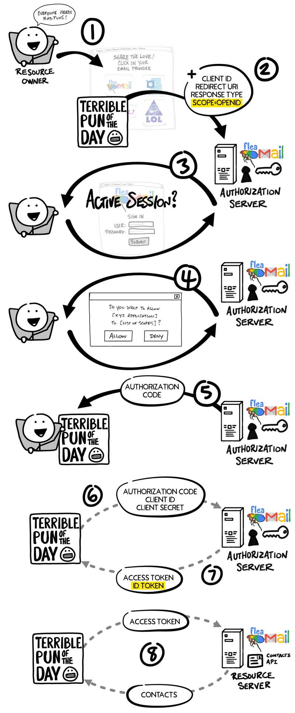

```There are several ways different services provide a way for an app to find out the identity of the user. A simple way is for the API to provide a _“/userinfo”_ endpoint which will return the authenticated user’s name and other profile info when an API call is made with an access token. This is a common approach many services have taken. A more advanced and standardized approach is to use OpenID Connect, an OAuth 2.0 extension.```


OAuth 2.0 is designed only for **authorization**
- granting access to data and features from one application to another.


OpenID Connect (OIDC) is a thin layer that sits on top of OAuth 2.0 that **adds login and profile information about the person who is logged in**.
- **permette sia la gestione delle autorizzazioni che delle autenticazioni**
    - autorizzazioni vengono concesse in maniera analoga ad OAuth (thin layer that sits on top)
- se serve autenticazione, **invece di accedere a dati generici il Client accede all'identità digitale**
- establishing a login session is often referred to as authentication
- information about the person logged in (i.e. the Resource Owner) is called identity.
- when an Authorization Server supports OIDC, it is sometimes called an identity provider, since it provides information about the Resource Owner back to the Client.


OpenID Connect enables scenarios where **one login can be used across multiple applications**, also known as single sign-on (**SSO**). 

For example, an application could support SSO with social networking services such as Facebook or Twitter so that users can choose to leverage a login they already have and are comfortable using.
- non c'è bisogno di creare nuove credenziali


The OpenID Connect flow **looks the same as OAuth**. The only differences are,
- in the initial request, a **specific scope of openid** is used (Client vuole accedere all'identità digitale)
- and in the final exchange the Client receives both an Access Token and an **ID Token**.





As with the OAuth flow, the OpenID Connect Access Token is a value the Client doesn’t understand. 
- As far as the Client is concerned, the Access Token is just a string of gibberish to pass with any request to the Resource Server, and the Resource Server knows if the token is valid.

**The ID Token, however, is very different**.

An ID Token is a specifically formatted string of characters known as a JSON Web Token, or **JWT**.

A JWT may look like gibberish to you and me, but **the Client can extract information embedded in the JWT** such as your
- ID
- name
- when you logged in
- the ID Token expiration
- who emitted the JWT
- ...

Siccome i JWT sono autenticati con un HMAC, il Client si accorge if anything has tried to tamper with the JWT.

**Come mai oltre all'access token viene dato al Client anche un id token? Per accedere all'identità digitale non basta l'access token?**
- Mi serve un anche un id token in quanto **il Client non sa chi è il resource owner** (sta proprio cercando di registrare l'utente) 

Con l'id token (che è un JWT) google mi certifica la mia identità firmando il JWT
- **Con le informazioni presenti nell'id token (firmate dall'IdP) il Client può registrare l'utente (se è la prima volta) e il resource owner può finalmente accedere al servizio**
    - è qui che avviene l'autenticazione! (identificazione dell'utente)
    - se le avessi chieste con l'access token e basta non sarebbero state autenticate con la firma di, ad esempio, Google
    - **NB**: notare che **non serve condividere la pwd con il Client!**
        - L'identificazione è fatta presso l'authorization server (è lui colui che memorizza le credenziali degli utenti).
        - I vari Client effettuano il login dell'utente utilizzando le informazioni (mail, name, ...) contenute nell'id token e registrano solo quest'ultime

If needed, the Client can request additional identity information from the Authorization Server, like usual -> using the Access Token.

Riassumendo:
- l’access token autorizza l’accesso alle risorse
- mentre l’ID token autentica l’utente e trasmette in modo sicuro la sua identità al Client


### Esempio di id-token
```json
{
  "sub(ject)": "creepy-pintail@example.com",
  "name": "Creepy Pintail",
  "email": "creepy-pintail@example.com",
  "iss": "https://pk-demo.okta.com/oauth2/default",
  "aud": "qsMdMr31zBHBQNfy5ngXGkUL",
  "iat": 1755606219,
  "exp": 1758198219,
  "amr": [
    "pwd"
  ]
}
```

Di nuovo, notare che non serve condividere la pwd