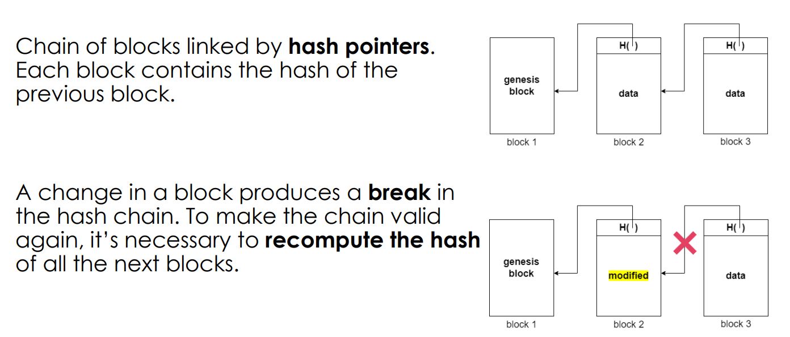

### Trust problem | problema che ha motivato la nascita della blockchain
La tecnologia blockchain nasce nel contesto dei sistemi finanziari in cui è presente una **terza parte fidata** che fa da garante

Pensa alle carte di credito
- Most common option for payments. Each buyer and each seller has to **open a credit line in advance with a bank or a broker (terza parte fidata)**.
- Then, for each transaction, **the third party has to confirm** that the buyer has the funds to complete the operation.

This “simple” method of payment has several issues:
- **la terza parte deve essere online**
    - Timings: procedures can depend on the opening hours for banks and offices.
    - se la terza parte è offline io non posso procedere con un pagamento/transazione
- **dipendenza dalla terza parte**
    - Costs: each intermediary can demand commissions for the service it provides, even large ones.
    - Data ownership: the user is not the real owner of his/her data or his/her account; 
        - la terza parte sa cosa sto facendo

Cash money has clear advantages compared to credit cards:
- it guarantees full anonymity.
- it does not need third parties.

However, there are other issues:
- we need to “coin money”
    - i.e. a third party that initially distributes the bills and that can be queried against their validity.
- non è digitale, it works only offline.

cio che vorremmo è ottenere il meglio dei due mondi, ovvero:
- vogliamo poter validare le transazioni
- **eliminando la terza parte fidata**
- mantenendo così totale anonimità

_Is it possible to get rid of **trusted third parties** to guarantee the authenticity of documents (vedi CA e certificato) and the validity of economic transactions between parties that **do not trust each other** (PGP non va bene (vabe, non aveva validità legale in ogni caso))?_


### Background sistemi distribuiti e decentralizzati
We can categorise systems according to two criteria:
- where the computation takes place
- and **who makes the decisions**.

Computation
- Centralized: all operations are performed by a single node.
- Distributed: operations are spread across all nodes.

Governance
- Centralized: one single node decides for all.
- **Decentralized: each node participates in the decision-making process**.

#### P2P network
a network in which the computers of connected users act as both client and server.
- Peers make a portion of their resources directly available to other network participants, **without the need for central coordination**.

#### Failures
A failure is a condition that causes a functional unit to fail to perform its required function.
- Benign Failure: when a node stops performing the operations it is supposed to perform.
    - Crash and omissions.
- __Byzantine Failure__: when a node starts to perform arbitrary operations, not present in the correct flow of operations.
    - Internet sistema asincrono bizantino

## CONSENSO
Distributed processes that have to agree on a single value (e.g., new status of the system).

Properties
- **Agreement**:
    - If a correct process decides a value, then all correct processes eventually **decide the same value**
- **Termination**:
    - Every correct process eventually decides some value

Il consenso è un po' quello che vogliamo ottenere con la blockchain, vogliamo che nodi in un sistema decentralizzato, che non si fidano tra di loro, riescano a mettersi daccordo sullo stato delle transazioni senza la terza parte fidata.

**problema dei due generali**
- due generali si vogliono mettere daccordo su quando attaccare
- anche nel caso facile di un sistema con fault benigni non abbiamo la certezza se l'altro ha ricevuto i nostri messaggi o meno
- uno dei due generali (processi) ha sempre delle informazioni in più o in meno rispetto all'altro

```perchè a TCP bastano 3 pacchetti e con i due generali andiamo all'infinito?```
- non è che bastano, semplicemente qua non stiamo decidendo della nostra vita/morte
- dopo tre messaggi sono abbastanza sicuro ma non ho garanzia che il server sia presente
    - se al terzo messaggio il server crasha io me ne accorgo solo quando vado in timeout al quarto 

**blockchain è una soluzione al problema del consenso nel contesto di internet**

**NB**:
- **There is no DETERMINISTIC protocol that solves consensus** (in an asynchronous system where ...)
- But is it often said that **blockchain solves consensus?**
- We will see that this is not actually true. 


### Struttura Blockchain
A blockchain is an **append-only list of (effectively) IMMUTABLE records (ledger)**, called **blocks (che sono quindi dati di qualsisi natura)**, that are linked together using hash-pointers.
- è quindi una **struttura dati**
- based on cryptography and on the digital signature to guarantee user anonymity, integrity, and authenticity.
    - immutabilità, crittografia e firma digitale rendono la blockchain a good candidate to store economic transactions!

Blockchains are typically **managed by a decentralized peer-to-peer network** for use as a publicly distributed ledger.
- struttura dati 
    - **distributed on many nodes of a P2P network (everyone has a copy of the ledger)**
    - e **decentralized (nobody owns it)**

#### the Chain


**the correct version of the chain**
The whole chain (ledger) is replicated on the network
- it is possible to find the correct version of the chain by **asking it to the majority of the nodes** (assuming that the majority of the nodes is honest).
- Assumption: 50% + 1 of nodes are benign.

**La blockchain è tamper-resistant**
- se modifico un blocco devo anche modificare tutti i blocchi precedenti per aggiustare gli hashpointer
- questo lo posso anche fare sulla mia copia locale ma poi devo raggiungere il consenso del resto della rete
    - devo fare un sacco di PoW
    - intanto il resto della rete continua ad aggiungere blocchi il che peggiora la mia situazione
    - anche se riesco a fare i PoW, genero una fork e la mia catena deve diventare quella più lunga (vedi nakamoto consensus dopo) 
- per questo motivo i dati nella blockchain sono **effectively immutable**
    - non basta che io modifica la mia copia locale della blockchain!
    - **i fatti veri sono dettati dalla maggiornaza dei blocchi**

Appending data:
- only valid transactions are inserted in the blockchain (no double spending);
- all the nodes agree on the same version of the blockchain (**distributed consensus**), thus making it really immutable

#### the Block
The block consists of two main parts:
- Header: contains the hash of the previous block, the root hash of the Merkle tree (data hash) and other information
- Data / Merkle tree:
    - how the data is structured inside a block
    - the leaves of the tree are the transactions (notare il plurale) contained in the block.

The hash of a block is calculated using its header as input
- l'header contiene l'hash dei dati e quindi è già considerato
- se qualcuno cambia qualsiasi cosa in un blocco (header e/o dati) l'hash cambia per il blocco corrente e tutti i successivi (la catena si spezza)


### Nakamoto Consensus
“Nakamoto consensus” is the algorithm used in Bitcoin network to achieve **trustless consensus** (riguardo al prossimo blocco da aggiungere) among participants.
- l'unica assunzione è che il 50% +1 dei nodi della rete sia non malevolo (altrimenti la maggioranza si mette daccordo su quello che vuole)

Peers have to **agree** (consenso) on the new state of the system (i.e., the **next block (contenente transazioni) to be added to the blockchain**).

Peers who generate new blocks are called miners. 
- **A miner receives transactions from clients**.
- After **validating them**, it can start the process of generating a new block.

To discourage byzantine miners and DoS attacks, **Bitcoin requires miners to solve a “puzzle” (mining) in order to generate a new block**
- This is the so-called **Proof of Work**.
- Solving the puzzle in a short time requires a **large amount of computational power**.
- Also, if you solve the puzzle, **you get a reward in Bitcoin**.

La PoW:
- non serve per fare consenso
- piuttosto serve a scoraggiare i nodi bizantini

**NB**: i client della blockchain non devono aggiungere blocchi e quindi non devono fare delle POW

#### How blocks get added
Two possible scenarios:
- The miner solves the puzzle, adds the block to its chain and sends it to all other nodes.
    - di fatto i miner fanno un broadcast
- The miner before solving the puzzle receives a block from another node. In this case, it stops searching for the solution and adds the block to its chain.

**NB**: Actually, a new block may arrive at any moment (asynchrony). **What happens if a miner receives a block when it has already added one to its chain?**

**The miner keeps both blocks** as if they are both valid, resulting in a **fork**.
- The rule is that **the longest chain is the one that individual nodes accept as a valid** version of the blockchain.
    - **NB**: questa è la regola di consenso
- blocks inside the other shorter paths of the fork are called “orphans” and transactions in them are considered invalid.
    
#### A che cosa server la PoW (chatgpt)
Perché serve la Proof of Work (PoW) per aggiungere blocchi?

In un sistema distribuito come Bitcoin, chiunque potrebbe dire: “Ho creato il nuovo blocco, accettatelo!”
- **La PoW introduce un costo computazionale per proporre un blocco**.
- Quindi, per essere preso sul serio, un blocco deve dimostrare che il suo creatore ha consumato risorse reali (energia, tempo, hardware).

**Come scoraggia i nodi bizantini?**
- Un nodo bizantino potrebbe voler immettere blocchi invalidi o manipolati.
- Ma per ogni blocco deve risolvere il puzzle → costa soldi ed energia.
- Se la maggioranza (>50% della potenza di calcolo) è onesta, **la catena valida crescerà più velocemente di quella malevola**
    - gli altri nodi seguiranno la catena onesta.

**Come scoraggia i DoS attacks?**
- Un attacco DoS tipico sarebbe: inondare la rete di blocchi per confondere/impedire il funzionamento.
- Ma con PoW:
    - Generare un blocco richiede tempo (mediamente ~10 minuti) e grandi risorse.
    - Non puoi semplicemente floodare la rete di blocchi fasulli, perché non riusciresti a produrre abbastanza PoW.
    - I nodi scartano automaticamente i blocchi senza PoW valida → spam inutile.

In sintesi
- PoW = biglietto d’ingresso costoso per proporre un blocco.
- Serve a:
    - Limitare la frequenza con cui i blocchi vengono generati.
    - Rendere costoso l’attacco (conviene seguire le regole).
    - Consentire un criterio oggettivo per decidere la catena valida → quella con più lavoro cumulato.


#### Esempio Double spending
Double-spending is the risk that a cryptocurrency can be used twice or more.
- riutilizzo gli stessi soldi per comprare cose diverse
- In a context without intermediaries this is a serious problem.

**Assumption**: if you have already spent money on a transaction that is in the valid chain, the transaction validation process rejects the new transaction.

What an attacker might do is send two different transactions to two different miners.
- i miner aggiungono alla loro catena personale le due transazioni
- quindi sembra che gli stessi soldi siano stati spesi due volte ...

But no problem! **Eventually one of the two blocks will be considered invalid**
- abbiamo che i due miner aggiungono ognuno il loro nodo -> producono una fork nella catena
- dipendentemente da quale dei due percorsi diventa il più lungo, una delle due transazioni diventa invalida 
    - Ricorda: la catena valida è quella più lunga
- The rule per avere certezza che una transazione sia valida, is to wait for the block in which the transaction is present to be “buried” by other blocks (about 6).
    - dopo 6 è difficile che catene concorrenti superino la propria

#### Double spending con 51%
It is possible to exploit the fork mechanism to double-spend, if one entity owns 51% of the computational power of the entire network.
- Se l’attaccante controlla più della metà della potenza di calcolo totale della rete. **Questo significa che può generare blocchi più velocemente di tutti gli altri miner messi insieme.**
- L'attaccante può comprare qualcosa e aspettare che il venditore invii il bene (magari egli ha anche aspettato 6 blocchi per sicurezza) 
- Una volta ricevuto il bene, l'attaccante può attivare i suoi miner (> 50%) e cominciare una catena alternativa in cui la transazione verso il venditore non è mai avvenuta
- Siccome l'attaccante possiede la maggior parte della potenza computazionale della reta, prima o poi la sua catena diventerà quella più lunga e gli altri nodi saranno costretti ad accetarla come valida
- Il venditore perde sia i beni consegnati che i bitcoin.


### Considerazioni su nakamoto consensus
per il protocollo appena descritto:
- Agreement:
    - probabilistic.
    - If we stop at any time, we can always have forks.
- Termination:
    - to have deterministic agreement we cannot stop!
    
The main drawback of Bitcoin (Nakamato Consensus really) is that **it can never stop in order to work**.
- beh potrei fermarmi e scartare tutti i blocchi presenti in una fork...
- però in effetti questa lista potrebbe essere arbitrariamente lunga

Inoltre, con nakamoto consensus:
- risolvo fork e double spending
- ... ma devo aspettare un'ora per comprare qualcosa


### Bitcoin blockchain
Bitcoin (cryptocurrency) --- based on ---> Blockchain ("technology")

l'idea di bitcoin è quella di un contante che può essere utilizzata online
- l'idea non è nuova ma i predecessori di bitcoin si basavano tutti su una terza parte fidata centralizzata
- la peculiarità di un bitcoin è stata quella di essere **decentralizzato** risolvendo il trust problem

Three problems to solve:
1. Where do we store the bills and the transactions?
    - In all attempts before Bitcoin, a bank kept a centralized ledger of bills and transactions.
        - If we remove the bank (entità centrale), who keeps that ledger? Who guarantees the correctness of the transactions and prevents the double spending?
    - Cryptocurrencies use the **blockchain as a distributed ledger**
        - each user keeps a copy of it and validates the transactions.
2. If we remove the bank, who coins new money?
    - Cryptocurrencies based on blockchain let the **users coin and transfer money through specific protocols**
3. Who or what gives value to the new currency? (outside of the scope)

The blockchain is an attempt to answer these questions
- It allows sending and receiving payments to other users of the platform, **identified by completely anonymous and untraceable addresses**
- It makes extensive use of cryptography, both to ensure data integrity through hashing algorithms, and for authentication (through public / private key signature schemes)


**Address**: an alphanumeric string that represents an **identity on the ledger**
- used as a reference for sending currencies
- each identity is associated with a pair of keys (one private and one public) which allows transactions to be carried out with one's own cryptocurrency


**A Bitcoin wallet** is a device or program for holding and sending Bitcoins.
- Bitcoin wallets contain the **private keys needed to sign Bitcoin transactions**.
- Anyone who knows the private key can control the coins associated with that address.
- It does not contain Bitcoins!

**A transaction** is a transfer of Bitcoin value that is broadcast to the network (verified by the network by checking the signature) and **collected into blocks**.
Two main types of transaction:
- a transfer of existing money among identities.
- coinbase (generation of new money).

**NB: I bitcoin dove stanno?**
- Bitcoin does not save “the coins” somewhere (like real cash in wallet), but simply saves every transaction on the blockchain.
    - (Marco ha dato 10 bitcoin a mario)
    - prima a poi arrivo ad una transazione originaria in cui sono stati creati i bitcoin
- To prove that I have the right to spend a quantity of Bitcoins, I only need to prove that there is a transaction on the blockchain in my favour with that quantity.


### Conclusioni:
In sostanza la blockchain è una tecnologia che permette di avere una struttura dati condivisa immutabile tra dei peer in un sistema decentralizzato che raggiungono un consenso sullo stato di questi dati senza fidarsi l'uno dell'altro
- bitcoin si limita a rappresentare transazioni monetarie su questa struttura dati

Il trustless consensus si raggiunge in quanto tutti i nodi considerano valida la catena più lunga

Molto in breve:

1. Competizione tra miner (Proof of Work):
I miner competono per risolvere un puzzle crittografico (PoW). Questo richiede potenza computazionale, quindi "costa" energia.
Chi trova per primo la soluzione guadagna il diritto di proporre il nuovo blocco.

2. Incentivi:
Il miner vincente riceve una ricompensa (block reward + le fee delle transazioni incluse).
Questo incentiva a comportarsi onestamente, perché il guadagno è maggiore se si segue il protocollo piuttosto che provare ad attaccarlo.

3. Transazioni:
I client (utenti) inviano transazioni alla rete. Queste vanno nel "mempool" dei miner.
Il miner vincente seleziona alcune transazioni e le mette dentro il blocco che sta minando.

4. Propagazione e consenso:
Una volta trovato il blocco valido, il miner lo trasmette alla rete.
Gli altri nodi verificano che sia valido (firma, PoW, transazioni corrette).
Se sì, lo aggiungono alla loro copia della blockchain.

5. Risoluzione dei fork (consenso):
Se due miner trovano un blocco quasi contemporaneamente, si crea un fork.
I nodi mantengono entrambe le catene temporaneamente, ma considerano valida quella più lunga 