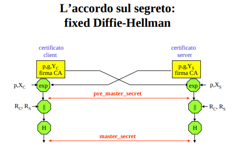
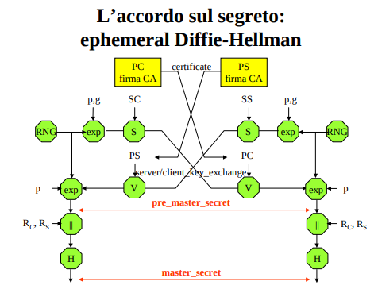

Per difendere la **riservatezza** delle loro comunicazioni in rete è usuale che i due corrispondenti impieghino un **Cifrario simmetrico**, dopo aver preliminarmente concordato una **chiave di sessione** con il protocollo **DH**. Il tutto è naturalmente **affidato alla suite dei protocolli di rete per renderlo “trasparente” agli utenti ed alle applicazioni**. 

Fino ad ora, si è visto solo lo **scambio anonimo**, ma questa è solo una tra diverse possibilità previste ad esempio nel protocollo SSL/TLS. TLS attribuisce ad un suo protocollo interno (l’Handshake) l’esecuzione dei calcoli necessari per la condivisione del segreto e **PUÒ AVVALERSI DI CERTIFICATI PER RENDERE NON ANONIMO LO SCAMBIO**. 

### Fixed DH

La modalità detta fixed DH prevede che **il dato pubblico <p, g, Y> di ciascun utente sia comunicato all’altro tramite un certificato X.509v3**.
- al posto della chiave pubblica, abbiamo la tripla di dati pubblici DH 

Una volta ricevuto questo dato, entrambi calcolano l’esponenziazione modulare, in modo del tutto **analogo a quello dell’anonimous DH**.

**NB**: siccome è certificata, la tripla è sempre la stessa. In particolare il dato Y (e di conseguenza anche il dato X) rimangono sempre gli stessi. Ma questo significa che la chiave di sessione che ci si scambia è sempre la stessa? NO! Questo viene ora chiamato **pre-master secret**
- (ora che X e Y non cambiano mai, diventano in tutto e per tutto analoghe a chiavi pubbliche e private) 
- Il pre_master_secret è sempre lo stesso per ogni coppia di utenti.

Per non dover usare sempre lo stesso segreto, i due partecipanti si scambiano in chiaro anche due numeri a caso RC, RS, che **consentono di variare ad ogni sessione il master_secret**.
- master_secret = H( pre_master_secret || RC || RS )
- La funzione hash disposta a valle della concatenazione consente di trasmettere in chiaro i due nonce

**NB**: Notare che l'accorgimento dei nonce per generare ogni volta chiavi di sessione diverse, funziona anche con anonymous DH se non si vuole rigenerare ogni volta X

### Ephemeral DH

La modalità detta ephemeral DH prevede che, all’inizio di ogni sessione di comunicazione, i due partecipanti 
- scelgano a caso il loro dato privato X
- calcolino il dato pubblico Y
- **lo autentichino firmandolo con una chiave privata**
- lo comunichino al corrispondente unitamente ad un **certificato della loro chiave pubblica**

In ricezione è così possibile verificare l’integrità e l’origine di Y.

Il valore del pre_ master_secret varia inoltre da una sessione all’altra. Per mantenere compatibilità con la modalità “fixed”, anche in questo caso si ha uno scambio di nonce ed un loro impiego nel calcolo del master_secret. 

### considerazioni
Fixed DH: “Ti mando un biglietto con la mia chiave DH stampata sopra, firmato da un notaio (la CA)”.

Ephemeral DH: “Ti mando una chiave pubblica DH generata al volo e ci metto la mia firma elettronica; allego il mio certificato per dimostrarti che quella firma è mia”.

In sostanza fixed autentica la chiave DH pubblica inserendola direttamente in un certificato, mentre ephemeral autentica la chiave pubblica DH firmandola con una sua chiave privata e condividendo un certificato che autentica la relativa chiave pubblica

**fixed-dh**
- questo meccanismo **evita che alice concordi con un MIM la stessa chiave di sessione**, tuttavia siccome **manca identificazione** 
    - non verifico che Bob abbia la chiave privata corrispondente a quella pubblica nel certificato (POP) ad esempio mandando un nonce di challenge
    - c'è il rischio che Alice completi il protocollo dal suo lato e cominci a mandare dei campioni di testo cifrato (con la chiave di sessione) ad un MIM (il certificato è pubblico)
    - poco male siccome l'attaccante non può ottenere la stessa chiave con cui decifrare i dati siccome non ha la chiave segreta (X_bob) 
   
**ephemeral DH**
- il protocollo parte con una firma
- il segreto X viene ricalcolato ogni volta e di conseguenza cambia anche la chiave DH pubblica Y 
- ho PERFECT-FORWARD-SECRECY ma sono più pesante

**NOTA**: è importante distinguere il requisito di autenticazione da quelle di identificazione
- il primo richiede che i messaggi che arrivano siano effettivamente appartenenti a Bob
- il secondo mi richiede che i messaggi che arrivano siano stati mandati proprio da Bob 