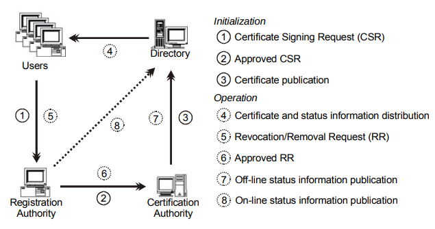
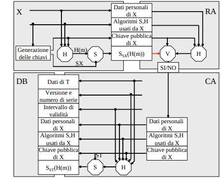
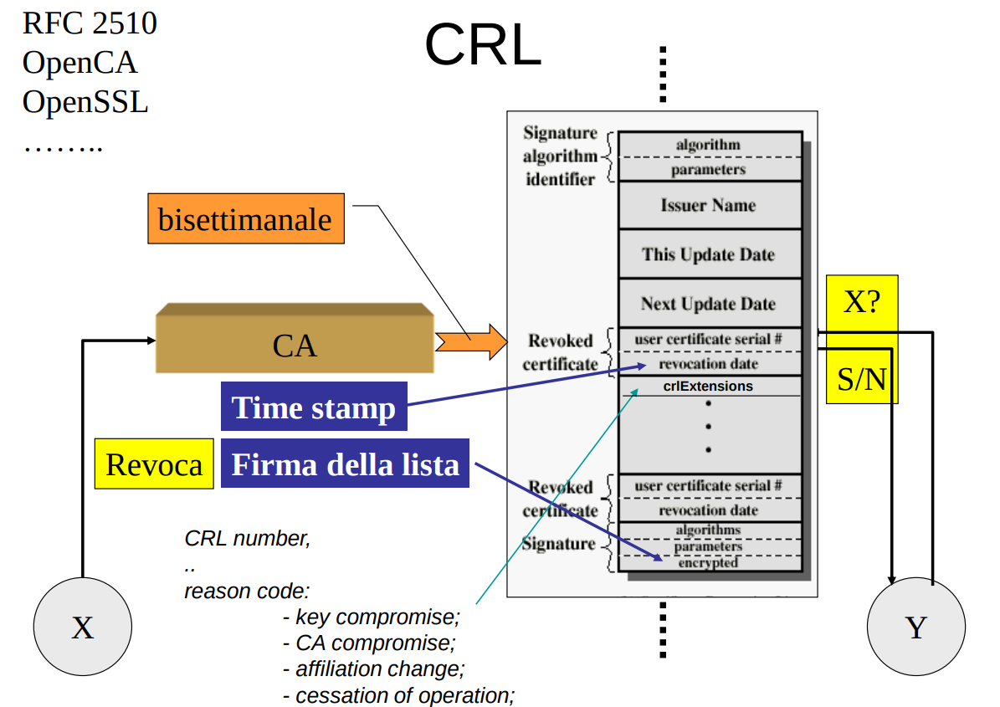
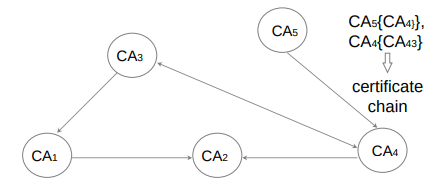

## PKI
**Utilizzando un cifrario asimmetrico, non si può prescindere dal sistema di gestione delle chiavi/certificati, che si occupa di distribuirli, aggiornarli e revocarli**. 

Il sistema consente di ottenere un certificato e pubblicare la chiave. Comprende principalmente tre entità:
- Certification authority
    - rilascia i certificati delle chiavi pubbliche, e li pubblica sul database.
- Registration authority
    - è l'entità a cui gli utenti si rivolgono per richiedere la certificazione delle chiavi, identificandosi
    - Riceve le richieste di Certificate Signing (CSR) e di Revocation (RR).
- DB (directory) 
    - registro ad accesso pubblico in cui vengono mantenuti i certificati

### Richiesta ed emissione del certificato (attività 1, 2, 3, 4) 

Supponiamo che X voglia farsi certificare una chiave di firma. 

Come prima cosa **genera un autocertificato della sua PX** (Certificate Signing Request), **per dimostrare di essere il proprietario di SX**.
- **NB**:notare che la generazione della coppia di chiavi avviene **lato utente**
    - la PKI non vede mai la chiave privata -> l'utente sarà **l'unico possessore della chiave privata**
    - questo è importante per garantire la proprietà di **non ripudio** quando questa coppia di chiavi verrà poi utilizzata
    - la RA potrà verificare che l'utente possegga la chiave privata (**POP**), verificando la firma presente nel CSR con la chiave pubblica presentata al suo interno
    - in questa maniera e con le altre informazioni identificative presentate alla RA, l'utente viene identificato 

A questo punto X fornisce a RA i suoi dati (tramite un’e-mail o una form, quando è richiesto un basso livello di sicurezza, presentandosi invece con documenti autenticati, quando il livello di sicurezza deve essere alto). 

RA verifica la firma e, in caso positivo, passa i dati a CA. CA organizza secondo lo standard i dati raccolti da RA, aggiunge quelli di sua competenza, calcola l’hash del tutto e lo firma. **Costruendo in questo modo il certificato**.

Una prima copia del certificato è consegnata a X ed una seconda al repository DB accessibile dalla rete: si noti che un database di questo tipo non richiede né controllo degli accessi, né alcuna particolare forma di protezione dei dati in memoria (contiene solo informazioni pubbliche read-only)

L’intervallo di validità del certificato è tipicamente è un anno: prima della scadenza, l’utente ne deve richiedere il rinnovo. 

... protocolli di gestione penso di potermeli anche dimenticare ...

#### POP
La CA deve avere garanzie circa il possesso della chiave privata da parte del soggetto che richiede il certificato. Rilasciare un certificato senza prova di possesso può permettere vari attacchi. 

**ES**: Bob può registrare a nome suo la stessa chiave pubblica di Alice (nessuno verifica che Bob effettivamente non ha la chiave privata di Alice), dunque Bob può dire di aver firmato un documento firmato da Alice 🡪 Alice può ripudiare la firma.  

Per questo è importante che il CSR sia firmato dal richiedente con la sua chiave privata e che la RA verifichi questa firma. In questa maniera la CA sa che il richiedente ha dimostrato la POP.

**La POP serve per tutelare la CA ed è fondamentale per garantire il non ripudio**. 

### Ripudio della chiave pubblica e revoca del suo certificato (attività 5, 6, 7, 8)
Su tutti i meccanismi basati su un segreto incombe il pericolo che qualcuno riesca o ad indovinarlo o a rubarlo.

La difesa che gli utenti devono adottare è espressa nella seguente regola.

‰R29: `quando uno ha il sospetto che la sua chiave privata sia stata violata, deve rinunciare immediatamente ad impiegarla, generarsene una nuova e farsi certificare la corrispondente chiave pubblica`

Come misura preventiva, **la CA da una periodo di validità limitato ai certificati che emette**

Il ripudio è l’azione con cui un utente, prima della scadenza, **spezza l’associazione chiave pubblica/proprietario** sancita da un certificato. 

E’ indispensabile che questo evento sia tempestivamente notificato a tutti gli altri utenti. Altrimenti gli altri utenti potrebbero, fino a quando non vengono a conoscenza del ripudio, continuano ad utilizzare il vecchio certificato che però corrisponde ad una **chiave privata compromessa**.

- La raccolta delle notifiche di ripudio è fatta dalla RA
- Alla CA compete la successiva azione di revoca del certificato.
    - La CA revoca i certificati anche spontaneamente quando scadono i periodi di validità

#### come si distribuisce agli utenti l'informazione sullo stato di revoca di un certificato?
I metodi esistenti per la notifica della revoca vengono classificati generalmente fra:
- **push**
    - effettivamente quello più utilizzato
    - gli utenti devono controllare le revoche su un DB
- **pull**
    - la CA propaga a tutti la revoca a tutti (presuppone un'infrastruttura pub/sub, difficile)

Un’ altra classificazione tra gli schemi di notifica della revoca è tra
- offline status checking
    - **Certificate Revocation List**, Certificate Revocation Tree, ...
- online status checking
    - **OCSP** (Online Certificate Status Protocol) 

I modelli più utilizzati sono pull: le Certificate Revocation List (CRL) e l’Online Certificate Status Protocol (OCSP)
- CRL: pull, sia online che offline;
- OCSP: pull, solo online.

### CRL
Per rendere noto a tutti gli altri utenti che una chiave non deve essere più usata, **CA mantiene on line una lista autenticata dei certificati revocati (CRL).**
- Chiunque è dunque così in grado di sapere se è ancora valida la chiave pubblica di chiunque altro. 
- Fino a poco tempo fa occorreva reperire la CRL (la cui posizione era indicata in un campo estensione nel certificato), scaricarla e poi interrogarla; ora alcune CA supportano query dirette (vedi OCSP dopo).

Una lista di revoca è una **struttura dati analaga ad un certificato**
- viene **firmata dalla CA** per garantirne l'autenticità
- contiene l'indicazione dei certificati revocati
- ha un periodo di validità
    - (i campi _this update date_ e _next update date_ identificano un intervallo temporale di validità della lista di revoca)
- ha delle estensioni (CRL extensions):
    - informazioni aggiuntive utili a livello applicativo, non necessariamente bisogna garantirne autenticità e integrità
    - e.g. ragione di revoca

**NB**: tutti i documenti firmati prima della data di revoca di un certificato deve essere considerati valido (la chiave privata non era ancora compromessa), e viceversa

**Tipica sequenza di operazioni**:
- La CA rilascia **periodicamente** su una Directory la CRL.
- Ogni utente scarica dalla Directory la  CRL
- Ogni utente controlla localmente lo stato del certificato per sapere se è ancora valida la chiave pubblica di un determinato soggetto (se non lo fa, la responsabilità è solo ed esclusivamente dell’utente).

**NB**: Siccome il CRL viene rilasciato periodicamente **non ho freschezza delle informazioni** (ho un transitorio in cui non ho informazioni real-time), il periodo di aggiornamento dipende dalla CA, la struttura dati è valida in un certo intervallo temporale (campi this update - next update).

vantaggi: CRL **funziona anche offline** data la validità temporale

svantaggi: non garantiscono la freschezza delle informazioni!
- Se avviene una revoca in mezzo all'intervallo di tempo, non me ne accorgo fino al prossimo rilascio
- limite: non garantisce mai freschezza in tempo reale per quanto io diminuisca l'intervallo di validità

#### Problema della dimensione delle CRL
Dato che di volta in volta la CRL cresce con l’aggiunta di nuovi certificati revocati, ci potrebbe essere un problema dal punto di vista della dimensione della CRL e quindi della dimensione delle strutture dati da scaricare. A tal proposito sono state elaborate delle soluzioni, tra cui:
- **Eliminare la revoca dopo la prima CRL successiva alla scadenza del certificato**
    - perché tanto sarebbe scaduto in ogni caso la data, dunque non serve continuare a farlo sapere

- **Pubblicare CRL complete (Base CRL) e poi solo le differenze (Delta CRL)**
    - vengono effettuati dunque degli aggiornamenti incrementali
    - abbiamo la CRL di base che rimane fissa nel tempo e poi successivamente strutture dati più piccole con i soli nuovi certificati revocati, senza ripetere quelli precedenti.
    -  Chi scarica periodicamente, scarica solo gli aggiornamenti incrementali.

- **Partizionare le CRL in vari gruppi**
    - (es. per ogni mille certificati emessi, per motivo di revoca, ...) CRLDP (Distribution Point)
    - imposto un **criterio di partizionamento dei certificati** e li suddivido in partizioni
        -  Un esempio di parametro sul quale basare il partizionamento è quello del **certificate serial number** (da 0 a 1000 in questo CRLDP, da 1000 a 2000 in quest’altro, ...).
    - la CA dovrà quindi fare N firme 🡪 incremento overhead ma non è un grosso problema.
    - Chi scarica sa in quale partizione potrebbe trovarsi la revoca di una certa X. 

**NB**: il campo estensioni della CRL mi può dire se una determinata CRL è una delta CRL, base CRL, sotto lista, ecc... 

#### Ragionamenti sulle tre soluzioni (importanti per l’esame):
- **La prima soluzione ha un problema**
    - se un utente vuole sapere se il certificato X è stato revocato **sarà costretto a scaricare progressivamente tutte le revoche** (dimensioni download molto grandi) finché non trova una corrispondenza o finché non scopre che il certificato non è stato revocato.
    - È dunque molto oneroso per l’utente.
    - La CA deve mantenere poi tutte le CRL -> costoso anche per la CA

- Nella seconda soluzione diminuisco il costo di trasmissione (se sono fortunato scarico solo una o qualche Delta CRL, non sempre tutte), ma non i costi di memorizzazione e ricerca del certificato.
    - Con il meccanismo delle Delta CRL la Base CRL, nel campo estensioni, avrà il link per la Delta CRL successiva e così via per ogni altra Delta CRL.
    - Questa **soluzione è onerosa** in quanto, come la precedente, è necessario per l’utente **ricostruire l’intera CRL** per avere un quadro completo e vedere se il certificato d’interesse è stato revocato o meno.

- **La terza soluzione è quella più usata**.
    - Si divide la CRL in più blocchi, partizioni.
    - **Come fa l'utente finale a sapere quale partizione deve scaricare con il certificato che gli interessa?**
    - L’utente che vuole verificare lo stato di un certificato **controlla il campo estensioni del certificato stesso** per verificare il valore del campo CRLDP.
        - la CA quando emette il certificato per la prima volta mette dentro al campo estensione l'URL (link) della partizione di revoca che eventualmente verrà usata.
        - Si tratterà di una CRL molto piccola in confronto a quella che si avrebbe non partizionando.
        - Le partizioni sono talmente piccole da poter considerare questa come la soluzione migliore.

### OCSP
Le CRL vengono emesse con una data cadenza. Fra l’emissione di una CRL e la successiva capita che siano revocati altri certificati, dunque per un periodo è possibile che l’utente non ottenga informazioni aggiornate sulla revoca di un certificato. 
- problema della freschezza

Un rimedio a questo problema è dato dal protocollo OCSP (Online Certificate Status Protocol), mediante il quale l’utente può avere **informazioni in tempo reale circa lo stato di revoca di un certificato grazie ad un server sempre online**. 

OCSP È un protocollo “client-server” in modalità “pull” che **funziona solo online** (al contrario delle CRL che una volta scaricate possono essere consultate offline). 
- data una richiesta mi risponde con lo stato di revoca di un certificato
- OCSP attinge informazioni dalle CRL ma non solo!
    - magari chiede direttamente anche ad una CA (che riceve le richieste di revoca)
- **Le risposte sono firmate dal server, non dalla CA!**
- Il server OCSP avrà una coppia di chiavi certificata da una CA. 
- Il certificato del server non è verificabile con OCSP

OCSP viene quindi usato principalmente per due motivi:
- Freschezza delle informazioni;
- Un utente non si deve scaricare l'intera CRL ma solo l'informazione sullo stato di revoca del certificato richiesto.

### La Gerarchia delle autorità di certificazione
Non possiamo pensare che tutti gli utenti con cui si vuole comunicare appartengano sempre allo stesso dominio di certificazione: spesso appartengono a domini di certificazione diversi.

**Come fidarsi di un utente per il quale ad emettere un certificato è stata una CA diversa dalla propria?**

Lo standard X.509 prevede una **gerarchia di Autorità**.

quando un utente si registra presso una CA
- sicuramente nel certificato che riceve è contenuta la chiave pubblica della CA in cui si è registrato
- inoltre, ottiene anche le chiavi pubbliche di altre CA, della quali la CA presso cui si è registrato si fida
- in particolare, assumiamo che un utente **oltre alla chiave pubblica della sua CA abbia anche la chiave pubblica della ROOT CA del suo dominio**
    - in questa maniera, un utente può cercare certificati di altre CA partendo dalla radice

Bisogna costruire il cosiddetto **cammino di fiducia**.
- l'idea è quella di **trasferire la fiducia**: se io mi fido della mia CA, e la mia CA si fida della CA di un altro, allora io mi fido automaticamente anche della CA di questo qualcun'altro

**Esempio | Modello distribuito**:

- L'utente A invia un messaggio all'utente B 
    - firmato con la sua chiave privata e in allegato il suo certificato. 
- Il certificato di B è stato rilasciato dall'autorità di certificazione CA5, quello di A da CA3.
- L'utente B vuole essere sicuro di potersi fidare del certificato che CA3 ha emesso per A e cerca dunque quali entità hanno emesso un certificato per la chiave pubblica di CA3.
    - Trova CA4;
- Adesso deve trovare quali entità si fidano di CA4 e trova proprio CA5, ovvero la sua CA.
    - Il cammino di fiducia è stato trovato, quindi B si può fidare di A.
- Il contrario non è possibile in quanto non esiste un percorso di fiducia che permetta di raggiungere CA5.

The certification path discovery problem is as follows: 
-  need to find a certification path between a particular remote user’s public key and any one of the **set of root public key** that I already know securely
- given: 
    - a CA’s name
    - a service to retrieve certificates for that CA’s public key issued by other CAs
        - di nuovo, le **estensioni** di un certificato mi possono aiutare a trovare chi certifica la CA che mi ha certificato una chiave pubblica
- it is possible to find a certification path by **working back progressively from the target user’s certificate toward a root key**

Il protocollo di **ricerca del percorso di fiducia** (certification path discovery), è articolato come segue:
- Abbiamo un certificato rilasciato dall'entità CAx (rilasciato da qualcuno con cui vogliamo comunicare che è **al di fuori del nostro dominio di fiducia**). 
- Troviamo quali entità hanno rilasciato un certificato per la chiave di CAx.
- Se fra le entità c'è una root authority allora abbiamo trovato il percorso (CAx è fidata).
    - (nel caso di modello centralizzato, dove un nodo radice certifica tutti i nodi sottostanti, e così via nell’albero…).  
- Se non c'è ripetiamo il passo 1 per ognuna delle entità trovate e continuiamo fino ad ottenere il percorso di fiducia.

Dato un percorso di fiducia (non sempre si riesce a trovare), il prossimo step è la **validazione del percorso di fiducia**:
- **verifying the digital signature on each certificate**;
- checking that the names in the certificates are consistent with a valid certification path
    - that is, **the subject of every certificate is the issuer of the next certificate**;
- checking that the validity periods of all certificates correctly span the time for which validity is being checked;
- **checking that each certificate has not been revoked**.  

In generale il modello di fiducia potrebbe essere centralizzato o distribuito. 

#### Modello di fiducia centralizzato
**si hanno delle strutture gerarchiche**: 
- una CA radice che certifica le CA sottostanti
- I nodi foglia sono gli utenti finali.

Con un tale modello
- è facile costruire un cammino di certificazione tra due utenti finali (a cui basta rivolgersi solamente alle proprie CA): basta arrivare fino alla radice e poi riscendere fino alla CA di interesse.
- Garantisce buone caratteristiche di scalabilità e permette di trovare cammini abbastanza corti
 
**Un fattore che complica pesantemente questo modello è la fiducia**. 
- Dal punto di vista organizzativo questa struttura è possibile se e solo se queste CA (tutte) riconoscono il modello.
- La ROOT si assume una responsabilità significativa, in quanto se compromessa la ROOT può essere compromesso tutto.
- la catena di certificati potrebbe essere molto lunga

Dunque, sebbene sia un modello più semplice da realizzare, non è detto che sia praticamente possibile da realizzare. Da questo problema si arriva ai **“cross-certificates”**
- un cross-certificate è un certificato che certifica un'altra CA
- aggiungono link addizionali arbitrari tra CA
- accorciano la catena dei certificati

#### Modello di fiducia decentralizzato
... in pratica uguale a quello centralizzato ma meno strutturato
- posso avere più root CA che hanno cross-certificates tra di loro

Chiedi a Piè ma non penso sia importante

### Conclusioni
alla base di un qualsiasi cifrario asimmetrico vi è per forza dietro una PKI
- fondamentale, altrimenti le chiavi pubbliche non sono dotate di autenticità
- (in realtà, esistono anche altre tecnologie alternative che permettono di fornire di autenticità le chiavi pubbliche (PGP))

Quand'è che un prodotto commerciale si può considerare una infrastruttura a chiave pubblica?
- fa tutte le cose che ci sono in slide 35

Il certificato (l'intera struttura dati) è salvata all'interno del DB. Chi fa da ente certificatore si assume le responsabilità civili e penali sulla distribuzione e gestione delle chiavi: 
- **ciò che esso distribuisce ha validità legale**.