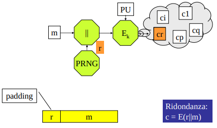

### generalità
In un Cifrario asimmetrico si deve cifrare il testo in chiaro con la chiave pubblica del destinatario; la corrispondente chiave privata serve per decifrare

I Cifrari asimmetrici a blocchi devono suddividere i bit della stringa che rappresenta un messaggio M in blocchi, **atti ciascuno a rappresentare un numero binario intero minore del modulo n**, un grande numero primo o composto, impiegato nelle operazioni della aritmetica modulare a cui verranno sottoposti i blocchi.
- **NB**: qua la cosa importante è la frammentazione. Siccome ad un unico testo in chiaro deve corrispondere uno e un solo testo cifrato, le operazioni modulari devono essere fatte su dei numeri minori di n -> frammentazione

La funzione E **trasforma un blocco dietro l’altro** generando, di volta in volta **testi cifrati corrispondenti a numeri minori di n** (sempre a causa delle operazioni modulo n).

Con queste ipotesi, la funzione D è in grado di ripristinare **in modo univoco** (blocchi cifrati < n, il modulo) il testo in chiaro di ogni blocco.

Al termine i blocchi vengono affiancati per restituire M. 

Esistono anche cifrari asimmetrici a flusso... ma non ci interessano

**NB**: noi facciamo solo RSA e non ci preoccupiamo degli algoritmi basati sulle curve ellittiche (algoritmi asimmetrici con le prestazioni migliori) 

**NB**: un Cifrario asimmetrico è almeno mille volte più lento di un Cifrario simmetrico ed è quindi fortemente auspicabile impiegarlo con messaggi “corti”.
- perchè?
    - dobbiamo fare delle esponenziazioni modulari!
    - nel caso simmetrico devo fare solo trasposizioni e sostituzioni (con xor) 
- Ciò non ne limita l’utilità, dato che il suo uso tipico è la comunicazione della chiave di un Cifrario simmetrico (vedi cifrario ibrido)
    - cioè di qualche centinaia di bit a fronte delle migliaia di bit che devono rappresentare il modulo. 

### Cifrari asimmetrici deterministici e probabilistici
Un Cifrario asimmetrico è detto
- **deterministico** se, una volta fissati la chiave di cifratura ed il testo in chiaro, il testo cifrato è unico,
- **probabilistico** se, a parità di chiave e di testo in chiaro, il testo cifrato è scelto di volta in volta tra molti possibili da un **numero generato a caso** durante il processo di cifratura.
    - il testo cifrato viene 'scelto tra molti possibili' in senso lato. Non è che si sceglie da una pool di testi cifrati esplicitamente; piuttosto, in base al numero casuale prodotto, viene generato un cifrato distinto
    - considerando tutti i numeri casuali possibili, si delinea questo pool immaginario di cifrati
    - va notato che l'algoritmo di cifratura è deterministico nel senso che fissati: chiave, plaintext e numero casuale, produrrà sempre lo stato cifrato; è probabilistico però dato che il numero casuale scelto è imprevedibile. 

E’ giusto chiedersi subito se sono “migliori” i primi od i secondi.  
- Se si considera la sola **efficienza** potrebbero sembrare migliori i Cifrari **deterministici**. 
    - Per consentire una corretta decifrazione, i Cifrari probabilistici devono, infatti, cifrare e decifrare una stringa più lunga di quella del messaggio, dato che il testo cifrato deve **contenere anche il valore del numero a caso impiegato durante la cifratura**.
- Se si mette invece in conto anche la **sicurezza** sono di gran lunga da preferire i Cifrari **probabilistici**.
    - I Cifrari deterministici operano, infatti, una sostituzione monoalfabetica ed hanno la seguente vulnerabilità (**ricorda ECB**): `testi in chiaro identici generano testi cifrato identici`
    - La **non segretezza della chiave pubblica** (che mi serve per cifrare) consente inoltre a chiunque di fare agevolmente **attacchi con testo in chiaro noto**. 
    - i cifrari a blocchi deterministici risultano anche **malleabili** e permettono attacchi di **sostituzione dei blocchi** (di nuovo, ricorda ECB) 

**ESEMPIO**: In un referendum bisogna rispondere o SI, o NO ed inviare il proprio voto cifrato con la chiave pubblica dell’Ente che eseguirà lo scrutinio. Se il Cifrario è deterministico, chi intercetta un testo cifrato riesce a violare la segretezza e l’anonimità del voto: gli **basta cifrare le due possibili risposte**.

Per eliminare questi punti deboli, il Cifrario deterministico deve essere “randomizzato”.
- Se il **messaggio è più lungo del modulo, si impiega tipicamente la modalità CBC ed un IV casuale**.
- Se il **messaggio è più corto del modulo**, ed è questo il caso di maggiore interesse (chiavi), il mittente, seguendo uno standard ben preciso indicatogli dal destinatario, gli **dispone in testa un padding contenente un numero a caso e poi cifra il tutto**.
    - Il destinatario decifra, controlla il formato del padding, e, se tutto va bene, trattiene il solo messaggio. 

## RSA
RSA, il primo Cifrario asimmetrico ad essere stato individuato (1978), **è deterministico**, **opera a blocchi** ed è universalmente considerato sicuro.

### L’algoritmo E
La trasformazione operata sul testo in chiaro m è l’esponenziazione modulare:
- `c = m^e mod n`
- **NB**: Per la decifrabilità di RSA, **ad ogni testo cifrato deve corrispondere un solo testo in chiaro**. Per garantire questa proprietà, m < n ed _e_ deve rispettare determinate caratteristiche (teoria dei numeri)

ove _n=p*q_ è il prodotto di due distinti numeri primi _p_ e _q_ ed _e_ è coprimo con _Φ(n)=(p-1)*(q-1)_
- **i numeri _e_ ed _n_ formano la chiave pubblica del destinatario** 
- Per l'esecuzione dell'esponenziazione si ricorre usualmente a **repeated square-and-multiply**

### L'algoritmo D
L’operazione inversa della cifratura RSA è l’estrazione della radice e-esima modulo n del testo cifrato c. Questo però è un problema difficile il cui calcolo è computazionalmente infattibile se n (dimensione del modulo e quindi della) è formato da almeno qualche migliaio di bit.

Il destinatario del messaggio riservato, cioè chi ha generato la chiave pubblica P, dispone di una **trapdoor**: la chiave privata.

Sia **S = {d, n} la sua chiave privata**, con _d = e^-1 mod Φ(n)_ **inverso moltiplicativo di e** modulo Φ(n) ( (d*e)%phi = 1 ). Per ottenere il testo in chiaro gli è sufficiente eseguire un’ulteriore esponenziazione 
- si ha, infatti: `c^d mod n = (m^e)^d mod n = m^(e*d) mod n = m`
- (non preoccuparti troppo della dimostrazione matematica, ci sono varie ipotesi e teoremi dietro che non ti devono interessare)

###  L’algoritmo G
Generazione delle chiavi di RSA:
1. si generano a caso due grandi numeri primi p, q di circa egual dimensione
2. si calcola n = p × q
3. si calcola Φ(n) = (p-1)(q-1)
4. si sceglie un intero e, 1 < e < Φ(n), tale che MCD(Φ(n), e) = 1
5. si calcola d = e^-1 mod Φ(n)
6. si rende di dominio pubblico la chiave {e, n}
7. si impiega come privata la chiave {d, n}

**NB**: se rendo pubblici anche p e q, un attaccante riesce a calcolare phi, e di conseguenza riesce a calcolare la chiave privata d
- **è importante nascondere anche p e q oltre a d!** Non a caso dopo la generazione della coppia di chiavi solitamente vengono distrutti 

## Robustezza di RSA
RSA è un **Cifrario deterministico**
- ha quindi la vulnerabilità che a blocchi identici di testo in chiaro corrispondono blocchi identici di testo cifrato (vedi attacchi citati sopra) 

La contromisura è quella di rendere RSA probabilistico. A questo scopo si utilizza del **padding** randomico inserito nel plaintext secondo lo standard **OAEP (Optimal Asymmetric Encryption Padding)**
- non ci interessa come è fatto ma dobbiamo utilizzare provider che lo implementano

### Attacco con proprietà moltiplicativa
RSA può essere rotto con un attacco “con testo cifrato scelto”. 

In questo contesto si suppone che **l’intruso possa richiedere al proprietario della chiave privata la decifrazione di qualsiasi messaggio di sua scelta, ad esclusione del messaggio c di suo interesse**.

L’attacco si basa sulla **proprietà moltiplicativa di RSA**.
- Consideriamo un messaggio m = m1 × m2.
- La sua cifratura è: `c = m^e mod n = ((m1^e mod n) × (m2^e mod n)) mod n`
- **La cifratura del prodotto di due messaggi è uguale al prodotto dei due testi cifrati.**
- Analogamente, si ha che **la decifrazione di un testo cifrato ottenuto moltiplicando due testi cifrati è uguale al prodotto dei due corrispondenti testi in chiaro**

Un intruso che ha intercettato un cifrato c di cui vuole scoprire il plaintext m
- può generare un numero a caso r
- costruire c1 = c × r^e (**prodotto di due cifrati**)
- calcolare m2 = r^-1
- ottenere dal proprietario la decifrazione m1 di c1 
    - **m1 = m * r**
- e moltiplicare infine m1 e m2
    - m1 * m2 = m * r * r^-1 = m

**Pur non avendo inviato c, l’intruso ha così ottenuto la decifrazione che gli interessa!** 
- questo perchè il destinatario ha decifrato per lui il prodotto dei due plaintext

Contromisure:
- difficile però che l'intrusore riesca a convincere il proprietario a decifrare qualsiasi messaggio di sua scelta
    - sopratutto se si ha identificazione
- (se si usa padding (OAEP) la proprietà moltiplicativa non penso valga più)

## Aspetti computazionali di RSA

### Come facciamo ad ottimizzare l'esponenziazione modulare?
Algoritmi di teoria dei numeri non sono da sapere per filo e per segno. Tuttavia è importante sapere quali sono gli algoritmi che rendono più efficiente per l'eseponenziazione modulare. 
- Perchè?
- **Nelle implementazioni i vari provider possono utilizzare algoritmi diversi, è desiderabile utilizzare quello più efficiente**.

Nel caso di RSA, il tempo di esponenziazione modulare scala con il cubo della dimensione in bit della chiave (1024 -> 2048 -> 8 volte il tempo)
- è desiderabile usare l'algoritmo più efficente possibile per questo calcolo
    - Repeated square and multiply per cifratura
    - Algoritmo di Garner per decifratura
        - 4 volte più veloce rispetto a repeated square and multiply -> da tenere a mente nei provider
        - richiede però di mantenere in memoria i numeri primi p e q generatori di n che dal punto di vista della robustezza sarebbe meglio eliminare dopo avere ottenuto n 

**NB**: per l’inviolabilità del Cifrario asimmetrico le chiavi devono essere molto lunghe, ma questo rende poi molto onerosi i calcoli di cifratura e di decifrazione; **bisogna quindi non esagerare mai nel dimensionamento delle chiavi**.  

### Come facciamo a generare dei numeri primi molto grandi?
Non è facile generare dei numeri primi 

algoritmi deterministici -> esponenziali
algoritmi probabilistici -> polimoniali ma vanno ripetuti

L'ottimizzazione della generazione dei numeri primi è comunque meno interessante rispetto all'ottimizzazione dell'esponenziazione modulare in quanto la generazione delle chiavi si fa una volta ogni tanto. La cifratura/decifratura si fa spesso

**conclusione**: insomma, la crittografia asimmetrica è sicuramente meno efficiente computazionalmente rispetto a quella simmetrica (devo generare i numeri primi, esponenziazioni modulari, ecc...)

**conclusione 2**: bisogna controllare che il provider che si sta utilizzando impieghi parametri opportuni per efficienza computazionale e contromisure per vari attacchi ad RSA

### Cifrario ibrido
nuovo modello per la distribuzione di una chiave simmetrica che si aggiunge a KDC, DH, ecc.

Due utenti che non hanno avuto in precedenza alcun accordo segreto possono comunicare in modo riservato impiegando dapprima lo scambio DH per arrivare a condividere il valore di una chiave segreta ed usandola poi con un Cifrario simmetrico per cifrare e decifrare i loro messaggi.

**Al posto dello scambio DH, si può usare un Cifrario asimmetrico**. In questo caso si parla di **Cifrario ibrido**, dato che si devono impiegare due Cifrari di tipo diverso.

Supponiamo che un X debba mandare un messaggio riservato m ad un U, di cui conosce con sicurezza (tipicamente mediante un Certificato) la chiave pubblica PU ed il Cifrario asimmetrico CA per cui è stata generata:
- CA sarà dunque il Cifrario che X e U impiegheranno, il primo per cifrare, il secondo per decifrare la chiave di sessione.

Sia infine CS il Cifrario simmetrico che X decide di impiegare per cifrare i vari m:
- sarà sua cura comunicare tale scelta a U insieme alla chiave di sessione.

In questo contesto X
1. sceglie a caso una chiave one-time k,
2. calcola E_PU(k||CS) con CA,
3. calcola Ek(m) con CS,
4. invia il messaggio EPU(k||CS) || Ek(m).

A sua volta, U
1. separa le due parti,
2. usa CA per calcolare D_SU(EPU(k||CS)) e venire così a conoscenza di CS e di k,
3. calcola Dk(Ek(m)) = m con CS. 

**NB**: Si noti la **similitudine tra questo schema e quello della master key**. In entrambi i casi esiste una chiave che cifra chiavi. C’è però una **grossa differenza**: in questo caso la chiave che cifra chiavi (PU) è unica per tutti i corrispondenti di U e può essere loro comunicata senza alcuna forma di riservatezza.  

Esiste però una vulnerabilità dei Cifrari asimmetrici, se li si per **cifrare messaggi molto più corti del modulo _n_**: i crittogrammi generati ricadrebbero sempre, infatti, in uno spazio più piccolo di quello a disposizione e ciò renderebbe più agevole il lavoro di crittanalisi (?).
- attacco di forza bruta facilitato

**Prima di cifrare la chiave di sessione, occorre dunque affiancarle un padding casuale** che porti la lunghezza complessiva a ⎣log2 n⎦ (un bit in meno di n). Se si usa RSA, lo standard **OAEP** di PKCS#1v2 (v. pag. 103) è idoneo allo scopo.