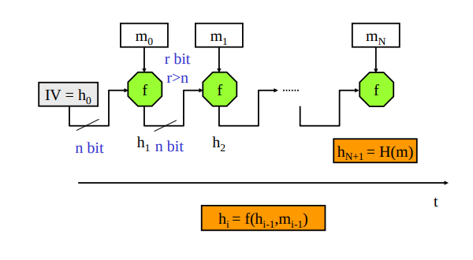
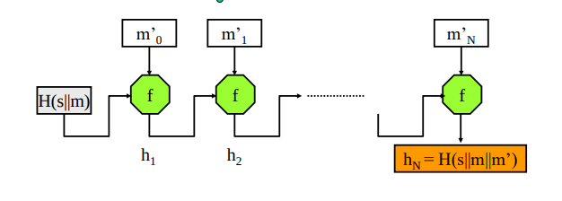

### Funzioni di Hash e algoritmi 
Una seconda primitiva crittografica (dopo gli RNG) è la funzione hash sicura, chiamata in causa in moltissimi meccanismi e servizi.

Gli algoritmi che la realizzano devono in generale presentare le seguenti quattro proprietà:
- **efficienza**: “il calcolo di H(x) è computazionalmente facile per ogni x”.
- **robustezza debole alle collisioni**: “per ogni x è infattibile trovare un y ≠ x tale che H(y) = H(x)”.
    - l'input non lo decide l'attaccante ed è fisso -> complessità O(2^n)
- **resistenza forte alle collisioni**: “è infattibile trovare una qualsiasi coppia x, y tale che H(y) = H(x)”.
    - l'input lo decide l'attaccante    -> complessità O(2^(n/2)) -> vedi paradosso del compleanno 
        - (data una persona trovarne un altra con lo stesso compleanno in un gruppo è difficile; ma dato un gruppo, trovare due persone con lo stesso compleanno è molto meno difficile)
- **unidirezionalità**: “per ogni h è infattibile trovare un x tale che H(x) = h”.
    - importante perchè **permette di fare una sorta di cifratura senza chiave**
    - L’impossibilità di inversione è richiesta alle funzioni hash, **quando sono impiegate per proteggere la segretezza di un dato di cui è resa nota la sola impronta**. 
        - Un caso tipico si ha quando un messaggio in chiaro m è autenticato da H(m||s), se si potesse invertire la funzione si potrebbe risalire (già che conosco m) al segreto.
    - Il più efficace algoritmo di inversione deve dunque avere complessità esponenziale O(exp(n)).

### Funzione a Stadi
Le funzioni di hash seguono un'implementazione con schema di **compressione iterata** per comprimere stringhe arbitrariamente lunghe
- il messaggio viene suddiviso in tanti **blocchi di dimensione fissa** pari a r bit
- la funzione di hash è formata da una pipeline di tanti stadi di compressione
- all'interno di ogni stadi vi è una mini-funzione di hash _f_ che calcola il suo hash prendendo gli _r_ bit del suo blocco dati e gli *__n* bit dell'hash dello stadio precedente__
    - n == dimensione dell'hash < r == dimensione del blocco
    - le funzioni di hash di ogni stadi rispettano le proprietà descritte sopra per formare una funzione di hash totale che le rispetta a sua volta
    - il primo stadio ha come 'hash dello stadio precedente' una costante che fa da **vettore di inizializzazione**
- **NB**: Se l’ultimo blocco del messaggio m è più piccolo di r bit lo si completa con un **padding**.
    - **Il padding è fondamentale per evitare attacchi con estensione del messaggio**.
        - In SHA-1 è costituito da un bit a 1 seguito da un numero di bit a 0 e infine un numero binario che indica la lunghezza originaria del messaggio m.
    - per questo motivo, **viene introdotto in ogni caso**, anche se il messaggio è già multiplo dei blocchi.

L’uscita dell’ultimo blocco è l’impronta del messaggio. 

### Attacco con estensione del messaggio
E’ interessante prendere subito nota che il precisare la lunghezza del messaggio nell’ultimo blocco è un’indispensabile “patch” per una vulnerabilità presente in tutti gli algoritmi a compressione iterata.
 
Consideriamo una sorgente che, dopo aver concordato un segreto s con la destinazione, le invia un messaggio m ed il suo MAC H(s||m), **calcolato però senza aver aggiunto alla fine di m l’indicazione di quanto è lungo.**
 
L’intruso può in questo caso condurre un attacco di length extension:
- individua un’estensione m’ di m di suo interesse (forma cioè un messaggio m||m’) e calcola H(m’),
    - **ponendo attenzione a fornire all’algoritmo come stato iniziale non la costante h0, ma il dato H(s||m) che ha intercettato**.
    - non devo neanche conoscere lo stato iniziale
- L’impronta H(m’) così ottenuta è **per costruzione uguale a quella di H(s||(m||m’))** e quindi **il messaggio forgiato dall’intruso sarà giudicato dalla destinazione come generato dalla sorgente (autentico e integro)**.
- la destinazione è convinta che il mittente abbia mandato m||m' e non m

Lo standard d’inserire la lunghezza del messaggio in coda al messaggio rende questo attacco più difficile, ma **non impossibile** (c'è un padding prima dell'estensione, e uno dopo, ma il padding prima dell'estensione potrebbe essere considerato come parte con un  significato del messaggio).
- facendo un doppio hash come in HMAC questa vulnerabilità scompare (da quello che si sà fino ad adesso) 

**NB**: costruire il MAC facendo l'hash di S||m permette l'attacco di estensione del messaggio. Se si usa m||S l'attacco non è possibile. 

### Attacco in mancanza di resistenza debole
Per parare l’attacco con estensione del messaggio, si potrebbe pensare di invertire la posizione di s e di m all’interno del MAC, ma se per l’algoritmo di hash non vale la resistenza debole questo non aiuta.

Supponiamo dunque che l’intruso possa trovare un messaggio m* in collisione con m.
- H(m*) = H(m)

Con questa ipotesi si ha anche che H(m||s) = H(m*||s):
- se il segreto è allineato con la dimensione del blocco
- lo stato interno raggiunto dall’algoritmo H dopo la compressione delle prime componenti è, infatti, lo stesso e l’uguaglianza non si modificherà con la successiva compressione di s, qualsiasi esso sia.

In conclusione all’intruso è sufficiente **inviare il messaggio m*||H(m||s)** per spacciarsi per uno dei due corrispondenti in quanto il MAC risulterà lo stesso.
- l'attaccante **non ha bisogno di conoscere il segreto**
- vale anche se si utilizza la firma come autenticatore S(H(m))

**Senza resistenza debole un autenticatore di un messaggio potrebbe autenticarne un altro fabbricato da un attaccante!** (se il segreto è allineato con la dimensione del blocco)

### Attacco in mancanza di resistenza forte nella firma digitale (paradosso del compleanno)
La resistenza alle collisioni forte (che include anche quella debole) garantiscono che sia infattibile trovare due messaggi con lo stesso hash.

Se valgono, **l'hash identifica univocamente un messaggio m** (non a caso l'hash si chiama anche impronta del messaggio).
- nessuno può dire che il messaggio non era quello inviato/ricevuto

Nella firma digitale è necessaria la resistenza forte oltre la debole, altrimenti un malintenzionato potrebbe riuscire a trovare una coppia di contratti che producono la stessa impronta: potrà eludere le vittime facendo firmare un contratto ad una delle due parti su un messaggio m a loro favorevole, per poi in futuro spacciare l’attestato di una variante m’ (favorevole ora all’intrusore) come firmata da loro, dato che c’è collisione.

Se vale resistenza forte trovare il messaggio m' con la stessa impronta di m diventa infattibile. Con la firma di H(m) si ottiene:
- individuazione di modifiche a m e/o a c apportate dall’intruso
- S non può sostenere di aver inviato m* e non m
- D non può sostenere di aver ricevuto da S un m* da lui inventato

### Quanti bit deve avere un hash per essere sicuro?
(i passaggi possono essere saltati)

Come detto all'inizio, una funzione di hash viene considerata sicura se è resistenti alle collisioni, sia debolmente che fortemente.

- la probabilità di collisione scala con O(2^n) e quindi per garantire la resistenza debole mi bastano 128 bit
    - bastano anche per la resistenza forte?

paradosso del compleanno (non sto fissando il giorno) <-> resistenza forte (non sto fissando l'hash)
- è molto più facile attaccare la resistenza forte!

**NB**: per la resistenza forte il numero di tentativi scala come O(2^(n/2)) -> l'impronta deve essere almeno 256 bit 