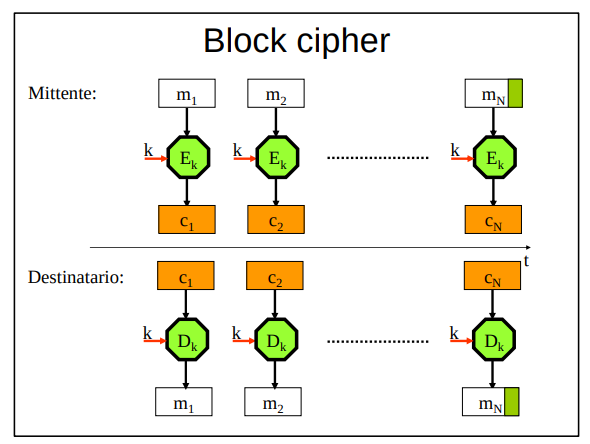
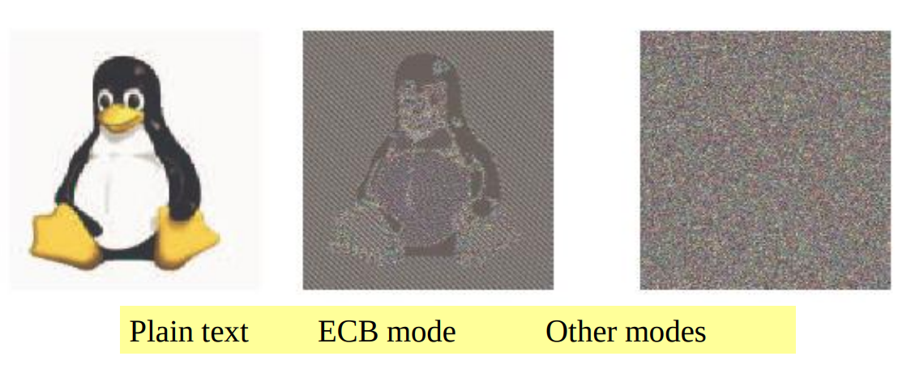
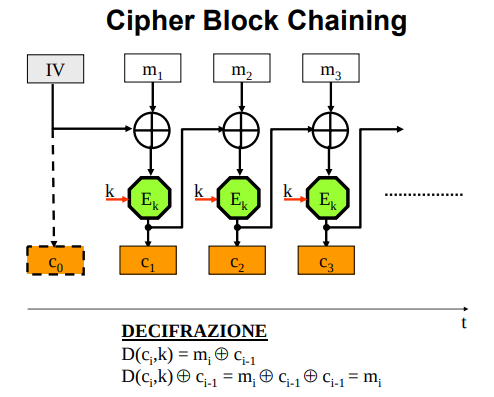
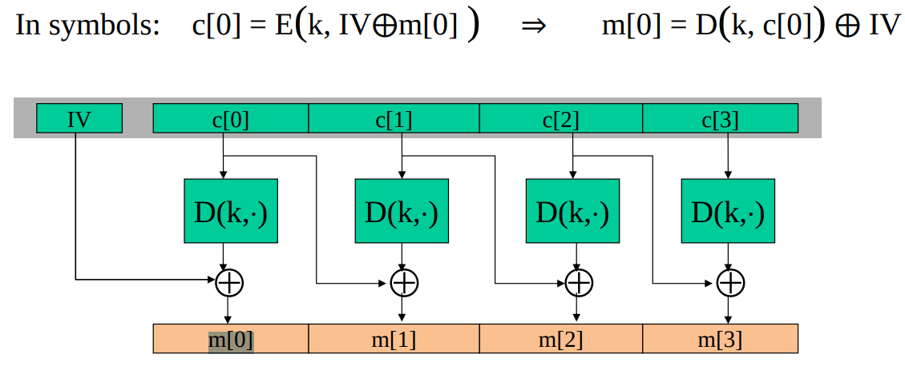
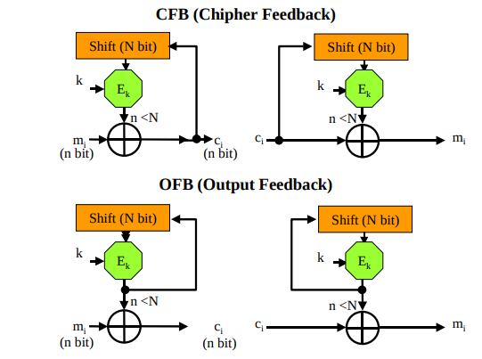
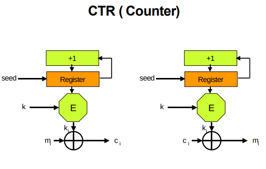

I cifrari a blocchi cifrano **blocchi di dimensione predefinita** e non singoli bit alla volta.
- Il testo da cifrare viene suddiviso in blocchi m1, m2, .., mN di lunghezza prefissata L.
- **Se la lunghezza del testo in chiaro non è un multiplo intero della lunghezza del blocco**, il mittente aggiunge all’ultimo blocco simboli di riempimento privi di significato (**padding**).
    - In realtà il padding a volte è presente in ogni caso (anche un intero blocco di padding)
    - Sono in uso diversi standard per consentire alla macchina del destinatario di **eliminare automaticamente i bit di padding** aggiunti dalla macchina del mittente (non ci interessano)

La regola di trasformazione dei blocchi, fissata dalla chiave k, è una sostituzione monoalfabetica, ma la grossa dimensione dei blocchi la rende immune da un attacco con statistiche (???).
- questo paragrafo è strano
- penso stia considerando come simbolo dell'alfabeto un'istanza di un blocco di cui ce ne sono 2^256

La chiave è la sempre la stessa per ogni blocco
- un blocco di bit viene sostituito con sempre lo stesso altro blocco di bit

**rete di Feistel**
garantisce confusione e diffusione mediante vari round che applicano sostituzione e trasposizione
- spezzo il testo in due metà, che scambio al livello di sotto e di cui cifro solo una delle due metà

A noi interessa lo standard attuale: **AES**
- non adotta il modello di Feistel ma adotto anche lui sostituzione e trasposizione

## Modalità di cifratura (parte che interessa di più!)

**LA MONTANARI CHIEDE GLI SCHEMI DELLE MODALITÀ DI CIFRATURA!!!**

### ECB
La cifratura di un solo blocco di bit alla volta, evidenziata sopra, è detta modalità ECB (Electronic Code Book mode), ha il pregio della non propagazione degli errori, ma ha anche una pericolosa vulnerabilità: `blocchi identici di testo in chiaro producono blocchi identici di testo cifrato`.
- è una sostituzione monoalfabetica in questo senso
- **manca la proprietà di diffusione**
    - ogni simbolo del testo in chiaro deve influire su tutto il cifrato. In ECB un simbolo del plaintext influisce solamente nel blocco del ciphertext

Questa proprietà risulta evidente quando si cifrano immagini: 
- **le regolarità del plaintext rimangono presenti nel ciphertext**

ECB risulta di conseguenza **malleabile** (modifiche al testo cifrato possono produrre effetti prevedibili al testo in chiaro)
- in particolare è facile fare un attacco di **sostituzione di blocchi**

#### esempio malleabilità ECB
Supponiamo che due banche A e B trasferiscano fondi con messaggi cifrati di **formato fisso** e che l’intruso sappia **in quali blocchi è comunicato il n° del conto corrente di destinazione**. Se l’intruso è in grado di svolgere attacchi passivi ed attivi può diventare ricco.

Come prima cosa apre un conto presso A, uno presso B ed ordina ad A di trasferire un po’ di danaro sul suo conto presso B. A questo punto intercetta il messaggio, **prende nota della cifratura del blocco contenente il suo n° di conto corrente e lo sostituisce poi a quello contenuto in tutti gli ordini di trasferimento emessi successivamente da A**. 
- NB: questo funziona se A e B cifrano sempre con la stessa chiave! -> Motivo in più per cambiare spesso le chiavi
- In generale posso sostituire/cambiare blocchi solo se cifrati con la stessa chiave. Altrimenti destinazione decifra dati insensati 

#### conclusioni ECB
Pro:
- Alto parallelismo: i blocchi sono tra loro indipendenti e quindi possono venire cifrati in parallelo 
- Non propagazione degli errori.
Contro:
- Preserva le regolarità (malleabile): a blocchi identici di testo in chiaro corrispondono blocchi identici di testo cifrato.

**ECB lo possiamo usare (in quanto efficente)**
- per cifrare un testo che risiede interamente in un solo blocco 
    - per esempio, ottimo per cifrare un chiave
- o se ho un messaggio totalmente non strutturato.

Il suo diffetto principale è che **ogni blocco cifrato dipende esclusivamente dal corrispondente blocco di testo in chiaro e dalla chiave**.
- quindi se ho lo stesso blocco di testo in chiaro (la chiave è per forza la stessa) ottengo lo stesso blocco di testo cifrato (centesima volta che lo ripeto ma meglio essere espliciti) 
- e per lo stesso motivo non ho diffusione il che rende suscettibili ad attacchi di malleabilità.

Un buon cifrario simmetrico dovrebbe:
- produrre ciphertext diversi anche partendo da plaintext identici
- mascherare le regolarità del plaintext facendo dipendere ogni blocco del ciphertext non solo dal corrispondente blocco del plaintext (altrimenti malleabilità)

Le successive modalità di cifratura sopperiscono a questi difetti di ECB facendo dipendere ogni blocco di testo cifrato anche da qualcos'altro, ottenendo così diffusione.
- una modifica ad un blocco in chiaro si propaga su molti blocchi del cifrato
- dato lo stessso blocco in chiaro, ottengo un blocco cifrato diverso

### Cypher Block Chaining

Con CBC (la modalità più usata) ogni blocco di bit del testo in chiaro è dapprima messo in xor con il blocco di bit del testo cifrato precedente, poi cifrato a sua volta. 
- In questo modo **ogni blocco di testo cifrato viene a dipendere da tutti i precedenti blocchi in chiaro**

Il primo blocco di testo in chiaro (che non ha un cifrato precedente) viene messo in xor con un valore casuale **non segreto** (la destinazione deve riuscire a decifrare), detto **vettore di inizializzazione IV**, per **impedire all’intruso di scoprire se il messaggio appena intercettato è uguale o ha la stessa intestazione di un messaggio precedente**.
- IV cambia sempre e quindi anche il primo blocco cifrato cambia sempre. Questo a sua volta va cambiare anche tutti i blocchi successivi. Di conseguenza anche plaintext uguali producono cifrati diversi 
- **NB**: che caratteristiche deve avere il IV?
    - **deve essere usato una e una sola volta**
        - altrimenti blocchi iniziali uguali appartenenti a messaggi in generale diversi vengono cifrati allo stesso modo.
        - se i messaggi sono uguali vengono cifrati nello stesso modo
    - Inoltre deve essere casuale e imprevedibile
    - per questi motivi **i vettori di inizializzazione vengono generati con PRNG**
    - questo requisito non viene sempre rispettato (vedi **beast attack** dopo in TLS/SSL)

si ha:
- Sorgente (cifratura):             c0 = IV, ci = Ek(ci-1 ⊕ mi)
- Destinazione (decifratura):       IV = c0, mi = Dk(ci) ⊕ ci-1 = ci-1 ⊕ mi ⊕ ci-1 

**Ottengo diffusione**: ogni blocco cifrato dipende anche dai blocchi cifrati precedenti (e quindi dal plaintext precedente)

- efficienza
    - in cifratura non parallelizzabile
        - ho bisogno dei ci-1
    - in decifatura è parallelizzabile
        - ho già tutti i ci-1

- propagazione degli errori: 
    - **in decifratura**, se un blocco cifrato viene alterato, si modificano tutti i blocchi seguenti (vedi immagine slide se ti serve)

**In CBC l'attacco di malleabilità è infattibile**
- Si è appena visto che se si prova a sostiture un blocco, la decifratura di tutti i blocchi seguenti viene corrotta
- Si potrebbe pensare però che l'ultimo blocco sia sostituibile, ma anche questo è impossibile in quanto non verrebbe decifrato correttamente
    - Per come è fatto CBC, per decifrare correttamente un blocco **ho bisogno del cifrato di tutti i blocchi precedenti**
    - ma siccome si utilizza un vettore di inizializzazione sempre diverso, i blocchi cifrati cambiano sempre, anche se di messaggi uguali   
        - impossibile intercettare i blocchi cifrati necessari
- **NB**: se però si trovano due messaggi strutturati molto simili (per esempio uguali fino all'ultimo blocco) in cui IV è stato ripetuto, allora la sostituzione dell'ultimo blocco diventa possibile
    - molto importante non ripetere l'IV

**ho bisogno di padding**

Modalità CBC: vantaggi/svantaggi
- Ciascun blocco di ciphertext dipende da tutti i precedenti blocchi di plaintext
- Un cambiamento in un singolo blocco ha effetto su tutti i blocchi cifrati seguenti
- C’è bisogno di un vettore di inizializzazione (IV) noto al trasmettitore e al ricevitore, non dovrebbe essere riutilizzato
- La modalità CBC è più lenta rispetto alle prossime, infatti CBC ha un funzionamento sequenziale, le altre modalità un funzionamento possibilmente parallelo.

### Cypher Feedback e Output Feedback

Le modalità CFB e OFB prevedono di cifrare e di decifrare n bit alla volta, con n notevolmente più piccolo della originaria lunghezza N del blocco.

Si noti in figura che in entrambi i casi, in ricezione, occorre impiegare ancora E e non D.

OFB e CFB sono **implementazioni di cifrari a flusso basati su cifrari a blocchi**:
- OFB realizza un Cifrario a flusso sincrono
- CFB un Cifrario a flusso con auto-sincronizzazione 
- **il ruolo attribuito ad E ed al registro a scorrimento è dunque quello di un generatore di flusso di chiave**.
    - Una volta inizializzati gli shift con lo stesso seed, in trasmissione ed in ricezione si ottengono flussi di chiave identici; il tutto è però non riproducibile dall’intruso, che non conosce la chiave k
    - Per avere flussi di chiave sempre diversi, il mittente deve scegliere ogni volta a caso un vettore di inizializzazione dello shift (il seed) e comunicarlo poi al destinatario in testa al messaggio cifrato
        - anche qua l'IV è comunicato in chiaro
    - **Sostanzialmente, IV ci serve per ottenere flussi di chiave sempre diversi. IV viene poi comunicato in chiaro su canale, tanto solo la destinazione ha la chiave k per generare un flusso di chiave simmetrico**
- **NB**: ho le stesse caratteristiche dei cifrari a flusso per quanto riguarda la propagazione dell'errore

Nuovamente, si utilizza un IV (seed) per l'inizializzazione dei registri
- **NB**: come prima l'uso degli IV permette di evitare una cifratura identica quando si cifra lo stesso plaintext con la stessa chiave.
    - IV diverso -> flusso di chiave diverso -> impossibile sostituire qualcosa nel flusso di byte dato che i byte che si vuole inserire sono stati cifrati con un flusso di chiave diverso e verrebbero quindi decifrati non correttamente -> malleabilità prevenuta
    - nuovamente, fondamentale non ripetere l'IV 

nello schema OFB il vettore iniziale deve essere unico anche per un altro motivo
- se non lo fosse avremmo due messaggi con due flussi di chiave identici
- siamo suscettibili al two-time key attack, il che mina alla riservatezza del messaggio

**No padding per entrambe (cifrari a flusso)**

(anche qua penso si possa parallelizzare suddividendo i vari blocchi di plaintext in vari flussi di byte)

### counter

Opera esattamente come una modalità ECB: **il testo in chiaro viene suddiviso in blocchi, ciascuno dei quali viene lavorato indipendentemente dagli altri (parallelo)**. Stavolta, però, i bit in chiaro di ogni singolo blocco vengono messi in xor con i bit in uscita di un contatore della stessa dimensione del blocco di testo in chiaro su cui operare.

Anche la modalità CTR impiega la sola trasformazione di cifratura per generare un flusso di chiave di L (= lunghezza del blocco) bit casuali da porre in xor con un pari numero di bit del testo in chiaro (lato sorgente) e cifrato (lato destinazione).I bit del flusso di chiave sono ottenuti cifrando lo stato di un contatore a L bit, incrementato di un’unità prima di procedere all’elaborazione di un nuovo blocco.
- Il comportamento è dunque quello di un **Cifrario a flusso sincrono** il cui flusso di dati è costituito dai bit di un blocco.
    - con le relative considerazioni sulla perdita di sincronizzazione

La segretezza della chiave di cifratura impedisce all’intruso di prevedere il dato di volta in volta fornito agli EX-OR.

Il seed, al solito trasmesso in chiaro in testa al messaggio cifrato, consente ai due corrispondenti di modificare il punto da cui iniziare il flusso di chiave. 
- di nuovo non malleabile perchè il seed (IV) non si ripete

Performante in quanto parallelizzabile!

## Beast attack (non proprio, block injection attack)
`CBC residue` = roba con cui faccio lo xor prima di cifrare = IV || cifrato del blocco precedente

Atacco a TLS 1.0 (o meglio alla implementazione SSL) che mina la confidenzialità dei messaggi.

In TLS 1.0 era possibile fare questo:

The flaw has to do with the **combination of CBC mode and the fact that TLS (like any network communication protocol) splits data into transmittable "chunks"(packets)**. A 1000-byte message may be split into 10 100-byte packets for transmission reasons, each as an individual SSL packet. Logically, they behave as though the were one long message; in particular, **the last eight bytes of packet n-1 is the CBC residue of the first eight bytes of packet n**. 
- CBC residue visibile

This means that if an attacker can **inject** his own packets into the SSL stream, **he'll know what CBC residue will be used to encrypt the beginning of his message**.
- basta guardare gli ultimi 8 byte del pacchetto precedente
- è come avere un IV prevedibile

Mettiamo un chiaro un dubbio che potrebbe venire (che mi è venuto):
- quello descritto sopra non è il funzionamento normale di CBC?
- NO!
- nel contesto di rete di TLS l'attaccante può fare attacchi attivi anche **durante la cifratura** e non solo dopo
    - in un contesto locale la cifratura inizia, finisce, e poi vengono eventualmente mandati i blocchi cifrati. 
    - In TLS, **la cifratura non ha una fine**. Ho una sessione attiva e posso continuare a mandare messaggi quanto mi pare
    - A questo punto il fatto che il fatto che il CBC residue di ogni blocco sia prevedibile è cio che mi **abilita un chosen-plaintext attack**
    - Se l'attaccante può iniettare blocchi, o alternativamente convincere/ingannare il mittente legittimo ad inviare il suo messaggio, nella sessione TLS (inviare blocchi che subiranno cifratura come se fosse il mittente lecito), esso può inserire un blocco in chiaro che verrà cifrato esattamente come un blocco precedente rompendo così la riservatezza

Remember that if you XOR the same value twice, the second undoes the effect of the first.
- m1 = la mia ipotesi sul contenuto di un messaggio = Kimberly
- K = CBC residuo al blocco 1 = cifratura del blocco 1
- K1 = CBC residuo al blocco 2 = cifratura del blocco 2
- m1^K = m1^k1^k^k1

**TRUCCO** (guarda le figure sulle slide o qua https://commandlinefanatic.com/cgi-bin/showarticle.cgi?article=art027): 
- Al blocco 3 non do come input m1 ma: m1 ^ K1 ^ K
    - **l'attaccante conosce già il CBC residue che verrà utilizzato per cifrare il terzo blocco**, è il secondo blocco cifrato! 
- così durante la cifratura del blocco 3
    - **K1 si annulla**
    - ottengo E(m1^k)! Lo stesso blocco cifrato al passo 2
        - posso fare la stessa cosa anche in mezzo ad altri passi, se voglio provare ad indovinare il contenuto di un blocco arbitrario
    - confidenzialità rotta. 
    - **All Dan had to do was to be able to inject a packet whose CBC residue was known**; this way he could **choose a plaintext that gets encrypted the same way as a previous block**
- **NB**: CBC vulnerable to **block injection attacks** when the IV of the blocks is predictable 

TLS 1.1 ha implementato il seguente fix:
- **each packet gets its own IV** and that IV is transmitted (unencrypted) at the beginning of each packet.
    - non uso più il cifrato del messaggio precedente (che è in chiaro all'attaccante prima della cifratura in cui viene usato)
    - in questo modo l'attaccante non può prevedere quale sarà il CBC residue che dovrà annullare nel suo chosen plaintext
- The fact that it's transmitted unencrypted is not a security problem — by the time the attacker can see it, it's already been used.

**Conclusioni**
A livello applicativo è tutto garantito!
- sto cifrando dati con CBC che in teoria è sicuro

Ma i progettisti non hanno considerato la prevedibilità a livello di trasporto...
- Se CBC usa IV prevedibili (ossia l’intruso puo’ predire quale IV verrà usato per un messaggio successivo), CBC vulnerabile ad attacchi chosen-plaintext.

### Paradosso del compleanno e cifrari a blocchi
Abbiamo affermato più volte che la dimensione della chiave è importante (sufficientemente grande per evitare brute force). Nei cifrari a blocco, anche **la dimensione del blocco deve essere sufficientemente grande!**
- essa **definisce quanti blocchi possono essere cifrati con la stessa chiave**

Si ha che molte modalità di cifratura diventano insicure dopo 2^n/2 cifrature ((paradosso del compleanno)) a causa dell’aumento di probabilità di **collisioni tra due blocchi di cifrato** (blocchi di plaintext diversi che producono lo stesso blocco cifrato).

Similmente a 2-time key, La collisione tra due blocchi permette di rivelare l’X-OR tra i testi in chiaro dei corrispondenti blocchi.
- Questo è già pessimo, ma se l’attaccante riesce a fare ipotesi su un testo in chiaro puo’ recuperare l’altro testo in chiaro violando ancora di più la riservatezza

**Esempio con CBC**:
L'idea chiave è che se troviamo due ciphertext block uguali Ci ​= Cj, allora possiamo dedurre una relazione tra i plaintext corrispondenti.

- Supponiamo di trovare:
    - `Ci ​= Cj ​  ⇒   E_k(Pi ​⊕ Ci−1) = E_k(Pj ⊕ Cj−1​)`

- Una collisione su due cifrati uguali CBC significa avere due input identici (E_k è deterministica):
    - `Pi ⊕ Ci−1 ​= Pj ​⊕ Cj−1`

- Basta riordinare i termini ed otteniamo che **lo xor dei cifrati precedenti è uguale allo xor dei plaintext correnti**
    - `Pi ​⊕ Pj ​= Ci−1 ​⊕ Cj−1`
​
**cosa concludiamo**
- La probabilità che un attaccante trovi due blocchi di testo cifrato uguali scala con 2^(n/2) e non con 2^n
- dopo 2^(n/2) cifratura continuare a cifrare con la stessa chiave non è più consigliato
- un cifrario a blocchi è sicuro **se e solo se i blocchi hanno dimensione >= 128 bit**

## (domande chiave esame)
guarda google doc