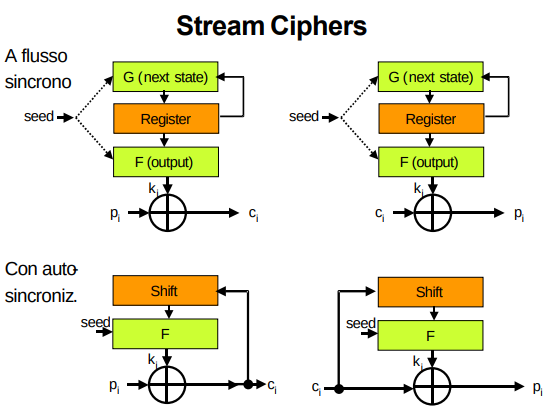

## Cifrari a flusso
Si rifà al one-time pad. Usa un **flusso di chiave** per cifrare un bit/byte alla volta del plaintext con delle operazioni di **xor**.
- ricorda che lo **xor è l'inverso di se stesso** (involutivo)
- cifratura:    ci = mi^Ki
- decifratura:  mi = ci^Ki = mi^ki^ki

La sicurezza del metodo è concentrata nella generazione di una stringa di bit aleatori Ki lunga quanto il testo. Per i ragionamenti fatti in precedenza sugli RNG (riproducibilità, sorgente e destinazione devono produrre lo stesso flusso di chiave), i bit di chiave non possono che essere pseudocasuali ed è questo il fatto che non consente di ottenere una sicurezza perfetta. **In trasmissione ed in ricezione** occorre, infatti, **impiegare due PRNG**, detti generatori di flusso di chiave, e garantirne la perfetta sincronizzazione.

- La sicurezza non è perfetta ma abbiamo già osservato che se la stringa dei bit di chiave ha un periodo grandissimo, ciò consente di suddividere la sequenza in moltissime sottosequenze e di rendere **imprevedibile** quella che viene di volta in volta impiegata tramite un **seme casuale concordato in segreto dai due corrispondenti**. 
- affinchè la decifrazione avvenga correttamente devo avere **perfetto sincronismo** e lo **stesso seed** del PRNG
    - i corrispondenti devono scambiarsi il seed in segreto

### Due tipi di cifrari a flusso
- A **flusso sincrono**:
    - **il flusso dei bit di chiave è indipendente dal flusso dei bit di testo cifrato**.
        - in pratica ho un ASF che mi fa da PRNG che NON ha alcun input proveniente dal testo cifrato 
    - Per un corretto funzionamento i generatori di trasmissione e di ricezione devono mantenersi al passo:
        - quando si verifica un disallineamento, sorgente e destinazione devono far ripartire i due generatori, **curando anche di scegliere un diverso punto di inizio della sequenza**.
            - In caso di inserimento o cancellazione di un bit (**nel cifrato inviato**) da parte di un attaccante, si perde il sincronismo e bisogna risincronizzare utilizzando un seme diverso.
            - In caso invece di modifica attiva di un solo bit non vi è propagazione dell’errore nei restanti.
    
- Con **flusso auto-sincronizzante**:
    - **il flusso dei bit di chiave dipende anche dal flusso dei bit di testo cifrato** (si noti in figura il ruolo svolto dai due registri a scorrimento)
    - in questo modo un’eventuale perdita di sincronismo dovuta a una modifica attiva non richiede alcun intervento da parte degli utenti perché **dopo un breve transitorio** (che dipende dalla grandezza dei registri di scorrimento) **i due generatori si rimettono al passo da soli** (auto-assestamento).
    - come funziona:
        - Nel cifrario a flusso autosincronizzante, ogni bit del keystream dipende da un numero fisso t (dim registro a scorrimento) di **bit di cifrato precedenti** (c_{i−t}, …, c_{i−1})
        - Supponiamo che un attaccante elimini un bit cifrato dalla trasmissione.
        - Effetto immediato
            - Tutti i bit ricevuti successivamente vengono “spostati” di una posizione.
            - Il destinatario, che non sa della cancellazione, continua a decifrare usando t bit precedenti che non corrispondono più alla posizione corretta.
            - Quindi: la decifratura immediata fallisce → i messaggi risultano corrotti.
        - Come si recupera la sincronizzazione
        - Dopo aver ricevuto almeno t bit validi (buco causato dal bit mancante è uscito dal shift register), il ricevente può nuovamente:
            - usare i nuovi t bit cifrati ricevuti come input corretti per la funzione F
            - calcolare un keystream z_i sincronizzato
            - riprendere la corretta decifratura

La più comune **causa di disallineamento** è la perdita d’integrità del testo cifrato, quale può essere generata o da un evento casuale o da un attacco intenzionale.
- Consideriamo dapprima l’eventualità che sia cancellato o inserito un bit.
    - Le stazioni di un Cifrario a flusso sincrono **perdono il sincronismo e l’errore si propaga su tutta la restante parte del messaggio**;
    - le stazioni del Cifrario con auto-sincronizzazione perdono il sincronismo solo temporaneamente e consentono di riprendere correttamente la decifrazione al termine del transitorio.
- Consideriamo ora l’eventualità che sia modificato un bit.
    - Nei Cifrari a flusso sincrono la violazione dell’integrità non si propaga ai bit successivi e non è rilevabile;
    - i Cifrari con auto-sincronizzazione decifrano invece in modo errato finché il bit modificato è presente nello shif di ricezione. 

### Quale tipo usare?

**Quand'è che perdo sincronismo?**
attacchi attivi. In questo caso i cifrari a flusso autosincronizzante sono più robusti dato che ho perdita di sincronismo solamente fino a che nel registro di shift rimane presente il/i bit manomessi

**Modello di minaccia**:
- se l'intrusore vuole leggere e basta flusso sincrono va bene
- se l'intrusore ha interessa a dare fastidio facendo anche attacchi attivi all'integrità, meglio cifrario a flusso autosincronizzante

cifrari a flusso sincrono
- più utilizzati perchè costano meno
autosincronizzanti
- più robusto alle perdite di sincronismo

**NB**: In generale, oggi si preferisce impiegare la funzione E di un Cifrario simmetrico a blocchi: vedi(modalità CTR, OFB e CFB)

## Possibili attacchi e problemi dei cifrari a flusso

### In generale
- Non adatti ad essere usato per file system in quanto la lunghezza della chiave equivale alla dimensione del file (e ogni file deve essere cifrato con una chiave diversa: costo elevato, overhead); 
- Non garantisce integrità, le modifiche fatte da un eventuale intruso non sono rilevabili e hanno impatto prevedibile.
    - Con un cifrario a flusso ottengo confidenzialità ma non integrità o autenticazione.
- problemi di sincronismo tra sorgente e destinazione

### Two-time key
Abbiamo già commentato il fatto che una chiave dovrebbe venire cambiata spesso (non concediamo molti ciphertext, non concediamo tempo di fare molte prove per capire la chiave)

Nel caso dei cifrari a flusso (a causa dello xor) questa problematica è ancora più accentuata. Infatti, basta utilizzare la stessa chiave due volte con messaggi diversi per annullare una cifratura
- c1 = m1^k
- c2 = m2^k
- __c1^c2 = m1^k ^ m2^k = m1^m2__ // ottengo con moltà facilità lo xor dei due messaggi in chiaro
    - (con delle imagini si capice bene)

Con i cifrari a flusso è quindi fondamentale usare quindi una chiave sempre diversa. Questo si traduce nell'utilizzare un seme sempre diverso

Come mai riutilizzare la stessa chiave è particolarmente problematico nei cifrari a flusso
- Perché il keystream è spesso usato direttamente come maschera XOR. E lo xor ha la proprietà involutiva

Questo problema non si presenta nei cifrari a blocchi nello stesso modo, perché:
- lì l’output dipende anche dalla posizione,
- e le modalità di cifratura (es. CBC, CFB, CTR) introducono variazioni.

#### Segretezza e variabilità di un seme (WEP)
Protocollo che veniva utilizzato nelle reti wireless per garantire riservatezza
- il mittente sceglie di volta in volta un diverso vettore di inizializzazione (IV) che concatena con la chiave segreta (password del router) per determinare un seed 
    - IV sceltro tramite un PRNG o contatore
- il seed viene utilizzato per inizializzare un PRNG che genererà il flusso di chiave di un cifrario a flusso
- il mittente trasmette in chiaro il vettore di inizializzazione in testa al messaggio cifrato in modo che anche la stazione di decifrazione possa ottenere lo stesso seed e quindi generare lo stesso keystream per la decifrazione
- il destinatario estrae IV, lo concatena con la chiave segreta che condivide con il mittente ed inizializza così la generazione del flusso di chiave esattamente dallo stesso punto da cui è partito il corrispondente

La soluzione è però oggi giudicata insicura. **Esempio notevole di Two-time key vulnerability**:
- Il vettore di inizializzazione non era abbastanza lungo (24 bit) e dopo un po' iniziava a ripetersi
    - in WEP aveva una probabilità del 50%, dopo 5000 volte, di ripetersi.
- Inoltre, Il pacchetto WEP contiene il campo IV in chiaro -> **l’attaccante può sapere se un keystream è stato riutilizzato in pacchetti diversi**
- è facile quindi che un attaccante trovi vari pacchetti cifrati con lo stesso keystream -> **riservatezza rotta per Two-time key**
  

#### Malleabilità
Con un cifrario a flusso, l’intrusore, è in alcuni casi in grado di modificare testi cifrati con del plaintext da lui voluto. 
- modifica al testo cifrato produce un effetto deterministico prevedibile al testo in chiaro
- il cifrario a flusso è vulnerabile perché malleabile **a causa delle proprietà dello xor**

Esempio:
- sorgente fa:               c   = m^k
- l’intrusore può fare:      c'  = c^p
    - con p da lui creato.
- **la destinazione decifra    c'^k = m^k^p^k = m^p.**

Se l’attaccante conoscesse il messaggio (o se lo immagina, perché m, magari, è fortemente strutturato) potrebbe cambiare parte del testo a suo piacimento.

Se l’intrusore pensa che i primi bit siano corrispondenti a “from Bob”, e vuole cambiare il mittente, deve trovare quel p che in xor con "from Bob ..."  produce “from Eve ...” (facile).

**NB**: interessante notare come l'implementazione pratica di una cifratura sia suscettibile ad attacchi che nella trasformazione teorica di cifratura non sono possibili.

**Conclusioni**:
- se si sta utilizzando un cifrario a flusso sappiamo che è malleabile e quindi è fondamentale implementare meccanismi che garantiscano integrità
- rompere un cifrario a flusso è più facile rispetto rompere un cifrario a blocchi **se non si fanno tutti gli opportuni accorgimenti**.