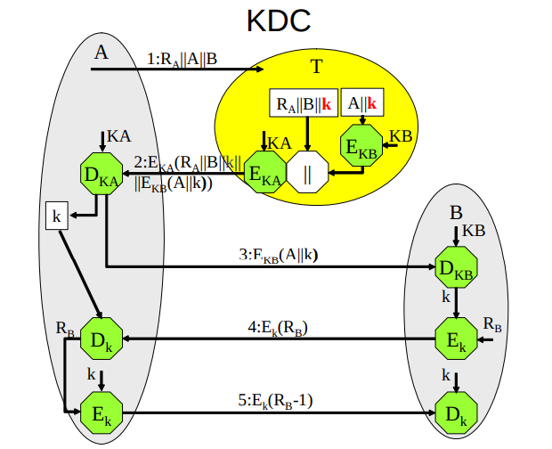
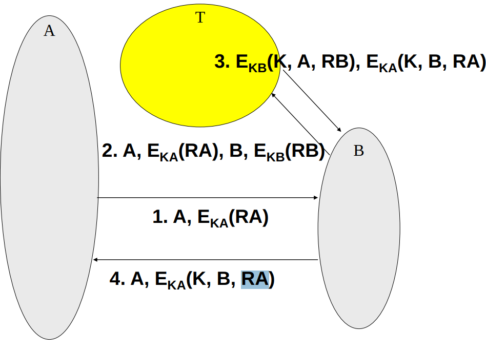
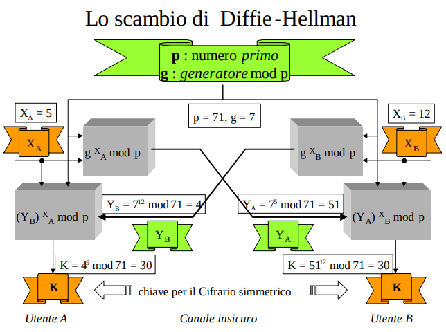
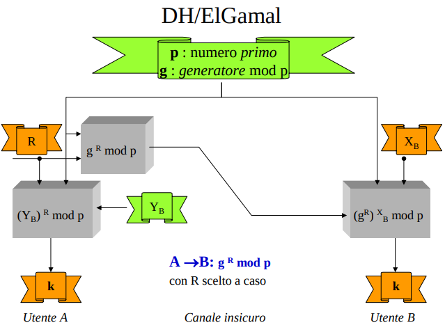

L’uso di un Cifrario simmetrico presuppone:
- che ogni utente, **tramite un canale sicuro**, stabilisca una chiave con chiunque voglia corrispondere con lui 
    - Key agreement
- che ogni coppia di corrispondenti ripeta periodicamente l’accordo per modificare la chiave in uso

Nel periodo della Crittografia classica l’accordo sulla chiave  si è basato su due modalità abbastanza pesanti: l’incontro diretto e l'impiego di un corriere fidato.

La comunicazione in rete è la terza e ben più efficiente modalità introdotta dalla Crittografia moderna. La Società dell’informazione presuppone che **tutti possano comunicare con tutti in modo riservato**. Il conseguimento di tale obiettivo richiede di risolvere il problema della gestione delle chiavi. Ciò è avvenuto in tre tappe, che è didatticamente utile ripercorrere nell’ordine:
1. la chiave che cifra chiavi (master key)
    - un accorgimento che consente a due corrispondenti di comunicarsi in modo riservato un nuovo valore di chiave;
2. il centro di distribuzione delle chiavi
    - un sistema che consente di assegnare un’unica chiave segreta ad ogni utente di una Comunità in cui tutti devono poter comunicare con tutti in modo riservato;
3. lo scambio di Diffie-Hellman
    - la tecnica asimmetrica che per prima ha consentito di concordare una chiave segreta su un canale insicuro senza presupporre l’esistenza di precedenti accordi tra i due corrispondenti. 

## Master key
Per modificare la chiave in uso, uno dei due corrispondenti potrebbe impiegarla un’ultima volta per comunicare all’altro, in modo riservato, un nuovo valore. Il motivo per il quale si cambia frequentemente la chiave è il timore che un suo uso prolungato abbia consentito all’intruso di identificarla (caso migliore in un attacco di forza bruta): **se questo si è verificato la nuova chiave nasce già compromessa** e questa soluzione risulta non soddisfacente.

Un metodo più sicuro è accordarsi su due differenti chiavi:
- **la master key**, che gli utenti impiegheranno solo per cifrare nuove chiavi,
    - cifra pochi bit alla volta e può avere una **vita più lunga** di quella attribuita alla chiave dei messaggi. 
    - **Ogni tanto va comunque rinnovata, con un incontro o con un corriere**. 
- la vera e propria chiave di cifratura/decifrazione dei messaggi che i due intendono scambiarsi.
    - il modo più sicuro per impiegare la chiave dei messaggi è quello di one-time pad: **usarla una volta sola**. 
    - **chiave dei messaggi è una session key**

Cosa devono fare due utenti A e B, che condividono la master key AB, per comunicarsi messaggi cifrati con una sempre diversa chiave di sessione k?
1. A: sceglie a caso la chiave k,
2. A: calcola c1 = EAB(k),
3. A: calcola c2 = Ek(m),
4. A: trasmette a B il testo cifrato c = c1 II c2.

1. B: separa c1 e c2,
2. B: calcola k = DAB(c1),
3. B: calcola m = Dk(c2).

Considerazioni:
- la master key può cifrare anche tante chiavi, ma il rinnovo è comunque costoso
    - inoltre, siccome viene utilizzata più volte, valgono le considerazioni riguardo al caso migliore fatto all'inizio
    - siccome la master key ha vita più lunga delle session key, è opportuno che la lunghezza della master key sia maggiore
- la modalità ECB va bene siccome le chiavi sono piccole

**NB**: Lo schema con master key è complicato dato che richiede ad **ogni utente di stabilire una master key con ognuno degli altri**, per altro, su canali dedicati costosi (out of band)
- **non scala quando c'è una comunità di utenti!!!**
    - se ho N utenti che si vogliono parlare tra di loro
    - ogni utente ha bisogno di N-1 master key e di altrettanti canali sicuri ((N*N-1)/2 totali)
    - ogni utente deve memorizzare e gestire N-1 chiavi
    - ogni qualvolta nella comunità si aggiunge un nuovo utente, tutti gli altri si devono dare da fare. 
    - il numero di master key (e di canali sicuri) scala con O(N^2)! Impensabile

## Centro distribuzione delle chiavi
L’accorgimento di far incontrare “tutti con tutti”, ammissibile in piccole Comunità chiuse, diventa ingestibile al crescere di Nu. L’obiettivo da conseguire è **Nc = Nu** (Nc = Num Master Key, Nu = Num Utenti):
- ogni utente deve avere un’unica chiave segreta e deve usare di conseguenza un solo canale sicuro per concordarla. 

La Crittografia simmetrica ha risolto il problema **prevedendo un’Autorità FIDATA**, detta **KDC** da Key Distribution Center, **con cui tutti gli utenti della comunità concordano individualmente una chiave segreta**.
- Nc = Nu
- **NB**: Non in tutti contesti gli utenti si vogliono fidare di una terza parte (vedi PGP)

A tale Autorità compete: 
- sia la **generazione di una chiave di sessione per ogni coppia di utenti che intendono comunicare**
- sia il **suo invio in modo riservato agli interessati (KDC cifra la chiave di sessione con la master key corrispondente all'interessato)**

Nella figura è illustrato il protocollo che è riuscito a conseguire i precedenti obiettivi, garantendo anche ad ogni parte in causa il **riconoscimento della controparte tramite “sfide” e “risposte”** (vedi servizi di identificazione).

Indichiamo con KA e KB le chiavi che A e B hanno concordato con l’Ente “fidato” T. 

- 1- A trasmette in chiaro a T la sua intenzione di comunicare con B
    - aggiunge un nonce RA (**SFIDA 1**) per poterne autenticare la risposta (evita gli attacchi con replica), e, mi viene da dire, per identificare il KDC. 
    - RA è una sorta di **identificatore di sessione di richiesta di una chiave** (associa una richiesta ad una chiave di sessione)

- 2- T genera la chiave di sessione k 
    - la concatena con RA||B **(per garantire ad A che si sta riferendo alla sua precedente richiesta)**
        - quando A decifra, può controllare che il nonce RA sia quello che ha generato al passo 1 in modo da **evitare attacchi con replica**. L'aggiunta del destinatario rende la replica ancora meno probabile
        - l'attaccante non può ridirezionare la comunicazione verso di lui replicando una vecchia risposta del KDC
    - aggiunge il messaggio E_KB(A||k) (che solo B potrà mettere in chiaro)
    - e cifra il tutto con KA per permettere solo ad A di leggerlo **e per farsi identificare**.
        - RISPOSTA 1 (/SFIDA 2, vedi punto 3)
        - se A decifra la risposta ed ottiene un qualcosa con RA||B allora è sicuro che il suo interlocutore è T dato che è l'unico che ha la chiave KA che permette di cifrare correttamente. 

- 3- A decifra, memorizza k (che gli servirà successivamente) ed invia a B la parte che T ha predisposto per lui. B lo mette in chiaro con la sua chiave KB. Il fatto che sia stato cifrato con KB garantisce a B che:
    - **T ha stabilito k**.
        - solo T ha la chiave segreta KB con cui la cifratura può avvenire correttamente
    - e che **A è stato identificato da T** dato che è riuscito a decifrare RISPOSTA 1
        - solo un mittente con la chiave segreta di chi dice di essere può decifrare la risposta del KDC ed estrarre la parte cifrata con la chiave del destinatario a quest'ultimo (RISPOSTA 2)
    - **NB**: A è stato identificato da T ma non è detto che sia il mittente del messaggio che B riceve! Un attaccante potrebbe replicare una RISPOSTA 2 precedentemente intercettata e inviarla direttamente a B, iniziando praticamente il protocollo dal passo 3. A questo punto (se non ci fossero i passi 4 e 5) B penserebbe di star parlando con A e potrebbe inviarli campioni di testo cifrato con k che l'attaccante sfrutterebbe per fare crittoanalisi e per rompere la riservatezza dei messaggi inviati (sia in questa sessione che in quella precedentemente intercettata)
    - Al punto 3, A non è ancora stato identificato da B, per questo motivo il protocollo viene completato coi passi 4 e 5. 

- 4,5- B ed A si identificano reciprocamente e dimostrano di aver già installato la chiave k. 
    - B genera un nonce RB, lo cifra, e lo invia ad A **(sfida che però mi identifica)**
    - **A identifca B** dato che ha dimostrato di possedere la chiave di sessione k cifrando RB, ottenibile solo da uno che ha la chiave segreta RB
    - A decifra, modifica leggeremente RB, ricifra con k e invia a B
    - B decifra la risposta di A, confronta, e, se corretta, **B identifica A** dato che ha dimostrato anch'esso di possedere la chiave di sessione k decifrando RB e cifrando RB-1

Considerazioni:
- L'interazione è solo tra A e T e A e B, non B e T.
- T manda ad A una sfida (sfida2 - con chiave di cifratura KA) per vedere se è effettivamente A. 
- A non è in grado di decifrare EKB (non possiede KB), servirà poi a B per recuperare k.
- B sfida A per vedere se è veramente A (sfida3 - con EKB(RB)), se A è veramente lui allora avrà recuperato k e risponderà positivamente alla sfida.

Scenario improbabile:
Se l’intrusore è riuscito ad ottenere k da una sessione precedente (davvero improbabile, lo presupponiamo noi), e tenta l'attoco con replica al passo 3, **può impersonare A** nonostante i passi 4 e 5 (perché sa fare E_K(RB)). A quel punto, B penserebbe di star parlando con A e ogni informazione inviata successivamente verrebbe cattrata.

Ci sono due possibili contromisure, entrambe però onerose, rispetto al reale guadagno in sicurezza che si ha:
- B memorizza tutte le chiavi che ha ricevuto in precedenza ed evita di riusarle, cioè B mantiene lo stato delle chiavi usate (se k è già stata usata il protocollo non procede);
- **KDC attribuisce un tempo di vita limitato ad ogni chiave di sessione (Kerberos)**.

ho problemi se implemento in modalità ECB?
- determinismo
    - se al passo 5 non si modifica di molto R_B l'attaccante può provare a forgiare una risposta nel tentativo di impersonare qualcun'altro 
- malleabilità
    - **con ECB e_k(A||B) diventa e_k(A)||e_k(B) se i blocchi sono allineati**
    - se ho ottenuto la stessa chiave k da una sessione precedente posso spacciarmi per A, e tento l'attacco con replica al punto 3, non solo posso spacciarmi per A, ma posso spacciarmi per chi voglio!
        - fai prima a vincere alla lotteria mi sa...

Il modello del KDC ha svariate limitazioni:
- Deve essere sempre On-line (Single Point of Failure)
- Collo di bottiglia(n° max di utenti)
- Memoria sicura (Memorizza tutte le chiavi segrete degli utenti)
- Ente degno di fiducia

Ha comunque una sua indiscutibile validità, quando il numero degli utenti è relativamente limitato. Molti sono i progetti che lo hanno assunto come riferimento; in particolare, il servizio di autenticazione **Kerberos**.

### Protocolo KDC alternativo 4-way

dopo aver ragionato in classe si è arrivati alla conclusione che anche questo protocollo è robusto. Per quanto riguarda la replica sarebbe inutile, non ci si fa nulla senza conoscere KA e KB.

- 4 way invia un messaggio in meno tra i due interlocutori
- 4 way effettua due operazioni di decifratura in più rispetto alle 0 si 5-way
- A di 4 way fa una decifratura in meno
- B di 4 way fa una decifratura in meno

con ECB cosa succede?
- se non si tiene traccia delle chiavi già usate I può indurre B a riusare una chiave che lui conosce da una sessione precedente

... vabbè

## Accordo DH
Si è già detto più volte che nella Società dell’informazione chiunque deve poter instaurare comunicazioni riservate con chiunque altro: molto spesso, però, i due che intendono corrispondere non si sono mai incontrati prima e non sanno neppure in quale parte del Globo vive il loro interlocutore.  

Incontri diretti e corrieri sono da escludere a priori (non si conoscono). Una rete mondiale di N KDC è improponibile (N*(N-1)/2 chiavi). L’accordo sulla chiave di sessione deve dunque poter essere preso in assenza di ogni altro precedente accordo e l’unico modo per prenderlo è di farlo tramite Internet, tenendo però presente che tutte le comunicazioni sono intercettabili. 

Il grande merito di Diffie ed Hellman è quello di aver individuato non solo un metodo di grande efficacia e sicurezza, lo scambio detto appunto DH dai loro cognomi, ma anche una nuova direzione su cui avviare gli studi e le applicazioni della Crittografia. Tale direzione è stata immediatamente seguita da tutto il modo scientifico ed ha oggi un nome: **crittografia a chiave pubblica**. 

L’obiettivo dello scambio DH è far si che due utenti qualsiasi A e B, **senza aver preso alcun precedente accordo segreto** (no master key sia essa in KDC o meno), riescano a **condividere un dato segreto K (chiave di sessione)** dopo aver calcolato ed essersi **scambiati senza alcuna segretezza due dati YA e YB (pubblici)**. 
- Non abbiamo più una terza parte fidata e nemmeno una Master Key pre-concordata. 

A tal fine è necessario che ciascuno dei due utenti **scelga a caso un numero X (che terrà segreto)** ed usi poi una **funzione unidirezionale F** per calcolare il numero **Y = F(X) da inviare al corrispondente**
- in questo modo, l’intruso che riesce ad intercettare Y non dispone di algoritmi efficienti per calcolare il segreto X = F^-1(Y). 

Una volta avvenuto lo scambio (A manda YA e B YB), il metodo prevede che A e B dispongano di una **particolare funzione G** che garantisca ad entrambi di **ottenere lo stesso risultato K (chiave di sessione)** a partire dai dati in loro possesso**:
- __G(XA,YB) = G(XB, YA) = K__
- **NB**: ho comunicato solo roba pubblica YA, YB, ma **HO CONCORDATO UN SEGRETO CONDIVISO**

Diffie ed Hellman hanno suggerito di usare **l’esponenziazione modulare** per entrambe le funzioni F e G:
- Y = g^X mod p -> funzione F
    - esponenziazione modulare non invertibile (logaritmo discreto problema NP)
- K = Y^X mod p -> funzione G
    - esponenziazione modulare mi fa ottenere l'uguaglianza
- ove p è un numero primo
- e g < p un numero il cui elevamento a potenza (mod p) per x=1,2,..,p-1 fornisce una permutazione di Z*p (numeri interi modulo p)
    - g generatore mod p

I dati **p e g, non segreti**, devono essere **noti ed uguali per entrambi**. 
- Ad esempio chi inizia il protocollo può deciderli e comunicarli al corrispondente insieme al suo dato Y

**NB**: C'è una somiglianza (non casuale) tra i dati X e Y, e i concetti di chiave privata e pubblica 

**NB**: La segretezza di K si basa sull’assunzione che la funzione y = g^x mod p sia unidirezionale (per adesso lo è).
- Per il calcolo dell’esponenziazione esistono algoritmi polinomiali.
- Per il calcolo della funzione inversa, detta estrazione del logaritmo discreto si conoscono solo algoritmi sub-esponenziali

### DH Anonimo
Il protocollo, nella sua versione più semplice detta DH anonimo, prevede quindi solo due passi:
1. **Generazione delle chiavi segrete XA, XB e pubbliche YA, YB**
    - A e B, dopo aver generato a caso rispettivamente i numeri 
        - 1 < XA < p-1
        - 1 < XB < p-1
    - (che tengono segreti), calcolano
        - YA = g^XA mod p
        - YB = g^XB mod p
    - e si scambiano i risultati in modo non riservato. 

2. **Calcolo del segreto K** 
    -  A e B calcolano rispettivamente:
        - KA = YB^XA mod p = (g^XB mod p)^XA mod p = (g^XB)^XA mod p
        - KB = YA^XB mod p = (g^XA mod p)^XB mod p = (g^XA)^XB mod p
    - **KA = KB = K**

**NB**: chi ci garantisce, in questo tipo di scambio, che XB provenga davvero da B e viceversa?
- nessuno! Ciascuno dei due utenti riceve un numero Y a cui non è associata alcuna indicazione sicura su chi l’ha inviato.
    - manca autenticità degli Y
- **potrei star scambiando una chiave con un impostore man in the middle**

### DH El Gamal
Una variante, proposta da ElGamal ed **adottata dal PGP**, prevede che: 
- A, l’iniziatore del protocollo, abbia già a disposizione YB (chiave pubblica), ottenuto in precedenza ed in modo sicuro dal corrispondente B (**autenticità garantita**).
-  In questo caso è sufficiente il solo messaggio A → B: YA = g^R mod p (con R scelto a caso da A) per consentire ad entrambi di condividere un segreto one-time  
    - K = g^(R*XB) mod p. 
- A è inoltre sicuro di averlo in comune proprio con B!
    - l'autenticità di YB è verificata ed A usa YB per produrre K insieme al suo segreto XA 
    - solamente chi ha XB corrispondente ad YB riesce a produrre lo stesso K che produce A
- ... B può solo sperarlo!

nota: fixed DH ed ephemeral DH, consentono a tutti e due i partecipanti di essere sicuri sull’origine della chiave pubblica ricevuta.

Lo scambio di chiavi Diffie-Hellman è un protocollo che permette a due utenti di scambiarsi una chiave segreta comunicando pubbicamente, senza rivelare la chiave segreta a degli attaccanti. 
- non preconcordiamo prima un segreto (master key), lo concordiamo online sul momento
- non c'è più bisogno di un accordo con cui cifrare le chiavi con cui comunichiamo, possiamo scambiare la chiave di sessione in maniera intelligente direttamente

I due partecipanti:
- concordano un numero casuale iniziale (possibilmente grande e primo in modo da annullare gli attacchi di forza bruta -> conseguenza di esponenziazione modulare) 
    - Per concordare un numero devono comunicarselo e quindi renderlo pubblico
    - Questo numero non può quindi essere la chiave
- Tuttavia, i due partecipanti generano anche un numero casuale segreto (e quindi distinto) che sarà una sorta di "chiave segreta personale"
- Chiaramente, non possiamo comunicare direttamente questi due nuovi numeri casuali, altrimenti saremmo punto e a capo. Tuttavia, se comunicassimo non direttamente le chiavi segrete, ma il **risultato di un operazione non facilmente reversibile** di quest'ultime con il primo numero casuale condiviso:
    - le chiavi segrete non verrebbero comunicate in quanto mascherate dall'operazione non reversibile
    - se l'operazione ha delle proprietà particolari (esponenziazione modulare), i due interlocutori **possono generare la stessa identica chiave di sessione** a partire solamente dai risultati dell'operazione non reversibile e quindi **senza mai essersi scambiati pubblicamente i loro segreti!**
        - ripeto per la terza volta: è fondamentale che l'operazione sia non reversibile, altrimenti un attaccante in ascolto potrebbe recuperare la chiave segreta di un interlocutore a partire dal risultato dell'operazione tra segreto e numero casuale concordato. 

... se vuoi capire più nel dettaglio riguardati il video del tipo coi cubi

**OSS**: D-H classico è vulnerabile agli attacchi Man-in-the-Middle se non viene autenticato. Per questo spesso viene combinato con altri meccanismi di autenticazione, come certificati digitali o firme crittografiche.