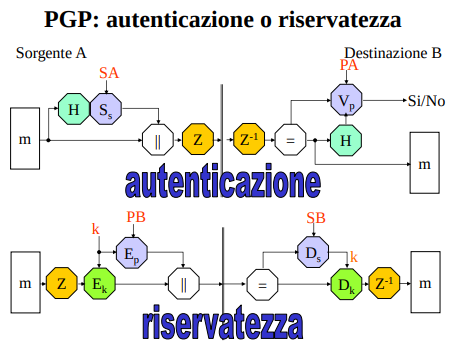
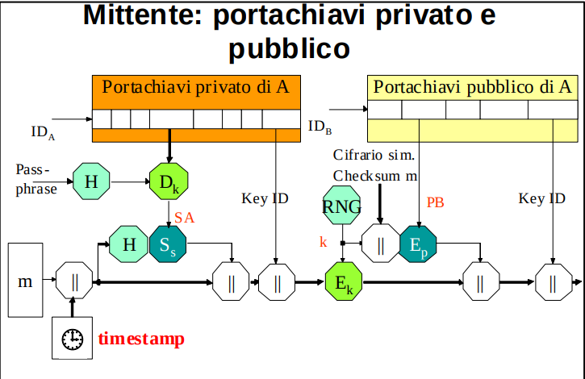
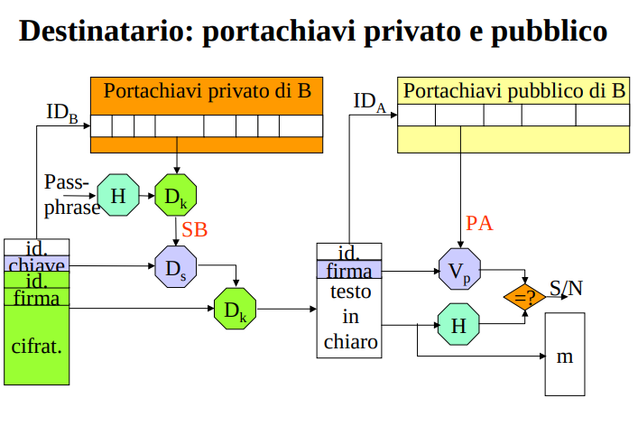

*non interessa tanto il protocollo o il formato dei messaggi nel dettaglio. Studiare PGP per vedere come sono stati applicati i meccanismi che abbiamo studiato, e per vedere un modello di fiducia decentralizzato*

## PGP
PGP provides a **confidentiality and authentication service** that can be used for **electronic mail and file storage applications**.

L’autenticazione è ottenuta allegando al documento in chiaro un suo hash firmato -> **firma con appendice** 
- gli utenti possono scegliere di farlo o con RSA, o con DSS.
- Il PGP consente anche di **comprimere il documento autenticato**, per renderne efficienti la memorizzazione e la trasmissione.

Per garantire la riservatezza, il PGP impiega un **Cifrario ibrido** per scambiare la chiave di sessione. 
- Il mittente usa un Cifrario simmetrico con modalità CFB per trasformare il documento;
- la chiave di sessione è comunicata o con RSA, o con ElGamal, a seconda del tipo di chiave pubblica che il destinatario si è generato.
- Prima della cifratura è possibile comprimere il messaggio.

E’ infine possibile proteggere contemporaneamente l’autenticità e la riservatezza: in questo caso il documento è prima firmato, poi cifrato. Chi lo riceve deve dunque prima decifrare e poi verificare. 

**OSS**: ompressione per motivi di risparmio di trasmissione e memorizzazione.
- interessante notare le posizione inverse delle trasformazioni di compressione/decompressione in autenticazione e riservatezza 
    1. Nel caso della firma: compressione dopo la firma 
        - se cosi’ non fosse ogni volta che verifico un messaggio dovrei ricomprimerlo
    2. Nel caso della cifratura: compressione prima della cifratura
        - elimino ridondanze eventuali nel messaggio (cifratura più robusta)

### Gestione delle chiavi
Il PGP si prende totalmente in carico la gestione delle chiavi dell’utente **e dei suoi corrispondenti**; a tal fine
impiega
- un generatore di numeri casuali
- un generatore di numeri pseudocasuali
- e **due portachiavi**
    - strutture dati che salvano la chiave privata dell'utente e le chiavi pubbliche degli altri utenti con cui si interagisce

La generazione di numeri casuali si basa su una continua raccolta di eventi verificatisi nell’applicazione (pause dell’utente tra una digitazione e l’altra, caratteri della passphrase, ecc.); i dati così ottenuti vengono processati e poi alloggiati in un archivio, detto RandomPool.
- Da tale archivio, il PGP estrae la **chiave privata** dell’utente ed il **seed** per avviare in maniera imprevedibile il generatore di numeri pseudocasuali.

Il generatore pseudocasuale del PGP viene chiamato in causa ogniqualvolta occorre una **chiave di sessione** o un **vettore d’inizializzazione**.

Ogni utente viene infine dotato di due distinti portachiavi.
- Nel **portachiavi pubblico** sono alloggiate le sue **chiavi pubbliche** e quelle dei suoi corrispondenti. 
- Nel **portachiavi privato** sono alloggiate, **cifrate**, le sue **chiavi private**;
    - la cifratura è fatta utilizzando come chiave 128 bit del **hash di una passphrase** (ricorda il file system sicuro)

#### esempio firma e cifratura
In figura **è evidenziato l’uso dei portachiavi** di un utente A, durante la firma e la cifratura di un messaggio: 

1. Tramite il suo ID, si specfica una chiave di firma (privata) da estrarre dal portachiavi privato
    - per decifrarla viene usato il meccanismo simmetrico Dk e la chiave (simmetrica) H(passphrase). 
2. Si concatena a m **l’istante t di firma (timestamp)**, se ne calcola l’hash e lo si firma con la chiave privata appena estratta;
    - il risultato è infine concatenato con il messaggio in chiaro m||t 
    - e con **l’identificativo di chiave**, per far capire ai riceventi quale chiave pubblica usare per la verifica.
    - **NB**: notare che PGP, adottando un modello di fiducia decentralizzato, non usa un TSS. Piuttosto, si fida che il timestap posto dal mittente sia valido
3. Tramite il suo ID, viene estratta dal portachiavi pubblico una delle chiavi di cifratura del destinatario.
    - notare che la chiave pubblica del destinatario è alloggicata nel MIO portachiavi pubblico
4. Con la chiave pubblica e con il meccanismo asimmetrico Ep viene cifrata la chiave di sessione k (**cifrario ibrido**) generata sul momento tramite un PRNG, unitamente al nome del cifrario simmetrico (sim.) scelto ed al checksum di m.
5. Con il cifrario sim. scelto si calcola Ek(m’).
    - con m' = m + timestamp + firma + id_pubkey_verifica
6. I due crittogrammi (messaggio m' e chiave di sessione) sono concatenati tra loro e con l’ID della chiave pubblica del destinatario.
    - io mittente ho solo l'id della chiave pubblica del destinatario, quest'ultimo userà questa informazione per **capire quale chiave privata utilizzare per decifrare il messaggio**

In ricezione, il messaggio è prima decifrato e poi verificato. Il processo PGP di B deve svolgere cinque attività.

1. Tramite l’identificativo di chiave pubblica in testa al messaggio, verifica se la chiave è presente nel portachiavi privato;
    - in caso affermativo, richiede la passphrase e mette in chiaro la chiave privata SB.
2. Con il meccanismo asimmetrico (chiave privata appena recuperata dal portachiavi) Ds ottiene la session key, e con il meccanismo simmetrico (session key appena decifrata) Dk mette in chiaro il testo.
3. Estrae dal campo apposito l'id della chiave pubblica di verifica,
4. Verifica se il portachiavi pubblico contiene la chiave pubblica di A: se PA esiste, la estrae e l’impiegata per mettere in chiaro, con Vp, l’hash del documento.
5. Calcola l’impronta del messaggio ricevuto e confronta il risultato con quello ottenuto al passo 4. 

**Formato dei messaggi pgp**: ... idc, puoi immaginartelo da quello che c'è sopra

#### Messaggi riservati a più destinatari
Una volta cifrato un messaggio con una certa chiave k, è possibile inviarlo anche a più corrispondenti.
- A tal fine al testo cifrato occorre **aggiungere tante intestazioni quanti sono i destinatari**, contenenti ciascuna la cifratura asimmetrica della chiave one-time con l'id dell’appropriata chiave pubblica.
- All’arrivo del messaggio, ogni destinatario, dopo aver identificato la parte dell’intestazione che lo riguarda, può al solito, capire che chiave privata utilizzare, e poi rimettere in chiaro dapprima k e poi m.

Un’applicazione interessante di questo modo di operare si ha quando il PGP è usato per l’archiviazione sicura di documenti.  Il proprietario del file system può, infatti, cifrare la chiave di cifratura di ogni file con due chiavi pubbliche, la sua e quella di un altro utente di sua fiducia, per garantire il recovery in sua assenza o nel caso di crash del suo portachiavi. 

### Modello di fiducia PGP
PGP usa modello di fiducia decentralizzato, senza certificati, alternativo all’ Autorità di certificazione.
- non c'è nessun certificatore

Ma allora, **chi mi da la garanzia che le chiavi pubbliche siano effettivamente del destinatario dichiarato?**

Ricordiamo che ogni utente è dotato di due portachiavi, uno delle proprie chiavi private e uno per le chiavi pubbliche (proprie e degli altri).

A tal proposito **una chiave pubblica può essere ricevuta**:
- **Personalmente/direttamente** 
    - massima fiducia
    - c'è stato un incontro e quindi non ho paura di un MIM
- **Tramite intermediario/indirettamente**
    - via mail, pubblicate su un sito, pubblicate su un db, ...
    - meno affidabile
    - per avere qualche garanzia un **intermediario di cui ci si fida** deve, in passato, aver firmato il certificato di quello con cui si vuole parlare ora.

**Il livello di fiducia attribuito per una determinata chiave dipende dalla fiducia nei confronti del firmatario**

Le strutture dati salvate all'interno del portachiavi pubblico sono simili a **certificati**, non chiavi pubbliche crude. Il certificato del PGP ha diversi campi in chiaro, seguiti dalla firma del proprietario (**autocertificazione**) ed, eventualmente, di altri utenti (**intermediari**).

I campi interessanti sono:
- **Owner Trust**:
    - fiducia iniziale che io ripongo in una data chiave pubblica.
    - diversi livelli di fiducia: contenuto fidato, non fidato, parzialmente fidato... 
    - a seconda di come ho ottenuto la chiave e di quanto conosco il proprietario posso impostare il livello di fiducia.
        - campo soggettivo gestito dall'utente
- **Signature(s)**:
    - firme su una data chiave pubblica
    - potrebbe essere
        - la firma di chi mi ha fornito la chiave pubblica (autocertificazione)
        - la firma di altri di cui mi fido
        - potrebbe essere anche la firma di una CA se la chiave pubblica è stata ottenuta da un certificato X.509, ma non necessariamente
- **Signature Trust(s)**:
    - fiducia che associo ad una firma firma
    - corrisponde all'owner trust della chiave pubblica associata a chi mi sta certificando la chiave
- **Key Legitimacy**:
    - legittimitò finale della chiave viene determinata con una media pesata delle owner e signature trust
    - PGP calcola automaticamente **sulla base di Owner Trust e Signature Trust** il livello di fiducia (fidata, non fidata, incerta, ...).
    - A intervalli regolari questo campo viene automaticamente ricalcolato da PGP: infatti, un peer potrebbe passare da fidato a non fidato (perché magari è stata compromessa la sua chiave privata). 

L’utente può, se vuole, firmare la chiave ricevuta ed inviare poi la sua certificazione al proprietario della chiave e/o ad un database di chiavi PGP. Da questa spontanea **collaborazione tra gli utenti** discende una **rete di fiducia (web of trust)**, che consente di **trasferire da una chiave all’altra la confidenza sulla sua autenticità** 
- (se io mi fido della chiave di A, e A si fida della chiave di B, allora io mi fido anche della chiave di B). 

La fiducia in questo sistema è sempre data da una componente soggettiva. Per questo motivo **non ha alcuna validità legale** (nessuno si assume responsabilità)

In questo modello si rinuncia ad alcuni vantaggi della CA
- **tempo di revoca molto più lungo**
    - l'informazione di revoca si deve propagare nella rete di fiducia
    - latenza naturale prima che tutti conoscano la revoca
    - tempestività molto bassa

**importante da sapere**: modello di fiducia del PGP come esempio di sistema decentralizzato

modello alla base dei trust management systems

PS: GPG versione open source di PGP. Implementa lo standard OpenPGP