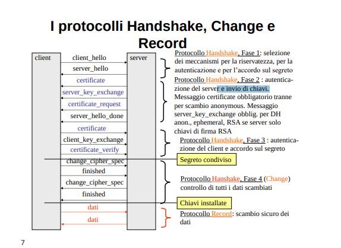
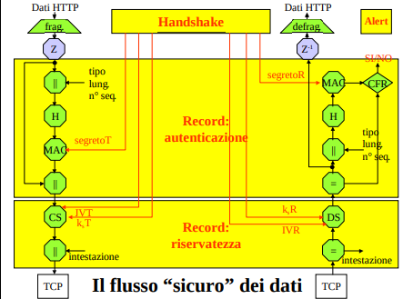

Ogni applicazione ha in generale la necessità di **comunicare in modo sicuro sulla rete** e deve quindi potersi avvalere di meccanismi per l’autenticazione, l’identificazione e la riservatezza. Un accorgimento che consente di ridurre notevolmente la complessità di progetto delle applicazioni è quello di predisporre nei livelli inferiori dello stack protocollare un insieme di meccanismi sicuri a disposizione di tutte le applicazioni. 

Parliamo quindi di meccanismi per l’autenticazione, l’identificazione e la riservatezza in ambienti distribuiti a livello di rete (ipsec) e trasporto (TLS/SSL).

## TLS/SSL
A livello di trasporto, una **suite di protocolli** per autenticazione e riservatezza delle comunicazione è SSL/TLS.
- Il primo supporto sicuro per applicazioni Internet, denominato SSL (Secure Sockets Layer) e concepito per essere collocato tra il protocollo HTTP ed il sottostante strato di trasporto TCP. 
- Lo standard Internet (RFC 2246) che discende da SSL è detto TLS (Transport Layer Security).
    - La sigla HTTPS indica un’applicazione http che si avvale dei servizi di sicurezza di TLS.

SSL garantisce quindi la confidenzialità e autenticità (implicitamente anche integrità e identificazione) dei dati tramite un trasporto sicuro dei pacchetti TCP. Ottengo così **semitrasparenza per le applicazioni** (devo creare esplicitamente una socket sicura)
- ipsec è completamente trasparente
- **NB**: l'applicazione non deve gestire la confidenzialità, integrità e autenticità dei dati in modo diretto, ma viene demandato tutto a SSL.

SSL è un insieme di protocolli (suite):
- **Handshake**:
    - si occupa della **negoziazione** dei meccanismi (detti anche parametri) di sicurezza, dell’**identificazione** (anche reciproca) tra client e server e dello **scambio della chiave** simmetrica di sessione
    - Es: Il client contatta un server
        - non è possibile sapere a priori quali cifrari, funzioni hash, PRNG, ... supporta (non possiamo pretendere che tutti i nodi della rete siano configurati allo stesso modo)
        - Tramite il protocollo di handshake è possibile negoziare i protocolli da usare e le chiavi da utilizzare per realizzare autenticazione e riservatezza. 
            - Chiaramente, non conoscendosi all’inizio, non si può pensare a modelli centralizzati per lo scambio delle chiavi (Master Key, KDC poco scalabile…): si può usare un cifrario ibrido o DH.
- **Record**:
    - calcola/verifica le etichette (SSL usa firme con appendice) di autenticazione e cifra/decifra i dati.
    - Protocollo di livello trasporto che riceve dati dal livello applicazione, li trasforma e li incapsula aggiungendo intestazioni di livello 4 (trasporto). 

- Alert: si occupa della gestione di tutte le segnalazioni di allarme.

- Change ciphersec: consente di allineare le due parti sull’uso di una nuova suite. Serve per rinegoziare i parametri della connessione.

### Generalità
Come avviene la cifratura?
- Cifratura simmetrica con chiave di sessione scambiata durante la negoziazione.

Autenticazione ed integrità?
- HMAC, con l'uso di un segreto condiviso durante la negoziazione.

Il protocollo Record sta a livello di trasporto e trasforma i pacchetti in dati autenticati e cifrati. Nella realizzazione **sfrutta i concetti di sessione e connessione**
- **in una sessione è possibile trovare una o più connessioni**.
- una sessione viene creata da handshake, che crea e definisce un insieme di chiavi e parametri che possono essere condivisi fra connessioni diverse 
- la sessione **evita la rinegoziazione dei parametri**. 

Lo **stato di una sessione** è composto da un:
- Identificatore di sessione;
- Certificato del peer (X.509):
- Metodo di compressione
- Cifrario ed algoritmo di hash
- **Master secret** (48 byte): 
    - ogni client e ogni server hanno stabilito a priori un segreto condiviso che verrà usato all'interno delle singole connessioni per produrre le chiavi one-time.

Abbiamo appena detto che il protocollo Handshake, all’inizio di ogni sessione di comunicazione, si occupa di far condividere un segreto (chiave di sessione) alle due parti.
- In realtà **di segreti ne servono complessivamente sei**
    - tre per il flusso di dati che il client invia al server ed altri tre per il flusso nella direzione opposta.
- La chiave scambiata durante l'handshake è il **master secret da cui si derivano gli altri sei segreti**

Per ogni direzione è, infatti, richiesto:
- un primo dato segreto per autenticare/verificare l’impronta di ogni blocco di dati scambiato (HMAC),
- un secondo dato segreto per inizializzare il Cifrario simmetrico che cifra/decifra i blocchi
    - (un vettore di inizializzazione se si usa la modalità CBC, un seme se si usa OFB o CFB),
    - notare che deve essere presente da entrambi i lati (se cifro usando un IV/seed, devo decifrare usando lo stesso IV/seed)
        - sono due perchè cifro in maniera diversa per lato
- un terzo dato segreto per definire la chiave di sessione ks del Cifrario a blocchi. 

Lo **stato di una connessione** è composto in sostanza da questi sei segreti:
- Server write MAC secret: segreto usato per il MAC dei dati del server.
- Client write MAC secret: segreto usato per il MAC dei dati del client.
- Server write key: chiave condivisa per la cifratura lato server e decifratura lato client.
- Client write key: chiave condivisa per la cifratura lato client e decifratura lato server.
- Vettori di inizializzazione
- Sequence numbers: per ogni messaggio trasmesso e ricevuto viene memorizzato da entrambi il numero di sequenza (controllo integrità).
- Random number RC e RS (nonce per far variare ogni volta la master key)

### Protocollo di handshake (negoziazione)
Utilizzato per stabilire una sessione. È la prima cosa da fare, client e server devono mettersi d'accordo sui parametri di sicurezza da utilizzare.

Possiamo distinguere quattro fasi:
- Accordamento algoritmi in base a quelli supportati da entrambi.
- Identificazione server presso il client (obbligatoria) 
- Identificazione client presso il server (facoltativa)
- Controllo scambio master key concluso correttamente.

Terminato il protocollo Handshake inizia il protocollo di Record.

**Fasi handshake**:
1. Fase 1 | selezione dei meccanismi e algoritmi per la riservatezza, per l'autenticazione e per l'identificazione 
    - Il client comunica al server quali sono i meccanismi di sicurezza di cui dispone (client-hello)
    - il server risponde con quali di questi protocolli vuole comunicare e con quale metodo bisognerà utilizzare per scambiarsi la master key (varianti DH, cifrario ibrido) (server-hello)

2. Fase 2 | autenticazione del server e invio di chiavi (meglio dire parametri per lo scambio di chiavi) 
    - Il server fornisce le informazioni di supporto alla sua autenticazione 
        - il suo certificato (o meglio, la sua catena di certificati)
        - firma per la POP (che lo **identifica**)
    - invia parametri per lo scambio delle chiavi (vedi Y e X in DH) se necessario (magari si usa cifrario ibrido con RSA)
    - Può richiedere l’autenticazione del client in questa fase se vuole.

3. Fase 3 | autenticazione del client e accordo sul master secret
    - Eventuale autenticazione del client in maniera analoga a quella del server
    - In ogni caso, in questa fase si completa l’accordo sul master secret. 

4. Fase 4 | controlli finali
    - Controllo dell'integrità e dell'autenticità dei dati scambiati e ci si assicura di aver concordato lo stesso segreto
    -  se la verifica ha successo le chiavi si considerano installate e si procede con lo scambio di pacchetti cifrati ed autenticati (Protocollo Record)

- non tutti i messaggi sono sempre richiesti

#### Commenti 
- il server_certificate è obbligatorio sempre, con l’eccezione nell’utilizzo di Anonymous DH, che però non è chiaramente affidabile come modalità. Già con fixed DH il certificato è presente.
- Al termine della fase 3 si concorda il master_secret, ovvero si è concluso l’accordo della chiave che si userà per cifrare/decifrare i dati.
- Nell’ultima fase si usano gli hash su tutti i dati del segreto, mandandoseli a vicenda (cifrati) per capire, rispettivamente, se la controparte abbia o meno concordato lo stesso segreto (hash uguali🡪segreti uguali, come controllo integrità).

come al solito non bisogna studiare a memoria il protocollo, piuttosto bisogna capire come mai si sono scelti quei messaggi

**per lo scambio delle chiavi (simmetriche) ho 3 alternative**:
- Diffie-Helmann
    - ephemeral
    - fixed
    - anonymous anche no dato che non so con chi sto scambiando la chiave
- KDC
- Cifrario ibrido (cifro la chiave segreta che ho generato per conto mio con la chiave pubblica di quello a cui la voglio mandare)

**per l'autenticazione dei pacchetti ho tre alternative**
- HMAC
    - In SSL viene scelta questa strategie in quanto fare un hash è più efficiente rispetto al fare una firma
    - tuttavia, questa alternativa **è ripudiabile** rispetto al   
- firma
- MAC simmetrico (boh, lascia stare)

**quand'è che il client si accorge che è presente la PoP del certificato del server (potrebbe avere mandato il certificato di un altro)?**
- i casi sono 3.
    - ho negoziato cifrario ibrido
        - allora me ne accorgo in client key exchange vedendo se il server riesce a decifrare il segreto cifrato con la chiave pubblica presente nel certificato
    - ho negoziato ephemeral DH
        - server key exchange, la verifica della firma non va a buon fine
    - ho negoziato fixed DH
        - qua non c'è una prova di possesso esplicita
        - me ne accorgo in fase 4 quando verifico di aver scambiato lo stesso segreto
        - se il server non è chi dice di essere **la fase 4 non si chiude** (per questo è importante questa conferma finale)

**NB**: TLS non fa identificazione esplicita (ad esempio, con sfida e risposta), piuttosto identifica implicitamente controllando nella fase finale dell'handshake se il segreto concordato è lo stesso
- se non lo è significa che uno dei due interlocutori non è in possesso della chiave privata associata alla chiave pubblica dichiarata

#### Attacco di redirezione
Se uso solo il protocollo di handshake sono vulnerabile a redirezioni (di cui non mi accorgo)
- il certificato che ricevo potrebbe essere valido e il mittente potrebbe avere anche la prova di possesso che lo identifica
- tuttavia, nel protocollo di negoziazione non c'è nessuna operazione che verifica che **il certificato che è stato inviato ha come soggetto proprio al server con cui voglio comunicare** 
- questo controllo lo devo fare a livello applicativo andando a controllare che l'URI nel certificato corrisponda a quello del server con cui sto tentando di comunicare in quanto a livello di protocollo non si fa niente
    - browser lo fanno da soli 

### protocollo record
Usa i meccanismi che abbiamo sappiamo già
- prima si autentica con HMAC e poi si cifra con un cifrario simmetrico
    - notare che SSL non supporta il non ripudio dato che usa segreti condivisi
    - si usa HMAC perchè più efficiente rispetto a firma digitale

Trasmissione
- Il messaggio è frammentato ed eventualmente compresso.
- Ogni pacchetto, secondo le decisioni prese da Handshake, può essere o non essere autenticato e cifrato.
- Al termine delle elaborazioni il pacchetto è completato con un’intestazione e passato al livello di trasport (incapsulamenti tipico dei protocolli Internet).

Ricezione
- Su ogni pacchetto, una volta eliminata l’intestazione, è operata prima la decifrazione
- poi la verifica dell’autenticità 
- ed infine la decompressione e la ricomposizione

Nota: Avendo cifrato il tutto, in ricezione, il server deve prima decifrare e poi verificare l'autenticità questo ordine è più oneroso rispetto al contrario 
- se infatti il messaggio non è integro lo dovrei scartare subito senza decifrarlo
- SSL risulta quindi sotto questo aspetto poco efficiente.
- confronta con ipsec

