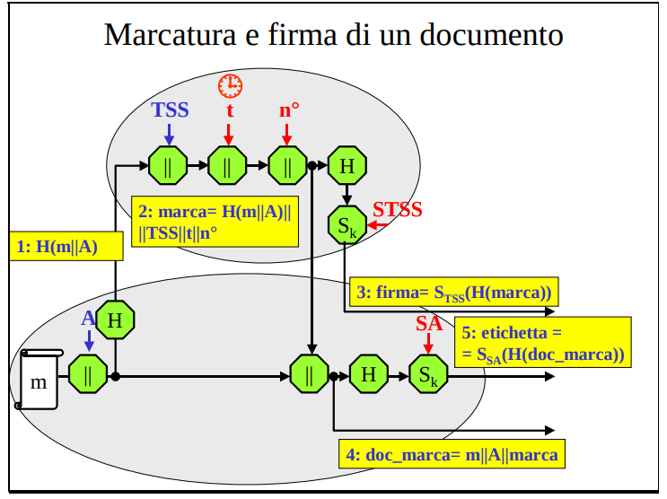

## TSS (Time Stamping Service)
Diversi sono i programmi che durante la loro esecuzione chiamano in causa l’orologio interno del calcolatore al fine di associare una marca temporale (anno, mese, giorno, ora, ecc.) ai dati che devono gestire. 
- **Diversa è anche l’accuratezza richiesta alle marche temporali: tutto dipende dall’uso che ne viene fatto**.

A noi interessano le **marche temporali impiegate insieme alle firme digitali**. Le firme digitali spesso dipendono da una marca temporale:
- per validità
- o quantaltro (pensa a momenti di invio di un messaggio per una graduatoria)

Quando firmi digitalmente un documento, la firma garantisce due cose:
- Integrità – il contenuto non è stato modificato dopo la firma.
- Autenticità – la firma è stata fatta proprio da quel titolare del certificato.

**Ma non garantisce di per sé la data e l’ora reali della firma**
- Infatti, la data scritta dentro il documento o anche quella che il software di firma mostra può essere **presa dall’orologio del computer del firmatario**
- ma quell’orologio **può essere impostato a piacere** 
- **non da alcuna garanzia sull'istante reale di firma** 

Se hai solo la firma digitale senza marca temporale sicura, in un contenzioso qualcuno potrebbe dire:
- "Io l’ho firmato prima che scadesse il mio certificato!", oppure
- "L’ho firmato quando il contratto era ancora valido!"

e sarebbe difficile dimostrare/rifiutare queste affermazioni

Con la marca temporale sicura, invece, un ente terzo indipendente certifica:
- "Questo documento era così alle 15:23 del 12 agosto 2025" e questa **data non è falsificabile**.

In pratica, la marca temporale serve per:
- Dimostrare quando un documento è stato firmato o esisteva in quella forma
- Rendere valida nel tempo una firma digitale anche dopo la scadenza o revoca del certificato
    - si sa se la firma è stata apposta prima o dopo la scadenza del certificato
- Evitare dispute su date falsificate

### Da dove si prende una misura precisa del tempo?
La Comunità internazionale ha **assunto come riferimento temporale** primario il comportamento medio di 260 orologi atomici posti in Istituti di Metrologia di più di 40 nazioni (**TAI** o Tempo Atomico Internazionale).

Un secondo riferimento internazionale è fornito da **UTC** (Tempo Universale Coordinato) che apporta una piccola correzione alle misure del TAI: l’obiettivo è far avvenire esattamente alle 12:00:00 il passaggio del sole a Greewich.

Le misure TAI e UTC sono diffuse nei vari Paesi ed impiegate poi da Enti e da persone per **sincronizzare orologi meno stabili e meno precisi**.

I calcolatori che richiedono una alta precisione temporale sincronizzano i loro orologi con questi riferimenti (magari con un protocollo apposito come **NTP**)   
- Il caso che qui interessa discutere è la sincronizzazione degli orologi di calcolatori impiegati nella generazione delle marche temporali. 

### Firma digitale con marca temporale
*Come al solito non dobbiamo studiare per filo e per segno i protocolli, ma dobbiamo capirne la logica e generalizzare le tecniche usate al suo interno per i nostri scopi e capire a cosa servono quest'ultime*

Un preciso riferimento temporale nella firma digitale di un documento consente a chi lo riceve sia di conoscere con esattezza la data di creazione, sia di accertare che a tale data la chiave di firma era valida.

Se gli utenti si fidano l'uno dell'altro, la marca temporale può essere apposta direttamemte dal firmatario (vedi PGP).

Altrimenti, occorre prevedere che la marcatura temporale del documento sia svolta da un’Entità fidata diversa dal firmatario e dotata di un orologio sicuro (TSS).

Un servizio sicuro di marcatura temporale deve avere diverse proprietà:
1. L’istante di marcatura di un documento non deve essere falso (deve essere quello indicato o dal TAI, o da UTC)
    - per questo il TSS deve essere fidato
2. La marca temporale deve riferirsi univocamente ad un istante, ad un documento ed a chi l’ha firmato
    - firma digitale
3. Chiunque deve poter accorgersi che una marca temporale è stata alterata
    - impiego di hash
4. Deve essere possibile far marcare temporalmente anche dati riservati
    - impiego di hash
5. Chiunque deve potere far marcare suoi documenti e verificare la marca apposta su documenti degli altri
    - servizio pubblico
    - impiego di crittografia asimmetrica

Una possibile organizzazione del servizio è indicata in figura.
1. L’utente A, prima di firmare un documento m, invia a TSS il suo identificativo e la sola impronta di m, per difenderne l’eventuale riservatezza.
2. TSS concatena H(m) con il suo ID, con l’indicazione temporale t e con il numero progressivo n° che ha attribuito alla marca.
3. TSS restituisce ad A sia questo dato in chiaro, sia la firma che ha apposto al tutto.
4. A, dopo aver verificato la correttezza della marca (l’impronta arrivata a TSS potrebbe essersi deteriorata lungo il percorso od aver subito un qualche attacco attivo), la allega al suo documento.
5. A firma l’intero documento ed allega la firma della marca apposta da TSS. 

Per il buon funzionamento occorrono due presupposti:
1. nessuno deve riuscire a far marcare un documento con un tempo diverso da quello reale;
2. tutti devono poter verificare l’origine della marca temporale.

La soluzione usuale è prevedere che **TSS sia un Ente fidato** (ci fidiamo che lui firmi sempre con le misurazioni del tempo prese da TAI/UTC) e che la chiave di verifica della sua firma sia **certificata**.
- Lo standard PKIX prevede che il servizio di time stamping sia incluso tra quelli **offerti da una PKI**.

Problemi:
- fiducia
- non molto scalabile in quanto servizio centralizzato molto richiesto
    - vita della chiave del TSS deve essere breve in quanto impiegata un sacco