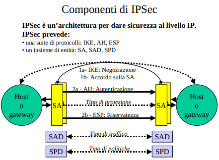
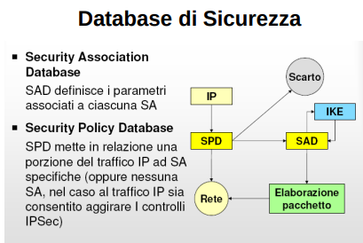
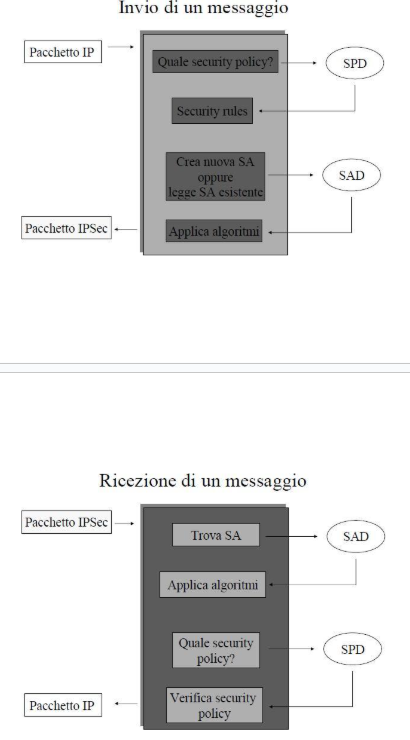
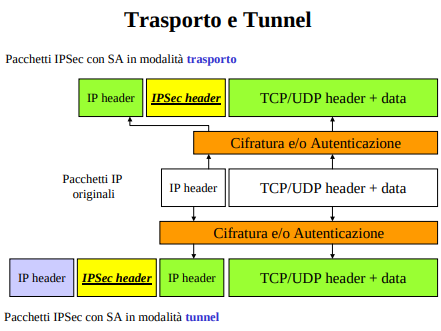
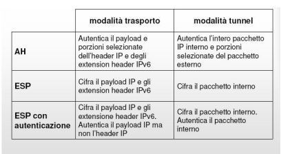
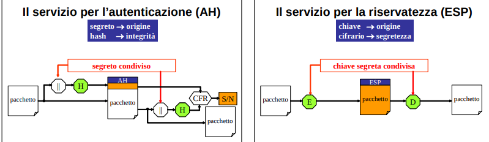

IPSec non è solo una suite di protocolli ma una vera e propria un’architettura sicura per il livello IP che prevede una serie di protocolli.

In figura è delineata la struttura logica che IPSec prevede di interporre tra due nodi della rete che intendono corrispondere:
- a grandi linee si distinguono tre protocolli per svolgere altrettanti servizi sicuri
- e tre strutture di dati per configurarli come desiderato dagli utenti. 

Obiettivi:
- Evitare la lettura di pacchetti intercettati -> cifratura (sniffing); 🡪 riservatezza
- Proteggere da falsificazione IP mittente (spoofing); 🡪 autenticità
- Proteggere da inserimento nei pacchetti illeciti nella comunicazione (hijacking); 🡪 integrità
- Proteggere da Denial of Service.

Garantisce sempre confidenzialità e autenticazione
- stavolta però siamo a livello IP
- stiamo autenticando e cifrando la comunicazione non tra un client e un server (processi) ma tra macchine fisiche
    - payload IP (e non TCP) incapusula i pacchetti dei layer superiori
- notiamo che siccome i due enpoint devono mantenere dello stato, questa versione di IP è connection oriented e **non più connectionless**

IPSec è costituito di tre protocolli:
- **Authentication Header (AH)**
    - per autenticazione, integrità e origine dei pacchetti;
- **Encapsulating Security Payload (ESP)**
    - per la riservatezza delle informazioni dei pacchetti 
    - sia per riservatezza che autenticazione se configurato appositamente
- **Internet Key Exchange (IKE)** 
    - per negoziazione dei parametri di sicurezza, autenticazione e distribuzione delle chiavi di sessione

Con IPsec (grazie alle SA) abbiamo anche una **granularità maggiore dei servizi di sicurezza che possiamo impiegare** rispetto a SSL
- possiamo ottenere solo riservatezza (ESP)
- o solo autenticazione (AH)
- o entrambi (ESP configurato appositamente)
- SSL mi da sempre tutto

L'identificazione reciproca avviene dentro a IKE

IPSec ovviamente rallenta il trattamento del pacchetto introducendo overhead di gestione.

**Quando si usa IPSEC?**
- VPN
- connettere LAN in maniera sicura
- routing sicuro

**Chi realizza una canale ipsec?**
- Due nodi (end-point).
- Un nodo e un gateway
- Due gateway

### Gli elementi di ipsec

#### SPD (Security Policy Database)
entità che esamina tutto il traffico IP, sia in ingresso che in uscita, per decidere quali pacchetti debbano usufruire dei servizi IPSec.
- una sorta di dispatcher con cui è possibile configurare cosa viene gestito da ipsec (quali porzioni del traffico), e cosa no
- Contiene le politiche di sicurezza da adottare per un determinato pacchetto. 

SPD contiene un insieme di politiche ciascuna delle quali specifica una porzione del traffico IP e la SA (contenuta in SAD) per quella particolare porzione di traffico.
- in pratica una mappa con **chiave=selettore del traffico**, e **valore=SA** 
- tramite **selettori** descrive come si vuole gestire il traffico:
    - da quali host si può ricevere pacchetti
    - quale traffico deve essere scartato,
    - quale traffico deve essere cifrato,
    - quale traffico deve essere autenticato,
    - ecc..

Esempi:
- tutto il traffico verso 192.169… deve essere protetto con ESP in modalità trasporto usando DES-CBC;
- il traffico FTP verso 192… deve essere protetto con ESP in modalità tunnel usando 3DES-CBC;
- ecc….

#### SA ed SAD
Per impiegare i servizi di sicurezza di ipsec, sorgente e destinazione devono aver “stipulato un contratto” (vedi IKE) che sancisce quali protocolli (AH o ESP), quali algoritmi e quali chiavi dovranno utilizzare per ogni “tipo” di traffico che intendono scambiarsi.
- ricorda handshake in TLS

L’insieme di queste informazioni è detta **Associazione di Sicurezza (Security Association o SA)**, è associata ad un certo tipo di traffico (vedi SPD) e si riferisce ad una **sola direzione del flusso di dati**
- Le SA **identificano in maniera univoca una connessione unidirezionale tra due interlocutori**, specificando il servizio di sicurezza offerto con i relativi parametri (chiavi, algoritmi, ...)
- Per avere protezione completa (traffico protetto in ingresso e uscita) di un canale bidirezionale occorrono due connessioni logiche unidirezionali (due SA).
- **Le SA vengono negoziate** tra i nodi in comunicazione (IKE). 

Una SA è identificata da tre parametri:
- SPI (Security Parameter Index)
    - Valore di SPI nelle intest. di AH, ESP per poter selezionare la SA con cui elaborare il pacchetto ricevuto
- IP di destinazione;
- Protocollo di sicurezza usato (AH o ESP). 

**Sorgente e destinazione devono dunque mantenere in un proprio database (detto SAD) i parametri di tutte le associazioni di sicurezza che hanno negoziato**  
- SAD è un database organizzato ad entry in cui per ogni SA ci sono tutte le informazioni che sono state negoziate tra gli interlocutori e permettono di gestire quella SA (es chiavi di cifratura, parametri crittografici, algoritmi ecc.).
- Tutte le SA attive su una connessione sono contenute nel SAD

### Invio e ricezione del traffico in ipsec

Invio:
- in base ai selettori in SPD si sceglie la politica di sicurezza da applicare al pacchetto, che specifica per il pacchetto IP
    - che modalità di incapuslamento adottare (trasporto o tunnel)
        - specifica una trasformazione da applicare al pacchetto 
    - e che protocollo di sicurezza adottare (AH o ESP).
- In base alla politica scelta, si controlla in SAD se esiste già una SA utilizzata in passato (istanziata con IKE) da poter riutilizzare o se si deve crearla.
- A questo punto si applicano gli algoritmi di trasformazione per ottenere il pacchetto IPSec, e si invia quest'ultimo

Ricezione:
- il pacchetto IPSec è cifrato/autenticato.
- Grazie al SPI nell'header, si va a trovare la SA nel SAD per capire quali sono gli algoritmi da applicare per poter decifrare/ verificare 
- alla fine dell’applicazione degli algoritmi si va a vedere in SPD la politica di validità per capire se quello è un pacchetto valido.
- Se lo è, si è riottenuto il pacchetto IP originario.

### Modalità di incapsulamento
Durante la definizione della SA è possibile scegliere tra due differenti modalità di trasporto dei pacchetti: il transport mode ed il tunnel mode.
- **Con entrambe le modalità, il servizio può poi essere o AH o ESP**

Modalità tunnel e modalità di trasporto in IPsec rappresentano la modalità di incapsulamento ovvero le modalità in cui il pacchetto IP originario viene incapsulato nel pacchetto IPsec che si va a costruire.

**Transport mode**
- viene protetto (cifrato e/o autenticato) **solo il payload del pacchetto IP**
    - cioè i dati provenienti dai protocolli di livello superiore a quello di rete (TCP, UDP, ...)
    - prevede che il pacchetto IPsec sia direttamente instradabile sulla rete pubblica (infatti ip sorgete e destinazione rimangono inalterati)
- È tipicamente impiegata quando i due end-point sono degli end-system.
- Visto che l’intestazione del pacchetto IP originale non è alterata (contiene gli indirizzi IP sorgente e destinazione originali). Il pacchetto ipsec è sempre instradabile qualsiasi sia la configurazione dei peer (H2H, G2G, ...)

**Tunnel mode**
- l’intero pacchetto IP viene cifrato e/o autenticato (quindi payload da livello TCP + header IP)
- indirizzo IP sorgente e destinazione contenuti nell’header del pacchetto IP originario non sono visibili e **per rendere il pacchetto instradabile viene costruito un nuovo pacchetto IP che incapsula il pacchetto cifrato**,
    - protezione totale del pacchetto anche degli header (non faccio sapere neanche indirizzi di mittente e destinatario)
    - gli indirizzi del nuovo pacchetto ip sono diversi rispetto a quelli originali

I nuovi IP di chi sono?
- Il nuovo indirizzo IP sorgente è l’IP del gateway o host che sta effettuando il tunneling (es. il router/firewall che protegge la LAN di partenza).
- Il nuovo indirizzo IP destinazione è l’IP del gateway o host remoto con cui è stabilita l’associazione di sicurezza (Security Association).

In pratica, i nuovi IP identificano i due endpoint del tunnel IPsec.
- per questo motivo **non è una modalità utilizzabile in un canale host-host** ma solo end-user/ gateway oppure gateway/gateway
    - essendo nascosto l’indirizzo IP originario di destinazione, nel nuovo pacchetto IPSec l’indirizzo di destinazione può appartenere solo ad un gateway.
- nota che h2g va bene ma g2h no

Se due gateway parlano in modalità tunnel, ciascuno incapsula i pacchetti dei nodi dietro di sé e li spedisce all’altro gateway. Una volta ricevuto, il pacchetto originale viene decapsulato e consegnato all’host di destinazione nella rete remota.
- vedi vpn

Se un host e un gateway parlano in modalità tunnel, il gateway rappresenta la rete remota, e l’host può inviare pacchetti verso quella rete come se fosse direttamente connesso.
- vedi accesso remoto

In pratica, origine, destinazione e contenuto sono verificati **solo alla fine del percorso** quando si raggiunge il gateway di destinazione (e decifrati nel caso ESP).

- È utilizzata quando i due host appartengono a reti locali diverse e quindi quando i due end-point delle rispettive reti locali sono gateway (firewall o router):
    - in quel caso l’IP destinazione diventerebbe il gateway dell’altra rete locale.
- **Con questo metodo è possibile utilizzare Internet come supporto di una rete virtuale privata (VPN)**.
    - se i pacchetti hanno l’intestazione ESP nessuno può vederne indirizzi e contenuto;
    - è comunque in ogni caso impossibile modificarli o falsificarli senza che il ricevente se ne accorga (il tutto è autenticato).

**molto importante**:
A seconda del protocollo della suite IPSEC, e che modaliltà di incapsulamento uso, ottengo proprietà di sicurezza più o meno estesa
- autentico/cifro solo payload e non header oppure tutto
- bisogna scegliere la combinazione adeguata ai proprio scopi

### AH ed ESP

IPv6 fornisce un servizio di autenticazione ed un servizio di cifratura. I due servizi sono mutuamente esclusivi  e contraddistinti da due differenti extension header (header ipsec aggiunti agli header ip)
- L'Authentication header (AH) è apposto ai pacchetti su cui la sorgente ha operato per **garantirne autenticità ed integrità**; al suo arrivo indica alla destinazione di verificare che il pacchetto non sia stato modificato in transito o non sia stato generato da un intruso
- L'Encrypted Security Payload header (ESP) è apposto ai pacchetti di dati che la sorgente ha sottoposto a cifratura; al suo arrivo **chiama in causa la decifrazione** e consente quindi solo alla legittima destinazione di rimettere i dati in chiaro. 

Come già detto sopra, per svolgere tali servizi, sorgente e destinazione devono aver “stipulato un contratto” (SA) con IKE che sancisce quali protocolli, quali algoritmi e quali chiavi dovranno utilizzare per ogni “tipo” di traffico che intendono scambiarsi. 

Per questo motivo, seppure le intestazioni AH e ESP, hanno formati diversi. In entrambe i formati è previsto un campo SPI (Security Parameter Index) di 32 bit
che serve alla destinazione per identificare la SA da usare

**NB**: in IPSEC prima cifra e poi HMAC (se si usa ESP autenticato), mentre in SSL il contrario
- ipsec più corretto in fase di ricezione: mi permette di risparmiare la decifrazione se il pacchetto non è integro/autentico

#### servizio anti-replica
Un ruolo importante per la sicurezza riveste anche il campo _Sequence number field_ in cui la sorgente indica il numero di sequenza attribuito al pacchetto per mettere in grado la destinazione di **scartare ogni pacchetto replicato da un intruso**.

Inoltre, come è noto, IP non garantisce l’arrivo di tutti i pacchetti ed il rispetto del loro ordine originario. Per dare comunque alla destinazione la possibilità d’individuare pacchetti replicati, è usato il principio della **finestra scorrevole**.

I seguenti controllo vengono fatti su un pacchetto **valido** (integro ed autentico)
- se arriva qualcosa a sinistra delle finestra si assume che sia qualcosa che sia gia arrivato e quindi si scarta il pacchetto
- se ricade dentro la finestra si marchia quel numero di sequenza come ricevuto
    - successivi arrivi dello stesso seq num vengono scartati
- se arriva qualcosa a destra della finestra si sposta la finestra e si marchia quel numero di sequenza come ricevuto   

### protocollo di negoziazione IKE skippato (godo)
molto simile al protocollo di negoziazione per SSL