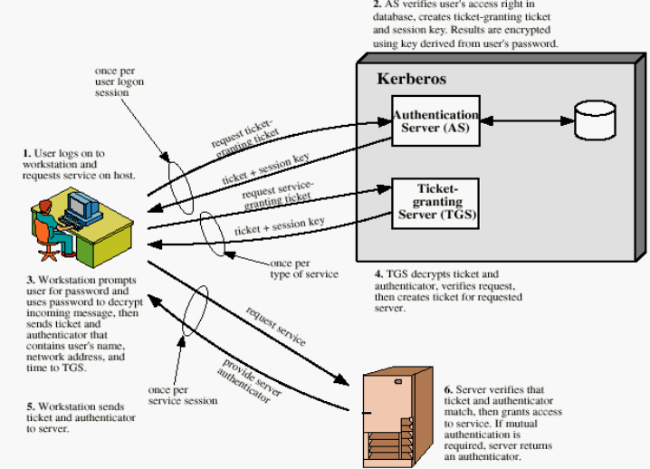

Kerberos è un **servizio di Autenticazione** per un ambiente client/server

Compito del sistema è il **controllo d’accesso (identificazione)** ad un insieme di server che offrono servizi distribuiti da parte di una comunità di utenti avente a disposizione un certo numero di workstation.
- Consente quindi a un utente tramite la propria workstation (comunità di utenti tipicamente piccola, ambito di tipo aziendale) di autenticarsi mutuamente su un server (tra tanti disponibili) e accedere al servizio fornito.

Il servizio di autenticazione si **ispira al modello del KDC**
- **impiega solo meccanismi a chiavi simmetriche** (cifrari simmetrici) 
- e richiede la presenza in linea di una **terza parte fidata (auth server)**.

È adatto però solo a domini limitati con utenti conosciuti a priori, come in azienda.

#### ragionamento iniziale | dove posiziono il servizio di autenticazione?
sulle workstation?
- **ogni workstation dovrebbe tenere traccia delle prova di identità di tutti gli utenti**
- ci dovrebbe essere una relazione di fiducia tra le workstation e i server 
    - scala con n^2
    - e devono essere aggiunte/tolte se vengono aggiunte/tolte delle workstation/server
- **non scalabile**
    - ci può stare se ci sono poche macchine e quindi l'aggravio ammistrativo del sistema è basso

sui server?
- uhm, stessi problemi in realtà

**Idea**: non ha senso distribuire su tutte le macchine le funzionalità di autenticare gli utenti, utilizziamo un **unico server di autenticazione centralizzato**.
- relazione di fiducia tra i server ed il server di autenticazione (**singola**).
    - I server accettano tutti i messaggi autenticati dal server di autenticazione
- permette Single Sign On
    - credenziali singole per accedere a tutti i servizi
    - le informazioni di autenticazione sono mantenuta da questo server centralizzato e non distribuite in giro
    - non ci sono problemi di sincronizzazione
    - **NB**: SSO è possibile siccome tutti i servizi hanno una relazione di fiducia con AS (o meglio, con TGS)
- permette di autenticare gli utenti ai server e i server agli utenti.

### Architettura generale Kerberos 
Ogni utente del servizio ha un suo **identificativo ID** ed un’unica **password P**, che gli consente di accedere a tutti i servizi. Il sistema che controlla gli accessi memorizza **un’impronta H(P)** di 64 bit come termine di paragone.

Gli obiettivi di sicurezza sono:
- rendere impossibile ad un intruso l'impersonare un utente legittimo;
- eliminare a priori la comunicazione della password;
- rendere trasparente all’utente l’intero processo di autenticazione;
- richiedere che l’utente fornisca prova della sua identità e del suo diritto al primo accesso ad ogni servizio;
- consentire agli utenti una sicura identificazione dei server.
    - si ha quindi identificazione mutua

Il servizio di autenticazione è implementato tramite due server particolari:

**AS (Authentication Server)**:
- **memorizza la password** ed i diritti (autorizzazioni ai vari servizi) di tutti gli utenti
- lancia una sfida d’identificazione a chi inizia una sessione di lavoro presso una qualsiasi delle workstation e gli restituisce un documento cifrato (ticket_tgs) che dovrà presentare a TGS al fine di ottenere specifiche autorizzazioni.

**TGS (Ticket-Granting Server)**: 
- condivide una chiave segreta con AS ed una con ogni altro server V
- decodifica e verifica il documento di AS che l'utente gli invia
- esamina la correttezza della risposta alla sfida lanciata da AS e, se tutto è “a posto”, restituisce all’utente un **diritto d’accesso (ticket) al server V di suo interesse**
    - valido per tutta la sessione di lavoro.

#### Nomenclatura
**V**:
- server al quale l’utente vuole accedere per utilizzare un determinato servizio
- AS precondivide con tutti i server chiavi simmetriche (Kv', Kv'', ...)

**C**:
- workstation client che richiede di poter accedere a V.
- ADc indirizzo IP della workstation (il protocollo deve avvenire dalla stessa workstation) 

**Sessione**:
- se l’utente, all’interno di una stessa sessione, vuole accedere più volte allo stesso servizio, **non dovrà ripetere l’autenticazione**, ma semplicemente continuare ad utilizzare il ticket che gli ha fornito TGS (se non è scaduto) per accedere a V.
- Analogamente se vorrà accedere a un altro servizio **dovrà richiedere un nuovo ticket a TGS**, senza interpellare AS (se l'autenticatore fornitogli da AS non è scaduto);

 

Studiamo il protocollo di Kerberos in maniera incrementale

### Semplice dialogo di autenticazione (che non va bene)

1. C -> AS : ID_c || P_c || ID_v
    - mi identifico (passivamente) presso AS e specifico il servizio a cui voglio accedere
2. AS -> C : Ticket
    - Ticket = E_kv( ID_c || AD_c || ID_v )
    - AS, se la password è corretta, mi fornisce direttamente lui un ticket che mi autorizza ad usare il servizio
    - AS svolge anche il ruole di TGS... :(
        - precondivide segreti con tutti i servizi
    - i ticket autenticano perchè sono cifrati con la chiave segreta del servizio
        - solo un utente che si è autenticato presso AS può ottenere quel ticket
    - **NB**: per evitare intercettazione del ticket al passo 2 e replica al passo 3, dentro al ticket vi è anche ADc che deve combaciare con l'indirizzo di chi presenta il ticket (... ma è sufficiente?) 
3. C -> V  : ID_c || Ticket
    - mi autentico presso il servizio presentato il ticket

**Problemi**:
- Identificazione passiva:
    - sappiamo essere suscettibile ad attacco con intercettazione e replica;
    - **bisogna rendere attiva l'identificazione**

- Attacco di replica:
    - è possibile per un attaccante riutilizzare il ticket emesso al punto 2 falsificando l'indirizzo IP della workstation (facile da fare)
    - un attaccante può facilmente impersonare un utente ed ottenere accesso ad un servizio con le sue autorizzazioni

- Overhead elevato
    - è necessario infatti rifare il protocollo ogni volta che si vuole accedere ad un servizio diverso (bisogna rifare l'identificazione)
    - (Se invece si usa costantemente lo stesso servizio si può pensare di mantenere un ticket)

### Dialogo di autenticazione più sicuro

#### Per ogni sessione di log-in
1. C -> AS : ID_c || ID_tgs
2. AS -> C : E_kc( ticket_tgs ) 
    - ticket_tgs = E_ktgs( ID_c || AD_C || ID_tgs || TS_1 || lifetime_1 )

i clienti C e AS precondividono una chiave segreta oltre alle PWD
- si evita invio della PWD (e quindi attacco con intercettazione e replica)

**NB**: ticket_tgs è cifrato due volte
- la prima con la chiave del tgs
    - garantisce al tgs che questo ticket è stato emesso da AS (l'unico altro che ha ktgs)
- la seconda con la chiave corrispondente a ID_c
    - identifica C dato che solo il vero C è in grado di decifrare ticket_tgs in modo da presentarlo al TGS
    - (non è identificazione attiva più una POP -> va comunque bene )

timestamp e lifetime danno una **vita limitata al ticket** il che **riduce (ma non elimina)** l'attacco con replica del ticket

#### Per ogni servizio
1. C -> TGS : ID_c || ID_v || ticket_tgs
    - qua un attaccante può provare a replicare ticket_tgs per ottenere un nuovo ticket_v (si spera che sia scaduto) 
2. TGS -> C : ticket_v
    - ticket_v = E_kv(ID_c || AD_c || ID_v || TS_2 || lifetime_2)
3. C -> V   : ID_c || Ticket_v

Se all’interno di una sessione di login contatto lo stesso servizio molteplici volte **non c’è bisogno di (1) e (2)**, basta ripresentare ticket_v (fino a quando è valido)

**problemi**
L’attacco con replica è ancora possibile (seppur limitato dalle scadenze dei ticket) poiché non è garantito che chi usa il ticket creato per C sia veramente C.
- C infatti non dice a V di essere il possessore del ticket (serve ancora qualcosa)

Occorre anche **autenticare i server V** 
- in generale non voglio scambiare informazioni con un attaccante
- ma anche se questo non fosse un problema, faciliterei ancora di più l'attacco con replica descritto sopra
    - **un intruso che finge di essere un server V** può intercettare il ticket al passo 3 e riutilizzarlo
 
Come dimensionare la durata dei ticket?
- se troppo breve, l'utente deve reidentificarsi troppo spesso
- se troppo lungo, facilito l'attacco con replica

### Kerberos v3
Per ogni dominio di amministrazione Kerberos esiste un AS e un TGS.

Vi è una serie di **precondivisione di segreti (instaurazione di relazioni di fiducia)**:
- Gli utenti precondividono segreti con gli AS,
- gli AS con i TGS
- i TGS con i servizi

Questi segreti precondivisi permettono di identificare e di avere garanzie sull'autenticazione:
- TGS è sicuro che C ci si sia autenticato da AS dato che ...
- ... 

Il protocollo si articola in questo modo:

1. All’inizio della sessione di lavoro sulla stazione C (una volta per login), **l’utente dichiara la sua identità ad AS**.
    - C->AS: IDc||ADc||IDtgs||T1
        - ADc perché un client sceglie una workstation con un IP proprio (ADc) e il server deve restituire nel ticket un permesso per un certo specifico ADc.
        - Riduce attacchi con replica: chi usa il ticket creato sia veramente C. 
    - l'id del TGS non è cablato dato che i server V possono essere stati suddivisi in diversi gruppi (realm), ciascuno controllato da un suo TGS

2. AS fornisce a C il permesso d’accesso a TGS (ticket_tgs) e lo **sfida ad usarlo** (cifrando con la chiave dell'utente dichiarato).
    - AS->C: Epsw(**Kct**||IDtgs||**T2||ΔT2**||**ticketTGS**)
        - AS e C hanno precondiviso il segreto Psw
        - solo C vero (che conosce la sua password) è ingrado di decifrare la chiave di sessione e il ticket
        - **Kct** = chiave di sessione tra C e TGS che serve a identicare chi invia il ticket.
        - **TicketTGS** = EKtgs(Kct||ID||ADc||IDtgs||T2||ΔT2)
            - AS e TGS precondividono una chiave segreta,
            - **solo il TGS sa interpretare il ticket fornito dal AS (da qui ottiene la chiave di sessione)**
        - T2 e ΔT2 indicano **l'inizio e la durata massima della sessine di lavoro**

3. C risponde alla sfida (decifrando ticket_tgs inviatogli da AS) e **richiede l’accesso al server V a TGS**.
    - C->TGS: IDv||ticketTGS||**autenticatoreC** 
    - autenticatoreC= E_Kct(IDc|| ADc || **T3**)
        - T3 evita la replica dell'autenticatore consentendo a TGS di verificare se quest'ultimo è "fresh" o meno
    - autenticatoreC serve per far sapere a TGS che **chi ha inviato il ticket è veramente C**
        - cifrato con la chiave di sessione in possesso da C e da TGS
            - solamente chi è riuscito a rispondere alla sfida di AS (decifranod E_psw) è in possesso della chiave di sessione giusta
            - **l'autenticatore dimostra che l'utente è riuscito a superare la sfida di AS**
            - TGS è sicuro dell'identità dichiarata nell'autenticatore e in ticket tgs (devono combaciare)
                - attacchi con replica non più possibili
        - è la cosa che mancava nel protocollo precedente

4. TGS fornisce a C il permesso d’accesso a V e lo sfida ad usarlo
    - innanzitutto, TGS decifra con la sua chiave segreta il ticket_tgs ricevuto ed estrae la chiave di sessione 
        - controlla se il ticket è scaduto e roba
    - Decifrando con la chiave di sessione l’autenticatore allegato al messaggio che ha ricevuto da C, **TGS completa il protocollo a sfida/risposta lanciato da AS**: 
        - se l’autenticatore contiene e le informazioni del ticket combaciano, l’utente è, infatti, proprio chi dice di essere. 
    
    Poi risonde (sicuro di star comunicando con C):
    - TGS->C: E_Kct(Kcv||IDv||T4||**ticketV**)
        - **Kcv** = nuova chiave di sessione tra C e V
    - ticketV = E_kv(Kcv||ID||ADc||IDv||**T4||ΔT4**)
        - cifrato con la chiave precondivisa tra TGS e V
        - di nuovo si ha un periodo di validità della sessione

5. C decifra ticket e chiave di sessione e si autentica presso V
    - C -> V: ticketV||autenticatoreC
    - autenticatoreC = E_Kcv(IDc||ADc||**T5**) 
        - anche qui si usa un autenticatore per assicurare a v che chi ha inviato il il ticket è proprio chi dice di essere (no attacchi con replica)
        - analogo a quello del passo 3 ma stavolta bisogna identificarsi presso V e quindi si cifra con la chiave di sessione Kcv
            - solamente chi è riuscito a rispondere alla sfida di AS (decifranod E_psw) è in possesso della chiave di sessione Kct con cui decifrare Kcv
        - con questo autenticatore, **sfida anche il server a dimostrare che è proprio V lanciandoli una sfida con T5**. 

6. V si fa identificare da C
    - V, se è veramente lui, è in grado di decifrare il ticket di TGS inoltratogli da C. Può in particolare estrarre la chiave di sessione KCV ed impiegarla per mettere in chiaro l’autenticatore allegato al ticket. 
        - di nuovo confrontando le info presenti nell'autenticatore con quelle del ticket, V si può assicurare dell'identita di C
    - V->C: Ekcv(T5+1) con questo **V risponde a C identificandosi**

Completato il protocollo il client C inizia ad avvalersi dei servizi del server V.

Se successivamente l’utente ha ancora bisogno di V il protocollo ricomincia dal passo 5 (ripresentando ticketV)
- basta rigenerare un nuovo autenticatore (T5 fresh) e che il ticketV sia ancora valido ([t4, t4+d])

Se durante la sessione l’utente ha bisogno di accedere anche ad un altro server, il protocollo deve essere riavviato dal passo 3 (ripresentando ticketTGS)
- C è già stato identificato da AS
- bisogna rigenerare un autenticatore (T3 fresh) e chiedere un ticket per il nuovo V

### Conclusioni
non da sapere a memoria, ma bisogna saperci ragionare sopra
- **per quale motivo ci sono i timestamp**
    - prevengono gli attacchi con replica
    - se un autenticatore non è 'fresh' significa che è stato replicato e quindi non è da considerare valido
    - **NB**: timestamp != da periodi di validità: in kerberos i periodi di validità possono essere anche lunghi perchè non sono quest'ultimi a prevenire gli attacchi con replica come nel protocollo precedente 

- **perchè c'è l'autenticatore (utile da generalizzare)?**
    - anche questo previene gli attacchi con replica
    - permette di dimostrare di essere il legittimo proprietario di un ticket
    - solo chi si è identificato superando una sfida è in grado di produrre un autenticatore corretto

- **cos'è un ticket?**
    - i ticket sono **permessi di accesso**
        - al TGS
        - ai vari V
    - permettono ad un utente di **non doversi riautenticare un sacco di volte**
        - basta ripresentare un ticket (se ancora valido) per poter riusufuire dei servizi

- **Cos’è un authentication server?**
    - È un server che verifica l’identità di un utente (lo identifica) o di un servizio (OAuth) quando tenta di accedere a una risorsa come:
        - rete aziendale
        - applicazione web
        - database
        - VPN
        - servizio cloud
    - In pratica, il client dice: “Sono Alice” e il server risponde: “Dimostralo”.
    - fondamentalmente il “buttafuori digitale” di un sistema informatico:
        - controlla chi può entrare e che permessi ha una volta dentro.
    - A cosa serve?
        - **Centralizzazione** 
            - un unico punto per gestire credenziali e permessi.
            - non devo replicare per ogni servizio in cui mi autentico
        - **Single Sign-On (SSO)**
            - un login per più servizi, riducendo password multiple e login multipli.
        - Tracciamento
            - registrare chi si è autenticato, quando e da dove
    - Come funziona (flusso generico; non specifico di kerberos)
        - Richiesta di accesso – il client chiede di accedere a una risorsa.
        - Sfida (challenge) – il server chiede credenziali (password, token, certificato, biometria…).
        - Verifica – il server confronta le credenziali con un archivio (database locale, LDAP, Active Directory, ecc.).
        - Risposta:
            - Se OK → rilascia un token che prova l’avvenuta autenticazione.
            - Se KO → nega l’accesso e può loggare il tentativo.
        - Accesso alle risorse – il client usa il token per accedere ai servizi autorizzati.

L'autenticazione di Kerbers è fortemente centralizzata; in futuro vedremo anche autenticazione federata

### Servizio inter-realm (direi facoltativo)
Per rendere scalabile questo servizio di autenticazione, e’ stata prevista la coesistenza di diversi Kerberos tra cui esiste un rapporto di reciproca fiducia. 
ricorda: **come si creano delle relazioni di fiducia?**
- con dei certificati (cross certification delle CA)
- o, nel caso di PGP, con delle catene di fiducia tra utenti
- o, nel caso di kerberos, con delle chiavi precondivise

Fino ad adesso un utente ha sempre interagito con il proprio AS e TGS. Se volessi accedere ad un servizio appartenente ad un altro dominio
- il mio TGS può darmi un ticket per interagire con un TGS remoto

scalabilità
- quante chiavi devono essere predistribuite all'AS se ci sono n-utenti?
    - n in un solo dominio
    - **n^2 se voglio più domini** (impazzisco)  