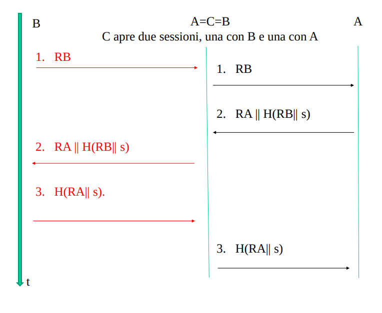
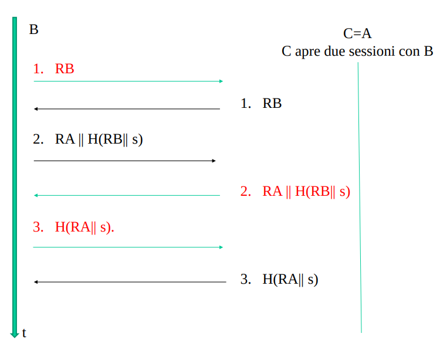

### Obiettivi
- Se le entità in gioco (A e B) sono fidate, B deve poter completare il protocollo di identificazione certo dell’identità di A 
- (**Transferability**) B non può riutilizzare lo scambio di identificazione con A per impersonare illegittimamente A presso un’altra entità. //non può trasferire la credibilità ad altri
- (**Impersonation**) Deve essere irrilevante la probabilità che un’entità terza C, che esegue il protocollo spacciandosi per A, possa indurre B a completare con successo il protocollo accettando l’identità di C come se fosse quella di A.
- Tutti gli obiettivi devono essere validi anche se si osservano numerose autenticazioni tra A e B, e se l’intrusore C è stato coinvolto in protocolli di identificazione con A e B anche in presenza di sessioni simultanee tra i due (vedi attacco del maestro scacchista) 
- identificazione sia unilaterale che **reciproca**

### Remind schema di un protocollo di identificazione

Due fasi:
- registrazione
- identificazione

Nella prima fase A e B concordano un segreto, nella seconda ci sono altre tre fasi:
- dichiarazione (A->B);
- interrogazione (B->A);
- dimostrazione (A->B).
    - dove viene fornita la prova di conoscenza

### Dimostrazione di conoscenza
Ricordiamo che per identificare bisogna fornire **informazioni non imitabili**. 
- Come già detto in 'trasformazioni per la sicurezza' per identificare delle macchine si può utilizzare solamente qualcosa che si sa. La **una prova di conoscenza!**

La dimostrazione della conoscenza di un segreto può essere eseguita tramite protocolli di identificazione di due tipi:

**protocolli attivi e passivi**
- passivo (o debole): 
    - non sono richieste elaborazioni da parte dell’identificando. 
    - **consiste solo nel comunicare il segreto concordato con il verificatore durante la registrazione e riusarlo in seguito.**
    - uso sempre lo stesso segreto come prova di identità (conoscenza)
- attivo (o forte): 
    - l’identificando deve prendersi carico di calcolare e di comunicare un dato sempre diverso ed imprevedibile per farsi riconoscere. La **dimostrazione di conoscenza**.
    - dimostrazione di conoscenza sempre diversa. La prova di conoscenza cambia da sessione di identificazione all'altra
    - la dimostrazione di conoscenza è funzione del segreto posseduto dall'identificando (e.g. one-time password, challenge-response, zero-knowledge)

**NB**: un protocollo di identificazione passiva è **per forza di cose unilaterale**. Al contrario, in un protocollo di identificazione attiva permette anche l'identificazione mutua.
- mi devo salvare le credenziali di ogni sito che visito? ridicolo

**NB**: protocolli attivi più robusti rispetto a protocolli passivi (vedi attacco con replica, e altre vulnerabilità sotto)


## Identificazione passiva
- cringe
- in locale anche accettabile
- nei sistemi in rete inaccettabile, è sempre possibile l'attacco con replica

Caratteristica dell’identificazione passiva è quella di far **trasmettere all’identificando sempre lo stesso dato**. 
- L’attacco più ovvio per l’intruso è intercettare la password comunicata da un utente legittimo e **replicare il messaggio** quando vorrà a sua volta avere libero accesso al sistema. 
- se l’utente cifrasse la password prima di trasmetterla, la pericolosità dell’attacco con intercettazione e replica non si ridurrebbe: 
    - è sicuramente vero che il testo cifrato intercettato dall’intruso non gli consente di individuare il segreto, 
    - ma ciò non gli impedisce certo di ripresentarlo tale e quale e di essere poi riconosciuto come il vero proprietario del segreto. 

L’intruso ha inoltre due altre vulnerabilità da sfruttare, **la memoria dell’utente e quella della macchina**. 
- Per facilità di memorizzazione, l'utente tende ad usare password corte e poco casuali... Facilmente indovinabili da un malintenzionato con un attacco con dizionario.
- con identificazione passiva le password vanno memorizzate da qualche parte (file, db). Se l'attaccante ottiene accesso al db delle pw, può impersonarsi come qualsiasi utente leggendo qualche entry, oppure può aggiungere una entry con le sue credenziali
    - una contromisura è memorizzare nel db l'hash (funzione non invertibilie) delle pw.
    - l'attaccante non può invertire gli hash e in questo modo solo l'utente conosce la sua pw
    - tuttavia le pw degli utenti abbiamo già visto essere poco casuali
    - diventa possibile precomputare l'hash di pw comuni e vedere se si trova un match (attacco con dizionario) 
    - contromisure all'attacco con dizionario (rainbow table) è aggiungere un salt alla password prima dell'hash. In questa maniera l'attaccante dovrà ricomputare il dizionario, e se si usa appositamente una funzione di hash particolarmente lenta, questo rende l'attacco infattibile. (guarda salt.md)

Un’ultima osservazione sulla debolezza intrinseca dell’identificazione passiva: 
- l’utente deve essere certo a priori che il **verificatore è veramente quello da cui vuole farsi riconoscere**. 
- Si potrebbe pensare di eliminare questo vincolo ricorrendo ad un protocollo in cui dapprima uno identifica l’altro e poi quest’ultimo identifica il primo. Purtroppo questo accorgimento è completamente insicuro.
- ESEMPIO – A, dopo aver indirizzato il sito di B, presenta le sue credenziali e si mette in attesa di quelle di B: se un intruso è riuscito a dirottare sul suo calcolatore i messaggi destinati a B non solo si guarderà bene dal rispondere, ma potrà successivamente spacciarsi per A ed ottenere dal vero B tutto quello che gli serve. 
    - intercettazione e replica
- conclusione: con l'identificazione passiva, l'identificando non può mai essere certo dell'identità dell'identificatore.


## Identificazione attiva
La vera contromisura all’attacco con intercettazione e replica è il prevedere che la prova d’identità sia continuamente cambiata
- posso intercettare la prova, ma il prossimo tentativo ne prevede una diversa e quindi non mi serve a niente
- vedremo che ciò consente anche l’identificazione reciproca.

Sono stati individuati tre differenti principi su cui basare l’identificazione attiva:
1. la password usata una volta sola (one-time password),
2. il protocollo a sfida/risposta (challenge/response),
3. la prova d’identità a conoscenza zero (zero-knowledge identity proof).

Tutti cercano di soddisfare la seguente regola di sicurezza:
```il calcolo della prova di identità da fornire di volta in volta deve essere facile per chi conosce un’informazione segreta, difficile per chi dispone solo delle prove inviate in precedenza```

I primi due metodi sono i più usati, realizzando un buon compromesso tra sicurezza ed efficienza; il terzo è il più sicuro, ma anche il più complesso ed è per questo poco impiegato. 


### one-time pwd
Il metodo della password impiegata una sola volta può basarsi sull’uso o di una **funzione unidirezionale** (o di un cifrario con chiave di sessione).

Il principio è di **assegnare all’utente una sequenza di password da consumare una dopo l’altra**. 

In fase di registrazione A sceglie a caso un numero X_A ed impiega una funzione non invertibile F (ad esempio una funzione hash sicura) per calcolare la sequenza di valori:  XA, F(XA), F^2(XA), F^3(XA) … F^n-1(XA) F^n(XA)
-  ove Fi indica l’i-esima applicazione di F. 
- I primi n dati sono memorizzati da A in ordine inverso (prima F^n(XA)).
- Nella memoria della macchina M viene inserito solo Fn (XA). 

Alla prima connessione A invia Prova(1) = F^n-1(XA) ed il sistema calcola F(Prova(1)). Se il risultato è proprio F^n-1(XA)
- A è identificato
- la one-time password che M ha ricevuto è memorizzata al posto del precedente termine di paragone (= funzione(segreto))
- A invece la depenna dalla sua lista, per poter usare il secondo dato come Prova(2).

Il comportamento di A e di M si ripete identico fino a quando il primo non invia XA, cosa che impone di rinnovare l'accordo sul segreto. 

L’ipotesi di non invertibilità della F rende del tutto inutile sia l’intercettazione delle prove già inviate, sia il furto del termine di paragone memorizzato da M. 
- l'attacco con replica non è più possibile dato che il verificatore cambia le prove di conoscenza ad ogni sessione di identificazione


#### cifrario con chiave di sessione
si era osservato che la trasmissione di una password cifrata non impedisce l’attacco con replica.
- l'attaccante rimanda il cifrato senza interessarsi del contenuto. La destinazione decifrerà e confronterà con il termine di paragone che è sempre lo stesso.

Questo non è più vero se l’identificando ed il verificatore, all’inizio di ogni loro sessione di lavoro, **concordano in segreto una sempre diversa chiave di cifratura**: la prova d’identità è di conseguenza sempre diversa e non serve a nulla intercettarla e replicarla.
- il segreto che invio è sempre lo stesso ma la prova di identità è diversa dato che è una cifratura con una chiave sempre diversa

Una chiave di cifratura sempre diversa è detta chiave di sessione (session key, one-time key). 

In questo caso sia A che B hanno il vantaggio di** poter memorizzare solo la PW che hanno inizialmente concordato**. Può però venire il dubbio che la modifica, continua ed in segreto, delle due trasformazioni costituisca un carico di lavoro eccessivo richiesto ai due corrispondenti.  Non è così e lo vedremo: tale delicata incombenza può essere **presa totalmente in carico dai servizi di rete, senza richiedere alcun intervento diretto da parte degli utenti (trasparenza)**.  
- ESEMPIO – All’inizio di ogni collegamento, i protocolli di rete SSL e IPv6 aiutano i due terminali a concordare in segreto la chiave di sessione che impiegheranno per cifrare ogni loro successiva comunicazione.
- vedi scambio DH


### sfida/risposta
Il metodo d’identificazione attiva oggi più usato è il protocollo a sfida e risposta (challenge/ response) per eseguirlo i due corrispondenti possono avvalersi
- o di funzioni hash sicure,
- o di un cifrario, simmetrico o asimmetrico,
- o di uno schema di firma digitale. 


#### hash
- A e B scelgono una funzione H sicura e **concordano un segreto s**.
- Quando A chiede a B di essere identificato inizia l’esecuzione del seguente protocollo a tre passi:
    1. B: invia ad A un dato di sfida RB che non ha mai impiegato prima (tale numero usato una sola volta è detto **nonce**);
        - i nonce servono proprio ad evitare gli attacchi di replay rendendo ogni sfida e risposta sempre diversa
    2. A: calcola c = H(RB || s) e trasmette c come risposta alla sfida;
    3. B: calcola c’ = H(RB || s) con i dati a sua disposizione ed esamina se c’ = c.

**NB**: cio che identifica è il segreto preconcordato, ma se mandassi l'hash di quello è basta sarei suscettibile ad attacch di replay (diventa identificazione passiva). Per questo si usa anche il NONCE.

**NB**: Se il nonce fosse prevedibile l'attaccante potrebbe sosituirsi a B e farsi mandare da A H(S || RB'); con RB' = nonce previsto dall'attaccante che B vero produrrebbe nella prossima sfida. A questo punto l'intrusore può spacciarsi per A con B nella prossima sessione dato che conosce l'hash che verrebbe usato da A alla sfida con RB'. 

Se si vuole un’identificazione mutua occorrono due dati di sfida (RA, RB). Un idea potrebbe essere:
0. A vuole identificarsi presso B e identificare B
1. B→A: RB                          // B sfida A
2. A→B: c_A = RA || H(RB || s)      // A risponde e sfida a sua volta B
3. B→A: c_B = H(RA || s)            // B risponde

Protocollo non robusto
- ho il problema che si possono tenere aperte due sessioni di identificazione
- **attacco di interleaving**: apro due sessioni contemporanee con due entità diverse
- **Attacco di reflection**: apro due sessioni contemporanee con la stessa entità

In realtà, per rendere sicura l’identificazione reciproca, occorre usare un protocollo più complesso. Considera il seguente problema:

**Il problema del Gran Maestro di scacchi (attacco di interleaving)**
Il signor A vuole spacciarsi per un grande esperto di scacchi pur non conoscendo il gioco.
- A sfida due Gran Maestri B e C, che sistema, senza che se ne accorgano, in due camere contigue: a B assegna i “bianchi”, a C i “neri”.
- Preso nota della prima mossa di B, A corre nell’altra stanza e la riproduce sulla scacchiera di C.
- Successivamente prende nota della contromossa di C e corre a riprodurla sulla scacchiera di B.
- Continuando così ottiene o due patte o un’incredibile vittoria. 



Utilizzando il protocollo ingenuo di sopra abbiamo che:
- **C tenta di impersonare B**
- quando A tenta di identificarsi presso B può produrre una sfida a cui A sa rispondere, impersonando A e rigirando la sfida prodotta dal vero B
- a questo punto A risponde alla sfida e sfida a sua volta l'intruso a dimostrare di essere B
- similmente a prima, C rigira la sfida al vero B insieme alla risposta di A, **identificandosi come A presso B**
- B risponde alla sfida rigirata, C riceve una risposta giusta da B a la passa indietro ad A, **identificandosi come B presso A**


**Attacco di reflection**


L’attacco richiede di attivare due copie del protocollo contemporaneamente. A inizia il protocollo inviando la sfida RA a C, C avvia un’altra copia del protocollo ma nell’opposta direzione inviando la sfida RA ad A pretendendo di essere B

C apre due sessione di identificazione (una in cui si identifica, e l'altra in cui identifica qualcun'altro):
- nella prima tenta di identificarsi come A presso B, B dunque lo sfida
- C non sa rispondere, ma può impersonare A ed aspettare che B tenti di identificarsi presso di lui
- a questo punto C può mandare come sfida verso B proprio il nonce che B gli aveva mandato come sfida nella prima sessione
- B, che è ingenuo, risponde; dando a C proprio la risposta che gli serviva alla sfida della prima sessione
- C a questo punto risponde alla sfida nella prima sessione e si identifica come A presso B
- per completare il protocollo, C sfida nella prima sessione B ad identificarsi come B 
- B, che non è un impostore, risponde correttamente, ma nel farlo fornisce la risposta all'ultima sfida che era rimasta aperta nella seconda sessione
- Concluso l'attacco C si è identificato come A presso B in entrambi i versi

**qual'è il motivo alla base della non sicurezza del protocollo di identificazione mutua che abbiamo visto**
1. c'è una forte simmetria tra i messaggi che A e B si mandano a vicenda
2. l'intrusore può rispondere con un ritardo rispetto a quando gli è stata fatta la sfida (aspetto di recuperare in qualche modo la risposta giusta)
    - non c'è un timestamping che limita la validità temporale dei messaggi
3. mancano dei legami tra i messaggi che mi consentono di **collegare una risposta ad una sfida**

Il protocollo viene quindi complicato nel seguente modo:
0. A vuole identificarsi presso B e identificare B
1. B→A: RB                                          // B sfida A                     
2. A→B: c_A = RA || H(**RA** || RB || **B** || s)   // A risponde 
3. B→A: c_B = H(RA || **RB** || **A** || s).        // B risponde

Bisogna dunque impedire all’intruso di intromettersi nel protocollo, spacciandosi per A con B e per B con A: **l’inserzione dell’identificativo del destinatario nelle risposte** è un primo utile accorgimento difensivo.
- (se uno si spaccia per B, l'identificatore non è quello di B?)

Bisogna anche non concedere all’intruso il tempo per svolgere contemporaneamente due protocolli (reflection): a tal fine al posto, o a fianco, di RA e di RB sono spesso impiegate delle marche temporali (**time-stamp**) per controllare quanto tempo intercorre tra il lancio della sfida e l’arrivo della risposta (faccio andare in timeout le sfide se passa troppo tempo). Utile sia per reflection che per interleaving

Un ulteriore accorgimento è quello di numerare le identificazioni (seq number) tra i due interlocutori (sia per inteleaving che per reflection). 

Come ogni contromisura, timestamp e numeri di sequenza hanno un costo e non sono sempre appropriati:
- Timestamp
    - occorre un servizio di timestamp sicuro altrimenti possono essere falsatiì
    - problemi di sincronizzazione
- Seq Num
    - necessità di mantenere dello stato per molto tempo

#### cifrario e firma
Per lanciare la sfida e controllare poi la risposta, può essere impiegato anche un Cifrario, o uno Schema di firma.

Nel primo caso il verificatore cifra il nonce (con la chiave pubblica del verificando (da autenticare) se si usa cifrario asimmetrico), si mette in attesa della sua decifrazione e confronta infine il risultato con il dato in suo possesso.

Nel secondo caso il verificatore trasmette il nonce in chiaro, si mette in attesa della sua firma e poi la verifica (di nuovo la chiave pubblica deve essere autentica)


### conclusione finale
protocollo di identificazione = real time
- per mantenere l'identità dell'entità identificata nel tempo occorre **affiancare ai protocolli di identificazione, dei protocolli di autenticazione**
    - e.g. utilizzare degli HMAC dopo l'identificazione

