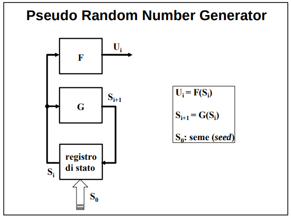

Abbiamo visto:
**Come si memorizzano?**
**Come si distribuiscono?**
**Come vengono utilizzate?**

Ma...
**Come si generano le chiavi?**


## RNG
Un RNG (Random Number Generator) è chiamato in causa, in un modo o nell’altro, da tutti i meccanismi ed i servizi per la sicurezza. Ad esempio, gli RNG generano le chiavi segrete.

Alle stringhe di simboli d’uscita del RNG è richiesto il rispetto della proprietà di **casualità**. Ovvero, ogni bit deve:
1. avere la stessa probabilità di verificarsi,
2. essere statisticamente indipendente da tutti gli altri (la probabilità di una qualsiasi coppia di valori nella stringa deve essere il prodotto delle loro probabilità).

Per verificare l'effettiva casualità di una sequenza di bit sono stati definiti diversi test statistici. 

Oltre alla casualità è necessaria anche l'**Imprevedibilità**: deve essere computazionalmente infattibile predire un valore da quelli che l'hanno preceduto, anche se si conosce perfettamente l'algoritmo o il dispositivo che ha generato la sequenza.


### TRNG
**Come si ottiene casualità?**
La casualità è presente in diversi fenomeni fisici e nei segnali d’uscita di diverse apparecchiature elettroniche. Tali sorgenti di rumore sono spesso
indicate con l’acronimo TRNG (True Random Number Generator). 

TRNG richiedano in generale:
- una digitalizzazione del segnale analogico fornito dalla sorgente,
- una post-elaborazione della stringa di bit che garantisce equiprobabilità ed indipendenza,
- una memorizzazione del dato da mettere a disposizione dell’applicazione. 

**Problemi**:
-  **la frequenza di produzione dei dati casuali è bassa** e bisogna quindi o accontentarsi di stringhe relativamente corte o usare risultati calcolati in precedenza e poi memorizzati in un apposito random pool. 
- **riproducibilità impossibile**: a volte è richiesta la generazione di sequenze di bit casuali identiche in calcolatori diversi. 
    - Meccanismi come one-time pad ed i cifrari a flusso richiedono la generazione di sequenze di bit casuali identiche (quindi pseudo-casuali) in calcolatori diversi.


### PRNG
Per risolvere le problematiche dei TRNG si utilizzano **algoritmi deterministici** (casuali ma deterministici? interessante!) per generare **lunghe** sequenze di numeri **casuali** a partire da un dato/stato iniziale, detto **seme** (seed), di piccola dimensione.
- Con lo stesso seme si genera la stessa sequenza di uscita.

Il modello di tali generatori algoritmici, detti pseudocasuali o PRNG (Pseudo Random Number Generator), è **l’automa a stati finiti** illustrato nella figura. Un automa a stati finiti è considerato un PRNG solo se supera i test di casualità.


- blocco F computa il bit da generare dato lo stato corrente
- blocco G computa lo stato futuro dato lo stato corrente
- lo stato iniziale è fornito dal seme S0


Garantisce casualità, riproducibilità e alta frequenza di generazione, ma **non imprevedibilità**. 


I PRNG differiscono dai TRNG per vari aspetti:
- la sequenza di numeri casuali prodotta **ad un certo punto si ripete (periodo limitato)**

- le sotto-sequenze ottenibili **al variare del seme** sono molto meno di quelle teoricamente possibili per una vera sorgente di rumore.
    - Una vera sorgente di rumore (cioè un TRNG - True Random Number Generator) è teoricamente in grado di generare qualsiasi possibile combinazione di bit.    
        - Non c’è alcun vincolo: ogni nuova sequenza può essere completamente diversa dalle precedenti, e tutte le combinazioni sono ugualmente probabili.
    - Un PRNG, invece, anche se può sembrare casuale, è deterministico: parte da un seme e usa una funzione matematica per generare i numeri. Quindi:
        - Il numero di possibili sequenze (e quindi anche di sottosequenze) è **limitato dalla dimensione del seme**.
        - Anche cambiando il seme molte volte, non si riesce a generare tutte le possibili combinazioni di bit, ma solo una piccola porzione di esse.
    - Alcune sottosequenze non verranno mai generate, perché non fanno parte dell’insieme prodotto dalla funzione deterministica del PRNG.
    - Un esempio semplice:
        - Immagina di voler generare tutte le sequenze possibili di 4 bit:
        - Ci sono 2^4=16 possibili combinazioni 0000, 0001, 0010, ..., 1111
        - Un TRNG potrebbe produrre qualsiasi di queste 16.
        - Un PRNG con seme a 2 bit può produrre al massimo 4 sequenze diverse, perché il numero di semi è solo 4. Quindi non potrà mai generare tutte le 16 combinazioni, nemmeno variando il seme.
    - in pratica: **i PRNG non sono in grado di esplorare tutto lo spazio delle possibili sequenze o sottosequenze, mentre un TRNG può.**
        
- in assenza di particolari accorgimenti nella costruzione delle funzioni F e/o G (unidirezionalità), **il valore in uscita è prevedibile** se si conosce un certo numero di valori precedenti (assenza di imprevedibilità). 

Problemi:
- le sequenze di un PRNG sono casuali e riproducibili, ma NON sono imprevedibili


### PRNG crittograficamente sicuri:
Nelle applicazioni crittografiche la sola casualità non è sufficiente. Occorre, infatti, anche l’imprevedibilità: ```un intruso che è riuscito ad intercettare l’uscita o ad individuare, in tutto o in parte, lo stato del generatore non deve poter dedurre da quale seme sono partiti i calcoli e/o quali saranno i prossimi valori generati.```

Un generatore pseudocasuale che ha anche la proprietà di imprevedibilità è detto crittograficamente sicuro o CSPRBG (Cryptographically Secure PseudoRandom Bit Generator).

Per conseguire imprevedibilità occorre che:
- il periodo sia grandissimo (10^50, 10^100), per poterlo suddividere con il seed in moltissime sottosequenze;
- il seme sia imprevedibile e tenuto segreto
    - tipicamente il seme viene generato da un TRNG
    - **non siamo tornati punto e a capo con la riproducibilità?** Penso di no dato che il seme diventa un segreto da scambiare (di dimensione molto più limitata rispetto alla chiave di un one-time pad ad esempio)
- sia unidirezionale o la funzione di stato futuro, o la funzione d’uscita
    - per rendere impossibile ad un avversario che ha individuato uno stato il risalire agli stati precedenti ed al seme; 

```
se vuoi sul libro c'è anche qualche esempio di implementazione di PRNG a pagina 19 ma non è roba che chiede
```