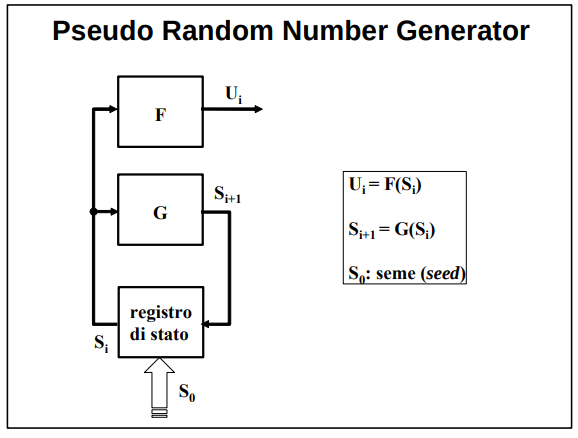

Abbiamo visto:
**Come si memorizzano?**
**Come si distribuiscono?**
**Come vengono utilizzate?**

Ma...
**Come si generano le chiavi?**


## RNG
Un RNG (Random Number Generator) è chiamato in causa, in un modo o nell’altro, da tutti i meccanismi ed i servizi per la sicurezza. Ad esempio, gli RNG generano le chiavi segrete.

Alle stringhe di simboli d’uscita del RNG è richiesto il rispetto della proprietà di casualità, ogni valore deve:
1. avere la stessa probabilità di verificarsi,
2. essere statisticamente indipendente da tutti gli altri (la probabilità di una qualsiasi coppia di valori nella stringa deve essere il prodotto delle loro probabilità).

In sostanza i bit che formano la stringa devono essere casuali ed imprevedibili.

**NB**: Per verificare l'effettiva casualità di una sequenza di bit sono stati definiti diversi test statistici. 


### TRNG
**Come si ottiene casualità?**
La casualità è presente in diversi fenomeni fisici e nei segnali d’uscita di diverse apparecchiature elettroniche. Tali sorgenti di rumore sono spesso
indicate con l’acronimo TRNG (True Random Number Generator). 

TRNG richiedano in generale:
- una digitalizzazione del segnale analogico fornito dalla sorgente,
- una post-elaborazione della stringa di bit che garantisce equiprobabilità ed indipendenza,
- una memorizzazione del dato da mettere a disposizione dell’applicazione. 

**Problemi**:
-  **la frequenza di produzione dei dati casuali è bassa** e bisogna quindi o accontentarsi di stringhe relativamente corte o usare risultati calcolati in precedenza e poi memorizzati in un apposito random pool. 
- **riproducibilità impossibile**: a volte è richiesta la generazione di sequenze di bit casuali identiche in calcolatori diversi. 


### PRNG
Per risolvere le problematiche dei TRNG si utilizzano **algoritmi deterministici** per generare **lunghe** sequenze di numeri casuali a partire da un dato/stato iniziale, detto **seme** (seed), di piccola dimensione. Il modello di tali generatori algoritmici, detti pseudocasuali o PRNG (Pseudo Random Number Generator), è **l’automa a stati finiti** illustrato nella figura. Un automa a stati finiti è un PRNG solo se supera i test di casualità.



I PRNG differiscono dai TRNG per vari aspetti:
- la sequenza di numeri in uscita **ad un certo punto si ripete**,
- in assenza di particolari accorgimenti nella costruzione delle funzioni F e/o G, **il valore in uscita è prevedibile** se si conosce un certo numero di valori precedenti. 

Problemi:
- le sequenze di un PRNG sono casuali e riproducibili, ma NON sono imprevedibili

**PRNG crittograficamente sicuri**:
Nelle applicazioni crittografiche la sola casualità non è sufficiente. Occorre, infatti, anche l’imprevedibilità: un intruso che è riuscito ad intercettare l’uscita o ad individuare, in tutto o in parte, lo stato del generatore non deve poter dedurre da quale seme sono partiti i calcoli e/o quali saranno i prossimi valori generati.

Un generatore pseudocasuale che ha anche la proprietà di imprevedibilità è detto crittograficamente sicuro o CSPRBG (Cryptographically Secure PseudoRandom Bit Generator). Per conseguire imprevedibilità occorre che:
- il periodo sia grandissimo (10^50/10^100), per poterlo suddividere con il seed in moltissime sottosequenze;
- il seme sia imprevedibile e tenuto segreto
    - tipicamente il seme viene generato da un TRNG
    - **non siamo tornati punto e a capo con la riproducibilità?**
- sia unidirezionale o la funzione di stato futuro, o la funzione d’uscita, per rendere impossibile ad un avversario che ha individuato uno stato il risalire agli stati precedenti ed al seme; 

```
se vuoi sul libro c'è anche qualche esempio di implementazione di PRNG a pagina 19
```


### Funzioni di Hash e algoritmi 
Una seconda primitiva crittografica è la funzione hash sicura, chiamata in causa in moltissimi meccanismi e servizi. Gli algoritmi che la realizzano devono in generale presentare le seguenti quattro proprietà:
- **efficienza**: “il calcolo di H(x) è computazionalmente facile per ogni x”.
    - implementazione con schema di **compressione iterata**
        - il messaggio viene suddiviso in tanti blocchi di dimensione pari a r bit
        - vari stadi di compressione in cui una funzione di hash *f* calcola l'hash prendendo gli r bit del blocco e gli *n* bit dell'hash dello stadio precedente
        - **NB**: m||S funziona; S||m no
- **robustezza debole alle collisioni**: “per ogni x è infattibile trovare un y ≠ x tale che H(y) = H(x)”.
    - l'input non lo decide l'attaccante
- **resistenza forte alle collisioni**: “è infattibile trovare una qualsiasi coppia x, y tale che H(y) = H(x)”.
    - l'input lo decide l'attaccante
- **unidirezionalità**: “per ogni h è infattibile trovare un x tale che H(x) = h”.
    - importante perchè **permette di fare una sorta di cifratura senza chiave**


