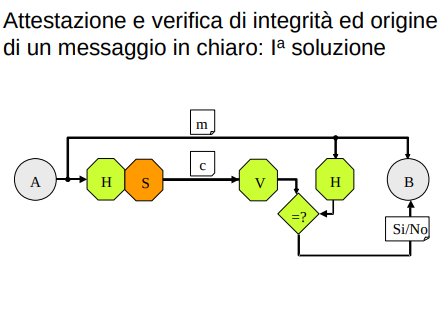
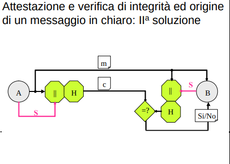
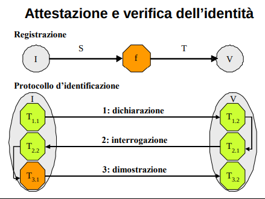

## TRASFORMAZIONI PER LA SICUREZZA
Le vulnerabilità del canale insicuro possono essere risolte da una contromisura in linea di principio molto semplice:
```
sorgente e destinazione, in perfetto accordo, attribuiscono alle informazioni comunicate sul canale insicuro una rappresentazione nota soltanto a loro ed atta ad impedire all’intruso di comprendere il significato della comunicazione (riservatezza) e/o di spacciare come inviati dalla sorgente messaggi che lui ha modificato (integrità) o forgiato (autenticità)
```

Sia nel caso di attacchi passivi che attivi, **i dati devono essere manipolati** (criptati nel caso di attacchi passivi, affiancati ad un qualcosa che ne garantisca l'integrità/autenticità nel caso di attacchi attivi). In altre parole, **i dati dalla sorgente alla destinazione devono essere trasformati**.

Le trasformazioni per la sicurezza possono essere implementate con:
- algoritmi: singola trasformazione
- protocolli: catena ben pensata di trasformazioni

Occorre, prevedere anche il caso che **il malintenzionato sia uno dei due corrispondenti**. Anticipiamo qui che per fronteggiare questa minaccia è necessario il coinvolgimento nel protocollo di una **terza parte fidata**, attribuendole il compito di intervenire nel corso (l’arbitro) o al termine (il giudice) dell'esecuzione del protocollo. 

Tutte le trasformazioni di sicurezza hanno come caratteristica comune una **codifica ridondante dei dati**
- o nella rappresentazione (uso più bit del caso senza trasformazione)
- o nel tempo (uso più tempo rispetto al caso senza trasformazione)

**crittologia, crittografia e crittanalisi**
La disciplina che studia gli algoritmi ed i protocolli da svolgere alle estremità di un canale insicuro è detta Crittologia.

Obiettivo fondamentale della Crittologia è l’individuazione di trasformazioni **efficienti, efficaci e sicure**; a tal fine la Crittologia è formata da due distinte e correlate discipline:
- la **Crittografia** individua le trasformazioni idonee a proteggere una o più proprietà critiche dell’informazione;
- la **Crittanalisi** ne valuta la robustezza, esaminando come, in quanto tempo e con quali risorse è possibile rompere le difese. 

**trasformazioni segrete e trasformazioni note con parametro segreto**
- algoritmo noto con parametro segreto (quello che considereremo d'ora in poi)
- algoritmo direttamente segreto (anche no)

vedi meglio dopo...


### Trasformazioni per la riservatezza
**Cifratura**: "la sorgente trasforma la rappresentazione originaria delle informazioni riservate in una rappresentazione che le renda
apparentemente incomprensibili; **la destinazione è l’unica a saper eseguire la trasformazione inversa**.


Una coppia di trasformazioni E, D è detta **cifrario**. 

Alcune osservazioni sull’uso di un cifrario:
- i due partecipanti non devono essere necessariamente on-line: in ricezione i messaggi cifrati possono, infatti, essere prima memorizzati e poi decifrati;
- uno stesso utente può essere sia sorgente, che destinazione: questo caso interessa chi vuole realizzare un proprio archivio di documenti riservati. 

La minaccia alla riservatezza è, come sappiamo, l’intercettazione. La difesa, **preventiva**, è mettere l’intruso I nella condizione di non riuscire a fare ciò che fa la destinazione B. A tal fine **la modalità di decifrazione deve essere tenuta segreta**, ma ciò non è sufficiente. L’intruso potrebbe, infatti, rimettere in chiaro il testo cifrato o, tanto peggio, individuare il segreto sulla trasformazione avvalendosi di conoscenze già in suo possesso (probabili motivi della comunicazione, probabile contenuto, ecc.) e di testi cifrati intercettati in precedenza. 

**Sicurezza perfetta**: dal cypher-text non si impara nulla.
- sicurezza perfetta non esiste; se il testo cifrato presenta ripetizioni (vedi linguaggio naturale) l'attaccante ottiene informazioni
- si parla solo di **sicurezza computazionale**: i calcoli per mettere in chiaro un testo cifrato devono essere computazionalemente impossibili (e.g. forza bruta con chiave da 512 bit)


### Trasformazioni per l'integrità
**Hashing**: “la sorgente affianca al messaggio un “riassunto” che ne rappresenti in modo univoco il contenuto e che funga da **attestato di integrità**; la destinazione calcola il riassunto del messaggio ricevuto e lo confronta con quello inviato dalla sorgente”.

La Crittografia impiega a tal fine **una particolare funzione, detta hash**, che comprime una stringa _m_ di lunghezza arbitraria in una stringa _h_ **di lunghezza piccola e prefissata**: h = H(m) 

#### Funzioni di Hash crittograficamente sicure
L’uscita di una funzione hash è detta riassunto o impronta (digest, fingerprint) del messaggio d’ingresso. Un’impronta di n bit (tipicamente nel range 128 ÷ 512) suddivide l’insieme di tutte le possibili stringhe d’ingresso in 2^n sottoinsiemi disgiunti, formati ciascuno da tutte e sole le stringhe (notare il plurale) che forniscono uguale h. 
- Due stringhe che hanno lo stesso hash sono dette essere in **collisione**.

Una funzione hash è detta crittograficamente sicura se:
- **il suo comportamento è apparentemente aleatorio**. Il modello a cui ci si fa riferimento è detto “oracolo casuale” e prevede che: fornendo in ingresso un
messaggio di cui non si conosce ancora l’impronta, **si riscontra sull’uscita, con uguale probabilità, uno qualsiasi dei 2^n valori possibili**.

Gli algoritmi che approssimano tale comportamento impiegano un n “grande” per rendere estremamente improbabile che messaggi diversi abbiano la stessa impronta e rispettano la seguente regola:
```
‰(resistenza alle collisioni): “l’individuazione di due messaggi con la stessa impronta è un calcolo difficile”. 
```

In generale una funzione hash crittograficamente sicura ha queste proprietà:
- comportamento aleatorio (ogni hash ha la stessa probabilità di essere scelto)
    - è difficile dato un hash trovar un altro messaggio che mi produca lo stesso hash
    - questo mi da resistenza alle collisioni
- non invertibilie, è computazionalmente impossibile risalire ad *m* a partire da *H(m)*
    - in questo modo dato un hash non riesco a recuperare il messaggio originale (neanche il destinatario però)

**Basta l'hashing per garantire l'integrità?** trasmetto m||H(m)
- NOOO!!
- cosi come l'intrusore può modificare il messaggio, esso può modificare anche l'hash
- in particolare può modificare il messaggio, ricalcolarne l'hash e inviare il tutto al destinatario che non si accorgerà di niente

Come fare? Bisogna trasmettere l'hash su un canale dedicato
- l'intrusore non è in grado di trovare un m' che collide con m (resistenza alle collisioni)
- perchè non trasmetto direttamente m sul canale dedicato?
    - Usare il canale dedicato ha un costo per messaggi di dimensione arbitraria (pensa a trasmettero un programma di 1MiB al telefono)

**Come possiamo combinare le trasformazioni E ed H?**
voglio garantire integrità e riservatezza

- E(m) || H(m) non va bene dato che non garantisce integrità
    - hash del messaggio in chiaro
    - un attaccante può provare tutti i messaggi finche non ne trova uno che ha un hash corrispondente
        - attacco di forza bruta per scoprire m partendo da H(m) 
        - funziona bene se ho poche possibilità ( |spazio dei messaggi| << |spazio degli hash| )
    - ancora più facile se l'attaccante ha informazioni di contesto e il dominio del messaggio è limitato (e.g PIN a 4 cifre)
- Versione corretta:
    1. p = m||H(m)              -> A forma un nuovo testo in chiaro p “concatenando” m e H(m)
    2. c = E(p)                 -> A cifra p ed invia a B il risultato c
    3. c -> c*                  -> attraversando il canale un canale può modificare c 
    4. p* = D(c*) = m*, H*(m)   -> B decifra c*, ottiene p* e separa le due componenti
    5. H(m*) =? H*(m)           -> B calcola l’impronta di m* e la confronta con l’impronta ricevuta: se sono uguali il messaggio è giudicato integro
    - ricorda quello che succede in SSL


### Trasformazioni per autenticazione/autenticità
vogliamo verficare che l'origine del messaggio sia effettivamente quella del mittente

**Firma**: **la sorgente** cifra il documento con informazioni **non imitabili**  atte ad attestare chi l’ha predisposto (prova di autenticità); la destinazione verifica che il documento ricevuto sia stato originato proprio da chi dichiara di averlo fatto”
- nessuno può produrre le informazioni contenute nell'attestato se non la sorgente legittima

Nuove trasformazioni:
- S(ign)
    - trasformazione segreta, la sa fare solo il mittente
    - nessuno può imitare S(m) del mittente
- V(erify)
    - la sanno fare tutti (non stiamo proteggendo la riservatezza)
    - produce due output: si/no; il messaggio m


Spesso è necessario trasmettere in chiaro il messaggio m. Per consentire a B di **accertare contemporaneamente l’integrità e l’origine del messaggio ricevuto**, la Crittografia ha messo a punto due differenti soluzioni:

**Schema Firma digitale**


il messaggio in chiaro viene affiancato con l'autenticazione del suo hash:
- La destinazione, con il meccanismo V, noto a tutti, mette in chiaro il l'hash cifrato e lo confronta con l'hash del messaggio ricevuto. In questa maniera rileva ogni alterazione apportata a *m* e/o a *c*. 
    - S algoritmo segreto, per un intruso è impossibile modificare *c* mantenendo l'integrità del messagggio **E** l'identità della sorgente
- non devo firmare un messaggio lungo
- non ripudiabile in quanto solo S conosce il suo segreto con cui è stato firmato il messaggio 

**Schema con PARAMETRO segreto**


I due corrispondenti A e B concordano in segreto un dato S. Per consentire la verifica dell’integrità e dell’origine di un m, A e B eseguono il seguente protocollo:
1. A:        calcola H(m||s)
2. A → B:    c = m||H(m||s)
3. B:        riceve c* ed ottiene m*, H*(m||s)
4. B:        calcola H(m*||s)
5. Se e solo se H(m*||s)=H*(m||s), B considera m integro ed originato da A.

ripudiabile: sia bob che alice conoscono il segreto e quindi possono imbrogliare 
- la generazione di m ed il calcolo di H(m||s) possono essere fatti anche da B all’insaputa di A (entrambi conoscono il segreto) ed un’eventuale disputa tra i due non può essere risolta.
- La soluzione è quindi utile solo se i due corrispondenti **si fidano uno dell’altro**. 

## Trasformazioni per identificazione:
Esistono applicazioni che ammettono l’anonimato (informativa su servizi pubblici, posta elettronica) ed altre che lo presuppongono (voto elettronico, moneta elettronica).

Nella maggioranza dei casi è però richiesto che l’erogatore di un servizio conosca l’identità di chi ne usufruisce (tipicamente per delimitare e per fatturare l’uso che ne viene fatto) e che il fruitore sia certo dell’identità dell’erogatore (per non cadere ingenuamente in una truffa).
- fondamentale per il controllo dell'accesso
- fondamentale per autenticazione?

Il processo d’identificazione è necessariamente real-time: si deve, infatti, riferire ad un ben preciso istante di tempo ed entrambi gli interessati (verificando e verificatore) devono quindi essere on line (sincrono).
- vale per un preciso istante di tempo
- la validità prolungata si ottiene affiancando al meccanismo di identificazione un altro (di autenticazione?)

Tre sono in generale le dimostrazioni d’identità che una persona può fornire:
1. La conoscenza di un’informazione che ha in precedenza concordata (password)
2. Il possesso di un oggetto (token) datogli in consegna (una scheda a banda magnetica, una smart card, ecc)
3. La conformità di una misura biometrica raccolta in quel momento con una misura registrata in precedenza; oggetto di misura è una caratteristica individuale, o fisiologica (l’impronta digitale, la forma della mano, ...)


L'identificazione è il classico esempio in cui non basta una singola trasformazione. Due sono i momenti topici:


- fase iniziale di registrazione
    - l’identificando I ed il verificatore V concordano e memorizzano **rispettivamente** il dato segreto S con cui I si farà riconoscere ed il termine di
    paragone T=f(S) che consentirà a V di accertare che I conosce S.
- fase a regime in cui si avvia una sessione di riconoscimento tramite un protocollo di identificazione a sua volta con 3 fasi:
    1. l’identificando dichiara chi è;
    2. il verificatore gli chiede di dimostrarlo;
    3. l’identificando fornisce la **prova di identità**; se è quella concordata, il verificatore lo identifica. 
    - 3 fasi -> 3 traformazioni
    - trasformazione di dimostrazione non imitabile 

NB: il tutto si base sul fatto che l'identificando mantenga il suo segreto segreto  


## Funzioni unidirezionali e pseudo-unidirezionali
Per ottenere sicurezza, la Crittografia chiama in causa **funzioni facili da calcolare e difficili da invertire**, per cui ha coniato la denominazione di funzioni unidirezionali (one-way functions).

Abbiamo già detto ad esempio:
- che la funzione hash sicura deve poter essere calcolata da un algoritmo con tempo polinomiale e che non deve esistere un algoritmo con tempo polinomiale in grado di risalire da un’impronta H(x) ad uno degli x che la generano;

- che la funzione di cifratura di un cifrario deve poter essere calcolata da un algoritmo con tempo polinomiale e che chi non conosce la funzione inversa non deve poter disporre di un altro algoritmo con tempo polinomiale in grado di risalire da E(m) a m;


OSS: Non si può escludere a priori che esistano anche alcuni risultati facili da invertire: l’importante è che siano pochissimi, per rendere assolutamente trascurabile la probabilità che l’attaccante si trovi proprio in quelle situazioni. 

**Funzione unidirezionale**: Una funzione f è detta unidirezionale se
- è invertibile,
- facile da calcolare
- e se per quasi tutti gli x appartenenti al dominio di f è difficile risolvere per x il problema y = f (x).

Due notizie, una cattiva ed una buona.
- La cattiva è che finora la Teoria della complessità computazionale non è riuscita a dimostrare l’esistenza delle funzioni unidirezionali.
- La buona. I Crittografi sono riusciti ad individuare funzioni di compressione, di cifratura e di firma calcolabili con algoritmi polinomiali ed hanno altresì verificato che tali funzioni sono invertibili solo con algoritmi o esponenziali, o sub-esponenziali. 

Un’ultima precisazione: nei casi della decifrazione e della firma, l’utente deve poter fare in tempo polinomiale quello che l’intruso non deve invece poter fare. Occorre dunque un ulteriore modello.

**Funzioni pseudo unidirezionali**: “una funzione F è detta pseudo-unidirezionale (trapdoor one-way function) se appare come unidirezionale per chiunque non sia in possesso di una particolare informazione sulla sua costruzione (chiave)"