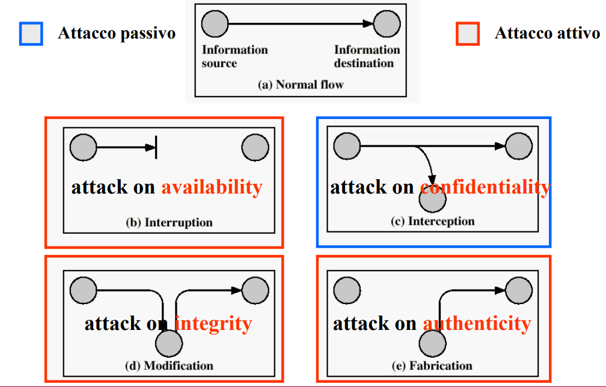

**Modello del canale insicuro**
"“al canale che connette una sorgente legittima ed una destinazione legittima può accedere illecitamente anche un intruso”
- ambiente sicuro lato sorgente e destinazione del dato
- il canale di comunicazione è insicuro nel senso che una terza entità (che può essere sempre la sorgente/destinazione) può accederci 

### Attacchi passivi ed attacchi attivi
attacco passivo: non altera il flusso dei dati. Osserva solo il traffico dei dati
attaco attivo: può alterare il flusso dei dati.

per attacchi passivi  
- proprietà a rischio: riservatezza
- contromisure: prevenzione tramite criptazione

per attacchi attivi     
- proprietà a rischio: integrità, autenticità
- contromisure: rilevazione tramite attestati di integrità e di origine

**OSS**: una contromisura preventiva che vale sempre è il controllo dell'accesso; tuttavia controllo dell'accesso al canale è infattibile (non scalabile) se il canale è internet (per questo modello del canale insicuro)

dove si collocano i meccanismi/servizi nella pila protocollare ISO/OSI?
- livello 3: ipsec
- livello 4: SSL
- livello 7: a mano

posizionarsi a livelli diversi fa differenza su trasparenza e personalizzazione della cifratura ad esempio

Abbiamo visto che sia nel caso di attacchi passivi che attivi i dati devono essere manipolati (criptati nel caso di attacchi passivi, affiancati ad un qualcosa che ne garantisca l'integrità nel caso di attacchi attivi). In altre parole, **i dati dalla sorgente alla destinazione devono essere trasformati**.

Le trasformazioni per la sicurezza possono essere implementate con:
- algoritmi: singola trasformazione
- protocolli: catena ben pensata di trasformazioni

A volte nei protocolli può essere coinvolta una **terza parte fidata** che fa da arbitro
- spesso sorgente/destinazione non sono fidate

Tutte le trasformazioni di sicurezza hanno come caratteristica comune una **codifica ridondante dei dati**
- o nella rappresentazione (uso più bit del caso senza trasformazione)
- o nel tempo (uso più tempo rispetto al caso senza trasformazione)

### Trasformazioni segrete e note
- algoritmo noto con parametro segreto (quello che considereremo d'ora in poi)
- algoritmo direttamente segreto (anche no)

### Trasformazioni per la riservatezza
cifratura

sicurezza perfetta non esiste; si parla solo di sicurezza computazionale

### Trasformazioni per l'integrità
“la sorgente affianca al messaggio un “riassunto” che ne rappresenti in modo univoco il contenuto; la destinazione calcola il riassunto del messaggio ricevuto e lo confronta con quello inviato dalla sorgente ”

non esiste una trasformazione preventiva, esiste una trasformazioni che rileva modifiche del contenuto del messaggio.
- generazione di un attestato di integrità prodotto tramite hashing crittografico. Ha queste due proprietà
    - comportamento aleatorio (ogni hash ha la stessa probabilità di essere scelto)
    - resistenza alle collisioni
    - non invertibilie, è computazionalmente impossibile risalire ad *m* a partire da *H(m)*

L’uscita di una funzione hash è detta
riassunto o impronta (digest, fingerprint) del
messaggio d’ingresso. Un’impronta di n bit
(tipicamente nel range 128 ÷ 512) suddivide
l’insieme di tutte le possibili stringhe d’ingresso
in 2n
 sottoinsiemi disgiunti, formati ciascuno da
tutte e sole le stringhe che forniscono uguale h. 
- Due stringhe che hanno lo stesso hash
sono dette essere in collisione.

Una funzione hash è detta semplice se
l’individuazione di collisioni è un calcolo facile.

Una funzione hash è detta sicura, o crittografica, se il suo comportamento è apparentemente aleatorio.
Il modello a cui ci si fa riferimento è detto “oracolo casuale” e prevede che fornendo in ingresso un
messaggio di cui non si conosce ancora l’impronta, si riscontra sull’uscita, con uguale probabilità, uno qualsiasi
dei 2n
 valori possibili. Gli algoritmi che approssimano tale comportamento impiegano un n “grande” per rendere
estremamente improbabile che messaggi diversi abbiano la stessa impronta e rispettano la seguente regola.
‰ R3 (resistenza alle collisioni): “l’individuazione di due messaggi con la stessa impronta è un calcolo difficile”. 

basta l'hashing per garantire l'integrità? NOOO!!
- cosi come l'intrusore può modificare il messaggio, esso può modificare anche l'hash
- in particolare può modificare il messaggi e ricalcolare l'hash

Come fare? Bisogna trasmettere l'hash su un canale dedicato
- l'intrusore non è in grado di trovare un m' privo che collide con m
- perchè non trasmetto direttamente m sul canale dedicato? Usare il canale dedicato ha un costo per messaggi di dimensione arbitraria

### Come possiamo combinare le trasformazioni E ed H?
voglio garantire integrità e riservatezza

- E(m) || H(m) non va bene dato che non garantisce integrità
    - un attaccante può provare tutti i messaggi finche non ne trova uno che ha un hash corrispondente
    - ancora più facile per messaggi di lunghezza arbitraria se l'attaccante ha informazioni di contesto

- 2^ esempio corretto
    - ricorda quello che succede in SSL

### Trasformazioni per autenticazione/autenticità
vogliamo verficare che l'origine del messaggio sia effettivamente quella del mittente

abbiamo bisogno di un attestato di autenticità. 
- nessuno può produrre le informazioni contenute nell'attestato se non la sorgente legittima

"la sorgente aggiunge al documento informazioni non imitabili ed atte ad attestare chi l’ha predisposto; la destinazione verifica che il documento ricevuto sia stato originato proprio da chi dichiara di averlo fatto"

Nuove trasformazioni
- S(ign)
    - trasformazione segreta, la sa fare solo il mittente
    - nessuno può imitare S(m) del mittente
    
- V(erify)
    - la sanno fare tutti (non stiamo proteggendo la riservatezza)
    - produce due output: si/no; il messaggio m

**Schema Firma digitale**
firmo l'hash del messaggio che ha dimensione ridotta
- S algoritmo segreto
- la destinazione non deve fare V(m)
- non devo firmare un messaggio lungo

**Schema con PARAMETRO segreto**
- ripudiabile: sia bob che alice conoscono il segreto e quindi possono imbrogliare 

## Identificazione:
- fondamentale per il controllo dell'accesso
- si svolge necessariamente in real-time e **vale per un preciso istante di tempo** (la validità prolungata si ottiene affiancando al meccanismo di identificazione un altro (di autenticazione?))
- verificando e verificatore devono essere entrambi online (sincrono)

identificazione vs autenticazione:
...

strumenti di identificazione:
...

L'identificazione è il classico esempio in cui non basta una singola trasformazione
- fase iniziale di registrazione
    - si concorda un termine di paragone con cui l'identificatore può controllare la veridicità di ciò che il verificando gli manda
- fase a regime in cui si avvia una sessione di identificazione
    - 3 fasi -> 3 traformazioni
    - trasformazione di dimostrazione non imitabile 

### Funzioni unidirezionali e pseudo-unidirezionali
