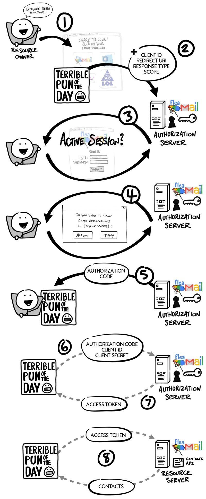

In the “stone age” days of the Internet, **sharing information between services** was easy. You simply **gave your username and password for one service to another** so they could login to your account and grab whatever information they wanted!
- **terribile**
- già è difficile garantire la sicurezza delle credenziali del servizio stesso, figuriamoci se un servizio deve gestire più credenziali per ogni utente
- inoltre, non c'è alcuna garanzia che il servizio acceda solo ai dati strettamente necessari e non faccia un po' di snooping

Today we have an agreed-upon **standard to securely allow one service to access data from another: OAuth**

OAuth 2.0 is a security standard where you give one application permission (**authorization**) to access your data in another application. 
- you authorize one application to access your data, or use features in another application **on your behalf**, **without giving them your credentials**
    - **deleghi** dei permessi
    - decouples authentication from authorization 
        - non devi per forza autenticarti (fare il login con la pwd) per avere delle autorizzazioni
- fornisce autorizzazioni in maniera **granulare**

**Esempio OAuth Authorization flow | overview**:
facciamo finta di voler autorizzare un servizio ad accedere alla lista dei tuoi contatti email per far si che il servizio mandi automaticamente mail ai tuoi contatti senza che ci debba pensare te manualmente.

Il servizio eseguirebbe, ad alto livello dei passi simili a questi:
1. Pick your email provider
2. Redirect to your email provider and login if needed
3. Give “Terrible Pun of the Day” permission to access to your contacts
4. Redirect back to “Terrible Pun of the Day”

### Terminologia

1. **Resource Owner**:
    - You! You are the owner of your identity, your data, and any actions that can be performed with your accounts.
    - la Resource sono quindi i tuoi dati

2. **Client**:
    - The application (e.g. “Terrible Pun of the Day”) that wants to access data or perform actions **on behalf of the Resource Owner**.
    - detto anche Relying Party

3. **Authorization Server**:
    - The application that knows the Resource Owner, **where the Resource Owner already has an account** (e.g. Gmail nell'esempio precedente).
    - fornisce le autorizzazioni al client una volta ricevuto il consenso del Resource Owner

4. **Resource Server**:
    - The API or service the Client wants to use on behalf of the Resource Owner.
    - Dove sono presenti i dati a cui il client vuole accedere

**NMB**: Sometimes the “Authorization Server” and the “Resource Server” are the **same server**.
- However, there are cases where they will not be the same server or even part of the same organization.
- For example, the “Authorization Server” might be a third-party service the “Resource Server” trusts (vedi sign-in with google)

5. **Redirect URI**:
- The URL the Authorization Server will redirect the Resource Owner back to after granting permission to the Client.
    - nell'esempio precedente: da Gmail -> Terrible Punt of the Day
- This is sometimes referred to as the “Callback URL.”

6. **Response Type**:
- The type of information the Client expects to receive.
- The most common Response Type is **code**, where the Client expects an **Authorization Code**.

7. **Scope**:
- These are the granular permissions the Client wants, such as access to data or to perform actions.

8. **Consent**:
- The Authorization Server takes the Scopes the Client is requesting, and verifies with the Resource Owner whether or not they want to give the Client permission.
- passo 3 nell'esempio precedente

9. **Client ID**: 
- This ID is used to **identify the Client with the Authorization Server**.

10. **Client Secret**:
- This is a secret password that **only the Client and Authorization Server know**.
- This allows them to securely share information privately behind the scenes.
- Identifica il client presso l'Authorization Server
    - se tu dichiari una certa identità con Client ID, utilizzerai il segreto preconcordato

**NB**: si suppone che Authorization Server e Client si conoscano già, e che vi sia già stabilità una relazione di fiducia. per questo motivo, client ID e client secret sono dati già scambiati in precedenza.

11. **Authorization Code**:
- A short-lived temporary code the **Client gives the Authorization Server** in exchange for an Access Token. 

12. **Access Token**:
- The key the client will use to communicate with the Resource Server.
- This gives the Client permission to request data or perform actions with the Resource Server on your behalf.

### Esempio OAuth Authorization flow | nel dettaglio:
1. You, the Resource Owner, want to allow “Terrible Pun of the Day,” the Client, to access your contacts so they can send invitations to all your friends.

2. The Client redirects your browser to the Authorization Server and includes with the request:
    - the Client ID: dichiara la sua identità
    - Redirect URI: dice all'Authorization Server dove deve redirezionare il browser dell'utente una volta fornite le autorizzazioni al Client 
    - Response Type: specifica il formato della risposta che il client vuole
    - and one or more Scopes it needs

3. The Authorization Server verifies who you are, and if necessary prompts for a login.
    - bisogna capire ai dati di chi il client vuole accedere
    - AS identifica sia il client che il Resource Owner

4. The Authorization Server presents you with a Consent form based on the Scopes requested by the Client. You grant (or deny) permission.

5. The Authorization Server redirects back to Client using the Redirect URI **along with an Authorization Code**.

6. The Client contacts the Authorization Server directly (**does not use the Resource Owner’s browser**) and securely sends its Client ID, Client Secret, and the Authorization Code.
    - il Resource Owner intanto può fare quello che gli pare
    - Client si identifica presso l'authentication server e gli mostra la prova che il Resource Owner gli ha concesso delle autorizzazioni
    - **NB**: questo passo sembra essere suscettibile ad un attacco con replica. Abbiamo però che Authorization code
        - è short lived (chatgpt dice che può essere usato una sola volta e scade dopo un minuto)
        - tutto il traffico passa per TLS che cifra ogni volta con una chiave di sessione diversa 

7. The Authorization Server verifies the data and responds with an Access Token.

8. The Client can now use the Access Token to send requests to the Resource Server (che ricorda in generale può essere diverso dall'AS) for your contacts.

**OSS**:

- Relazione di fiducia tra Client e Authorization server
    - Long before you gave “Terrible Pun of the Day” permission to access your contacts, the Client and the Authorization Server established a working relationship. The **Authorization Server generated a Client ID and Client Secret**, and gave them to the Client to use for all future OAuth exchanges. As the name implies, the Client Secret must be kept secret so that only the Client and Authorization Server know what it is. **This is how the Authorization Server can verify the Client.**

- Ruolo dell'authorization code
    - permette al Client di ottenere l'access token se riesce ad identificarsi correttamente con AS
    - è un qualcosa che mi dice che i passi 1-5 sono stati già fatti (Resource Owner è stato identificato ed ha concesso le autorizzazioni al Client)
    - **perchè AS non può mandare direttamente l'access token?**
        - il Client deve dimostrare identificarsi, questo è un modo per farlo
        - penso anche per evitare esposizione dell'access token durante la redirezione e quindi contromisura ad attacchi di replica
        - l'access token serve solamente al Client, non serve ne al resource owner ne al browser

- Qua siamo in un contesto federato (quasi centralizzato)
    - nel contesto decentralizzato non esiste un entità centrale (AS) con cui il Client ha una relazione di fiducia 