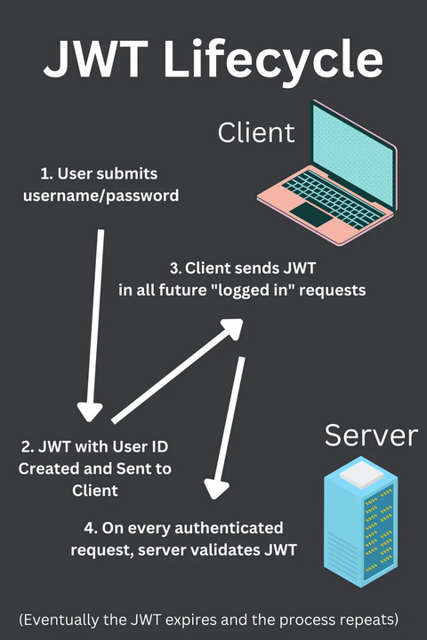

You might be thinking that it's inconvenient to only be able to validate messages with people who share a copy of the secret key. However, this is how many web applications handle authentication!

A JWT, or JSON Web Token, is **just an HMAC where the message data is a JSON object**. For example:

```Json
    message = {"userID": "11be9160-2243-4449-934b-e8245fe2feb0"}
    hmac = sha256(key1 + sha256(key2 + message))

    jwt = message + "." + hmac
```

JWTs that use HMACs are useful for authentication because **it's the same server that's issuing and validating the tokens**.
- solamente il server, che conosoce la/e chiavi segrete, può avere calcolato l'hmac corretto per un determinato userid. Quando il server riceve un JWT, se l'hmac è valido, allora esso è sicure di aver già identificato l'utente in precedenza. 
- se un attaccante prova a modificare lo user-id di una richiesta, l'hmac non matcherà




### Asymmetric JWTs vs. Symmetric JWTs
Asymmetric JWTs use a private key to sign the JSON payload, and a public key to validate it, it's similar to asymmetric encryption. but instead of encrypting data, we're signing it.

Symmetric JWTs use the same key to sign and validate the tokens.

#### Lifecycle of an Asymmetric JWT
An example of "Sign in with Google":

1. User clicks "Sign in with Google" and enters their credentials
2. If the credentials are valid, Google creates a JWT by signing it with their private key
3. The signed JWT is given to the client
4. The client sends the JWT in an HTTP header along with every request that requires authentication
5. The Boot.dev server uses Google's public key to validate the JWT in each subsequent request

ECDSA is just one signing algorithm that can be used with asymmetric JWTs. There are many others, including RSA.

#### Lifecycle of a Symmetric JWT
An example of signing into a website with a username and password:

1. User clicks "Sign in" and enters their credentials
2. If the credentials are valid, the server creates a JWT by signing it with their private key
3. The signed JWT is sent to the client
4. The Boot.dev server uses their private key again to validate the JWT in each subsequent request